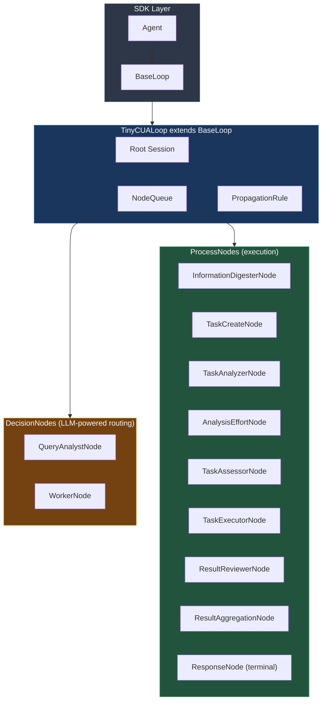
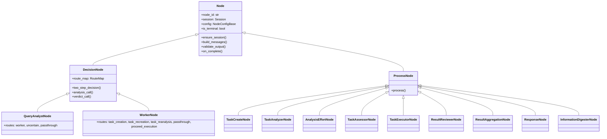
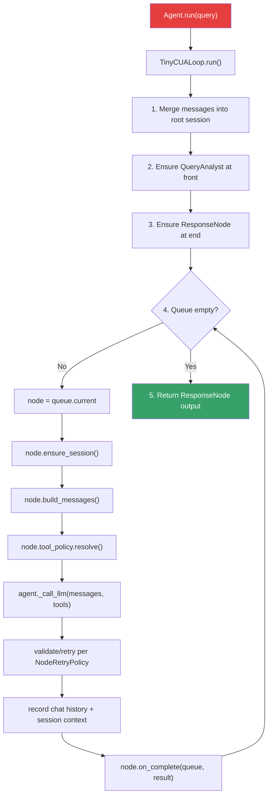
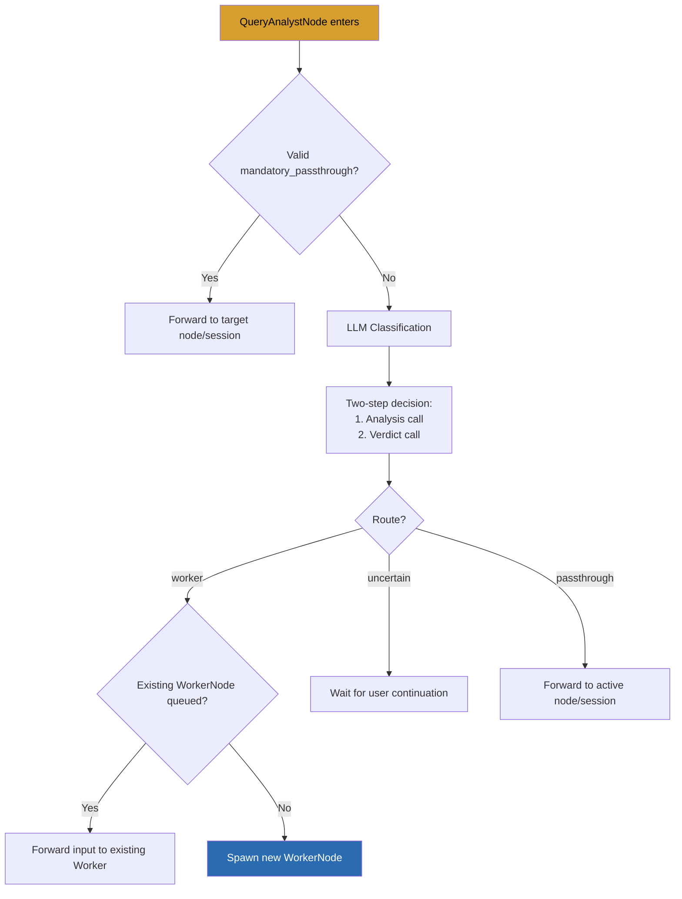
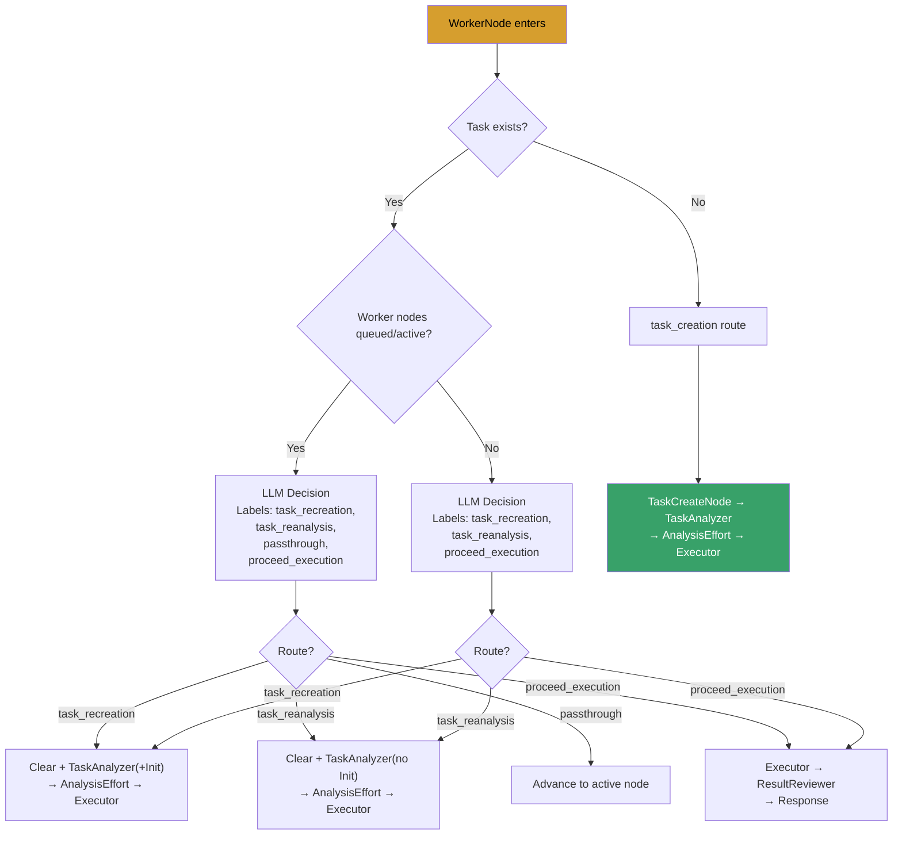
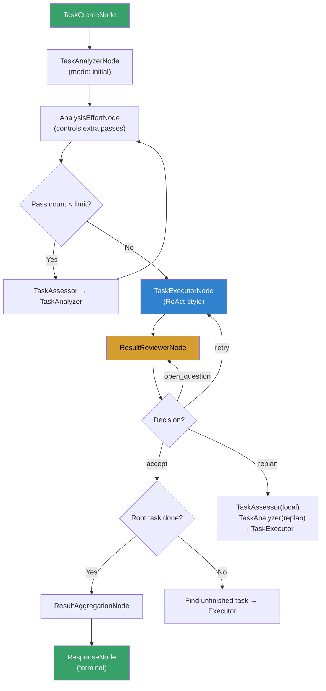
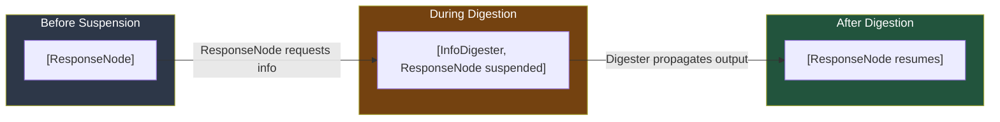
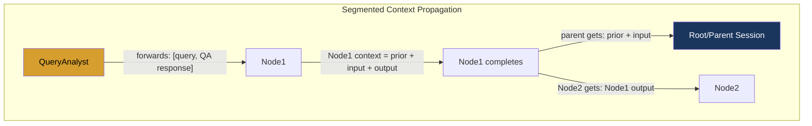

# TinyCUA Architecture Diagrams

## 1. Component Hierarchy

## 2. Node Class Hierarchy

## 3. Main Execution Flow

## 4. QueryAnalyst Routing

## 5. Worker Routing

## 6. Task Execution Flow (Inside Worker)

## 7. Queue Suspension & Suspension Example

## 8. Context Propagation Model

