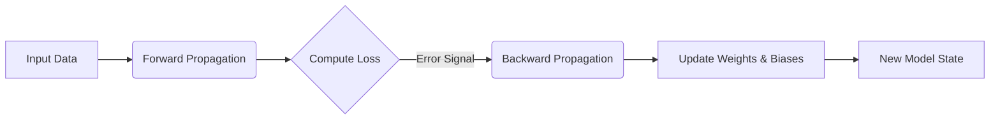

# Neural Networks Core Terminology Glossary

## Overview

This document provides comprehensive definitions and explanations of the fundamental terminology used in neural networks, essential for understanding their architecture, operation, and training mechanisms.

---

## 1. Neurons (Perceptrons)

### Definition
A **neuron** (also called a perceptron or node) is the basic computational unit of a neural network, inspired by biological neurons. Each neuron receives inputs, processes them through weighted connections, applies an activation function, and produces an output.

### Structure
- **Receives**: Multiple input signals from previous layer's neurons
- **Processes**: Computes a weighted sum of inputs plus a bias term
- **Activates**: Applies a non-linear activation function to introduce complexity
- **Outputs**: Produces a single value passed to the next layer

### Mathematical Formulation
```
z = (w₁×x₁) + (w₂×x₂) + ... + (wn×xn) + b  # Weighted sum + bias
a = f(z)                                     # Activation function applied
```

Where:
- `w` = weights connecting to the neuron
- `x` = input values from previous layer
- `b` = bias term (learnable parameter)
- `f()` = activation function (e.g., ReLU, sigmoid, tanh)
- `a` = output of the neuron

### Key Characteristics
- Each connection to a neuron has an associated **weight** that determines its importance
- The **bias** allows shifting the activation threshold independently
- Activation functions introduce non-linearity, enabling complex pattern recognition

---

## 2. Layers

### Definition
A **layer** is an organized group of neurons arranged in a specific order within a neural network. Neural networks are typically structured as sequences of layers processing data progressively.

### Layer Types

#### Input Layer
- Receives raw input data (features) from the external world
- Contains no computational operations; only passes values forward
- Number of neurons = number of features in input data

#### Hidden Layers
- Intermediate layers between input and output
- Perform feature extraction and pattern recognition
- Can be any depth (shallow vs deep networks)
- More hidden layers typically enable learning more complex patterns

#### Output Layer
- Produces final predictions or classifications
- Number of neurons depends on the task:
  - Binary classification: 1 neuron (0 or 1 probability)
  - Multi-class classification: N neurons (one per class)
  - Regression: 1 neuron (continuous value)

### Architectural Variations

| Architecture | Layer Arrangement | Use Case |
|--------------|-------------------|----------|
| Feedforward Network | Input → Hidden(s) → Output | General purpose, simple tasks |
| Convolutional Neural Network (CNN) | Input → Conv → Pooling → Fully Connected → Output | Image processing |
| Recurrent Neural Network (RNN) | Cyclic connections for sequences | Time series, text |
| Transformer | Multi-head attention layers | Language modeling |

### Layer Depth vs Width
- **Depth**: Number of hidden layers (depth determines complexity capacity)
- **Width**: Number of neurons per layer (width determines parallel computation)

---

## 3. Weights

### Definition
**Weights** are numerical parameters that determine the strength and direction of connections between neurons in adjacent layers. They represent learned importance of each input feature.

### Role in Learning
- During training, weights are adjusted to minimize prediction errors
- Large positive weight: Input has strong positive influence on output
- Large negative weight: Input has strong negative influence on output
- Zero/near-zero weight: Input is not important for this connection

### Mathematical Impact
```
contribution = weight × input_value
total_input = sum(all contributions) + bias
```

### Weight Initialization
Initial weights before training are typically small random values to avoid symmetry problems. Common strategies:
- **Xavier/Glorot initialization**: For tanh/sigmoid activations
- **He initialization**: For ReLU and its variants
- **Uniform/Normal distributions**: Random sampling from specific ranges

### Key Properties
- Weights are the primary learnable parameters in neural networks
- Networks with more connections have more weights (larger model capacity)
- Weight values can grow or shrink during training based on gradient descent

---

## 4. Biases

### Definition
**Bias** is an additional parameter added to each neuron's computation, acting as an offset that shifts the activation function independently of the input data.

### Purpose and Function
```
z = (weighted_sum_of_inputs) + bias
```

- Allows the neuron to activate even when all inputs are zero
- Provides flexibility in fitting data without forcing it through origin
- Each layer typically has one bias per neuron
- Biases are learned alongside weights during training

### Analogy
Think of bias as a "threshold adjustment":
- Without bias: Neuron only activates when inputs sum to positive value
- With bias: Neuron can activate even with small/negative input sums

### Implementation Notes
- In frameworks like PyTorch/TensorFlow, biases are stored separately from weights
- Bias terms don't have associated gradients in the same way as weights (no incoming connections)
- Often initialized to zero

---

## 5. Inputs and Outputs

### Input Layer and Data Flow

#### Input Features
- Raw data fed into the network's input layer
- Must be preprocessed/normalized before feeding:
  - Normalization: Scale features to similar ranges (e.g., [0,1] or mean=0, std=1)
  - Encoding: Convert categorical variables to numerical form
- Example input shapes:
  - Image: `(height, width, channels)` = `(224, 224, 3)` for RGB image
  - Text: `(sequence_length, embedding_dim)` for word embeddings
  - Tabular: `(n_features,)` for single sample

#### Input Tensor Structure
```python
# Example shapes in deep learning frameworks
batch_of_images = (batch_size, height, width, channels)  # e.g., (32, 224, 224, 3)
text_sequences = (batch_size, sequence_length, embedding_dim)  # e.g., (16, 50, 768)
tabular_data = (batch_size, n_features)  # e.g., (32, 10)
```

### Output Layer and Predictions

#### Classification Outputs
- **Binary**: Single output value in [0,1] representing probability
  - Activation: Sigmoid function
- **Multi-class**: Multiple outputs summing to 1 (one-hot encoded predictions)
  - Activation: Softmax function
  
#### Regression Outputs
- Continuous values without bounded range
- Typically no activation or linear activation
- Example: Predicting house prices, temperature

### Data Flow Direction
```
External World → Input Layer → Hidden Layers → Output Layer → Prediction/Decision
```

---

## 6. Forward Propagation (Forward Pass)

### Definition
**Forward propagation** is the process of passing input data through a neural network layer by layer to produce an output prediction. It's also called a "forward pass."

### Step-by-Step Process

1. **Input Processing**: Raw inputs enter the first (input) layer
2. **Layer-by-Layer Computation**:
   - For each neuron in current layer:
     - Compute weighted sum of inputs from previous layer
     - Add bias term
     - Apply activation function
3. **Output Generation**: Final values emerge from output layer as predictions

### Mathematical Representation (Single Layer)
```python
# Input matrix X: (batch_size, n_features)
# Weight matrix W: (n_features, neurons_in_layer)
# Bias vector b: (1, neurons_in_layer)

# Linear transformation
Z = X @ W + b  # Matrix multiplication

# Activation
A = f(Z)       # Apply activation function element-wise
```

### Batch Processing
Forward propagation typically processes multiple samples simultaneously:
- Input shape: `(batch_size, ...)` for dimensions after batch
- All computations happen in parallel across the batch dimension
- Enables efficient GPU/TPU utilization

### Applications
- **Inference**: Making predictions on new data (production use)
- **Training Phase**: Computing initial predictions before loss calculation
- **Validation**: Evaluating model performance on held-out datasets

---

## 7. Backward Propagation (Backpropagation)

### Definition
**Backward propagation** (or backpropagation, "backprop") is the algorithm used to compute gradients of the loss function with respect to all network parameters (weights and biases). These gradients guide parameter updates during training.

### Core Concept: Error Signal Flow
Unlike forward propagation which flows data forward, backpropagation flows error signals backward from output to input layers.

### The Chain Rule in Action
Backpropagation applies the chain rule of calculus repeatedly:
```
dL/dW = dL/dA × dA/dZ × dZ/dW
```
Where:
- `L` = Loss function value
- `A` = Activated output of layer
- `Z` = Pre-activation (linear combination before activation)
- `W` = Weights

### Step-by-Step Backpropagation Process

1. **Compute Output Error**: Calculate difference between predictions and true values
   ```python
   error_output = y_true - y_pred  # For regression
   error_output = y_true - softmax(y_pred)  # Often for classification
   ```

2. **Backward Through Output Layer**: Compute gradients w.r.t output layer weights/biases

3. **Propagate Error Backwards**: Pass error signals to previous layers, computing:
   - Gradient of loss w.r.t each neuron's activation
   - Gradient of activation w.r.t its pre-activation (from activation function)
   - Gradient of pre-activation w.r.t input and weights

4. **Repeat for All Layers**: Continue until reaching the first hidden layer

### Key Gradients Computed
```python
# For a single neuron in a specific layer:
dL/dW = error_signal_from_next_layer × activation_of_previous_neurons
dL/db = error_signal_from_next_layer  # Summed across batch
dL/dPrevActivation = error_signal × derivative_of_activation_function
```

### Gradient Descent Update (Following Backprop)
```python
# After computing gradients:
new_weight = old_weight - learning_rate × gradient_wrt_weights
new_bias = old_bias - learning_rate × gradient_wrt_biases
```

### Why It's Called "Backward" Propagation
- Error information flows in reverse direction (output → input)
- Each layer receives error from subsequent layers
- Enables all parameters to be updated based on their contribution to final error

---

## 8. Complete Training Cycle: Forward + Backward

### The Full Iteration


### Training Loop Structure
```python
# Pseudocode for one training iteration
for each batch in training_data:
    
    # 1. Forward pass - compute predictions
    predictions = model.forward(batch_inputs)
    
    # 2. Compute loss - measure error
    loss = compute_loss(predictions, true_labels)
    
    # 3. Backward pass - compute gradients
    gradients = model.backward(predictions, true_labels)
    
    # 4. Update parameters - learn from errors
    optimizer.step(gradients)
```

### Computational Efficiency
- **Forward pass**: O(n × m × k) for n layers with varying widths
- **Backward pass**: Similar complexity (one additional matrix multiplication per layer)
- Modern frameworks use automatic differentiation to handle gradient computation automatically

---

## 9. Summary Table: Core Terms at a Glance

| Term | What It Is | Role in Network | Learnable? |
|------|------------|-----------------|------------|
| **Neuron** | Basic computational unit | Processes inputs, produces outputs | No (structure), but parameters are learned |
| **Layer** | Group of neurons with same operation | Organizes computation flow | Yes (hyperparameter: depth/width) |
| **Weight** | Connection strength between neurons | Determines input importance | ✅ Yes - primary learnable parameter |
| **Bias** | Offset term for activation function | Shifts activation threshold | ✅ Yes - auxiliary learnable parameter |
| **Input** | Raw data fed to network | Starting point of computation | No (external data) |
| **Output** | Final prediction from network | Model's decision/prediction | N/A |
| **Forward Propagation** | Data flowing through layers | Produces predictions | N/A (computation process) |
| **Backward Propagation** | Error signals flowing backwards | Computes gradients for learning | N/A (training algorithm) |

---

## 10. Visual Concept Diagram

```
┌─────────────────────────────────────────────────────────────┐
│                    NEURAL NETWORK ARCHITECTURE               │
├─────────────────────────────────────────────────────────────┤
│                                                              │
│   INPUT LAYER                          HIDDEN LAYERS         │
│   ┌──┬──┬──┐                         ┌──┬──┬──┐             │
│   │i1│i2│i3│   →  [Forward Prop]     │h1│h2│h3│ ← Weights W│
│   └──┴──┴──┘                         ├──┼──┼──┤            │
│                                        │w│b │                │
│   (Raw Features)                     Hidden Layer 1         │
│                                                              │
│                        [Forward Prop]                        │
│   ┌─────────────────────→  HIDDEN LAYER 2 → ...             │
│   │                         (More hidden layers here...)    │
│   └─────────────────────→                                 │
│                                                              │
│                        [Backward Prop]                       │
│         Error Signal ←───────────←  Gradient Flow           │
│                                                              │
│   OUTPUT LAYER                          FINAL PREDICTION     │
│   ┌──┬──┬──┐                         ┌──┴──┴──┴──┐         │
│   │o1│o2│o3│   ←  [Backward Prop]   │    Result  │         │
│   └──┴──┴──┘                         └───────────┘         │
│                                                              │
│   Bias Terms:        │           Activation Functions:      │
│       b1    b2     b3          ReLU, Sigmoid, Tanh, Softmax │
└─────────────────────────────────────────────────────────────┘

Legend:
  i = input features (learnable weights connect to hidden layer)
  h = hidden neuron activations
  o = output predictions
  w = weight parameters (learned during training)
  b = bias parameters (learned during training)
  [Forward Prop] = Data flows left → right, computing outputs
  [Backward Prop] = Gradient/error flows right ← left, updating weights
```

---

## 11. Key Takeaways

### For Understanding Neural Networks:
- **Neurons** are the building blocks that perform computations
- **Layers** organize neurons into structured computational stages
- **Weights** encode what features matter most (learned from data)
- **Biases** provide flexibility in activation thresholds
- **Inputs/Outputs** represent data entering and decisions leaving the network
- **Forward propagation** turns inputs into predictions
- **Backward propagation** teaches the network by computing how to improve

### The Learning Process:
```
Data → Forward Prop (make prediction) 
     ↓
Loss (measure error)
     ↓
Backward Prop (compute gradients)
     ↓
Weight/Bias Update (learn from mistakes)
     ↓
Repeat with new data
```

---

## 12. Further Reading Recommendations

- **Deep Learning by Goodfellow, Bengio, Courville**: The definitive textbook covering all these concepts mathematically
- **Fast.ai Practical Deep Learning Course**: Excellent practical introduction to neural networks and training
- **CS231n / CS224n Stanford Courses**: Video lectures on CNNs and NLP architectures respectively

---

*Document created for comprehensive study of Neural Network fundamentals. This glossary serves as the foundation for understanding more advanced topics like Transformers, attention mechanisms, and deep learning architectures.*
