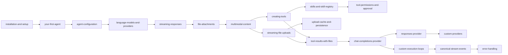

# Design Document: TINYCUA SDK Cookbook

**Spec**: `./spec.md`
**Status**: Draft
**Last Updated**: 2026-05-28

---

## Overview

This design describes the structure, page template, reading progression, and implementation phases for a 19-page Markdown cookbook under `src/tinycua-sdk/docs/cookbook/`. The cookbook provides a linear, basic-to-advanced reading experience covering all public capabilities of tinycua-sdk, with self-contained runnable code examples supporting both local (LM Studio) and remote (OpenAI) provider patterns.

---

## Architecture

### Component Overview

The cookbook is organized into six progressive phase folders. Files within each folder have descriptive names; the reading order is defined by the `index.md` table of contents.

<!-- Implements FR-001 -->

```
src/tinycua-sdk/docs/cookbook/
  index.md
  onboarding/
    installation-and-setup.md
    your-first-agent.md
    agent-configuration.md
  core-concepts/
    language-models-and-providers.md
    streaming-responses.md
    file-attachments.md
    multimodal-content.md
  agent-extensions/
    creating-tools.md
    skills-and-skill-registry.md
    tool-permissions-and-approval.md
  advanced-file-handling/
    streaming-file-uploads.md
    upload-cache-and-persistence.md
    tool-results-with-files.md
  provider-deep-dives/
    chat-completions-provider.md
    responses-provider.md
    custom-providers.md
  execution-and-reference/
    custom-execution-loops.md
    canonical-stream-events.md
    error-handling.md
```

### Reading Progression (Dependency Graph)



Provider deep dives are placed after the user has practical experience with file attachments and tools, giving them context for understanding provider internals. The `custom-providers` page builds on `ProviderRegistry` already introduced in `language-models-and-providers`.

### Affected Components

| Component | Change Type | Notes |
|-----------|-------------|-------|
| `src/tinycua-sdk/docs/cookbook/` | New | Root cookbook directory |
| `src/tinycua-sdk/docs/cookbook/index.md` | New | Table of contents |
| `src/tinycua-sdk/docs/cookbook/onboarding/` | New | 3 pages — getting started |
| `src/tinycua-sdk/docs/cookbook/core-concepts/` | New | 4 pages — fundamentals |
| `src/tinycua-sdk/docs/cookbook/agent-extensions/` | New | 3 pages — tools, skills, permissions |
| `src/tinycua-sdk/docs/cookbook/advanced-file-handling/` | New | 3 pages — streaming, cache, tool results |
| `src/tinycua-sdk/docs/cookbook/provider-deep-dives/` | New | 3 pages — provider internals |
| `src/tinycua-sdk/docs/cookbook/execution-and-reference/` | New | 3 pages — loops, events, errors |
| `src/tinycua-sdk/specs/sdk-cookbook/` | New | Spec and design docs |
| `src/tinycua-sdk/README.md` | Modified | Add link to cookbook from README |
| `src/tinycua-sdk/tests/test_cookbook_structure.py` | New | Structural validation test suite |

No product source code changes. A new structural validation test file (`src/tinycua-sdk/tests/test_cookbook_structure.py`) is added.

---

## Data Model
**N/A** — No data model changes. The cookbook uses the following page structure template.

### Page Structure (Template)

<!-- Implements FR-002 -->

Every cookbook page follows this structure:

```markdown
# [Page Title]

**Prerequisites**: [Links to prior pages or setup steps needed]

## Overview

[1–3 paragraphs explaining the concept, when to use it, and what you'll learn]

## [Example / Tutorial Section]

[Conceptual explanation interleaved with code snippets]

```python
from tinycua_sdk import ...

# Complete, runnable example
```

## Common Pitfalls

[1–3 common mistakes or gotchas with this feature]

## Next Steps

[Link to the next logical page or related deep-dives]
```

### Code Snippet Conventions

<!-- Implements FR-003, FR-004, FR-009 -->

- Every snippet is preceded by a sentence explaining what it does.
- Imports are explicit at the top of each snippet (not hidden in a shared preamble).
- Environment variables use `${VAR_NAME}` notation in prose and `os.environ.get("VAR")` in code.
- File paths use placeholder values like `"path/to/your/file.png"`.
- Provider configuration uses a tabbed or side-by-side pattern showing local vs remote options:

```python
# Local (LM Studio) — default, no extra config needed
agent = Agent(name="my-agent", instructions="...")

# Remote (OpenAI) — requires API key
from tinycua_sdk import LanguageModel
model = LanguageModel(
    provider="openai-responses",
    model_name="gpt-4o-mini",
    base_url="https://api.openai.com/v1",
    api_key=os.environ.get("OPENAI_API_KEY"),
)
agent = Agent(name="my-agent", instructions="...", llm_model=model)
```

---

## API / Interface Contracts
**N/A** — No API changes. The cookbook pages follow these content contracts.

### Page Naming Convention

- Files have descriptive, hyphenated lowercase names (e.g., `installation-and-setup.md`).
- No numeric prefixes — reading order is defined by the `index.md` table of contents.
- Files are grouped into phase folders: `onboarding/`, `core-concepts/`, `agent-extensions/`, `advanced-file-handling/`, `provider-deep-dives/`, `execution-and-reference/`.
- The `index.md` file lives at the cookbook root, outside any phase folder.

### Cross-Page Linking Convention

<!-- Implements FR-009 -->

- Prerequisites sections use relative Markdown links: `[Page Title](../other-phase/slug.md)`.
- The index page links every page grouped by phase folder with a one-line description.
- Next Steps sections link forward to the next logical page.

### Code Snippet Contract

- Every `python` fenced code block must be syntactically valid Python.
- Public API imports MUST use the top-level `tinycua_sdk` namespace where available.
- Internal/advanced imports (e.g., `tinycua_sdk.providers.registry`) are permitted in Phase 5–6 pages where the public API doesn't expose the feature.
- Snippets must not depend on external files that aren't generated within the snippet itself.

---

## Implementation Phases

### Phase 0 — Scaffolding & Index

- [ ] Create directory structure: `docs/cookbook/` root and all six phase subdirectories (`onboarding/`, `core-concepts/`, `agent-extensions/`, `advanced-file-handling/`, `provider-deep-dives/`, `execution-and-reference/`)
- [ ] Create `index.md` at the cookbook root listing all 19 pages grouped by phase with one-line descriptions

### Phase 1 — Onboarding (`onboarding/`)

- [ ] **installation-and-setup.md**: pip/uv install, environment variables (`LLM_MODEL`, `OPENAI_API_KEY`, etc.), verify installation, `.env` file setup
- [ ] **your-first-agent.md**: Import `Agent`, create with name/instructions, call `run()`, print response
- [ ] **agent-configuration.md**: `AgentConfig`, `AgentPolicy`, all config fields, `from_config`/`to_config`, serialization to JSON/YAML, `from_json_file`/`from_yaml_file`

### Phase 2 — Core Concepts (`core-concepts/`)

- [ ] **language-models-and-providers.md**: `LanguageModel` fields, model resolution, provider selection, local vs remote, `to_dict`/`from_dict`, `api_key` env expansion
- [ ] **streaming-responses.md**: `stream=True`, async iteration, event types, content accumulation, cancellation, `raw_events`
- [ ] **file-attachments.md**: `FileAttachment.from_path`, `from_bytes`, `from_url`, `file_id` reference, passing to `agent.run(file_attachments=[...])`
- [ ] **multimodal-content.md**: `ContentPart` text/file types, building multimodal queries, mixing text and images, provider behavior differences

### Phase 3 — Agent Extensions (`agent-extensions/`)

- [ ] **creating-tools.md**: `@tool` decorator (bare and parameterized), `Tool.from_callable`, docstring parsing, JSON Schema generation, `Tool.from_dict`, `load_directory`
- [ ] **skills-and-skill-registry.md**: `Skill` model, `Skill.from_directory`, `SKILL.md` format, `SkillRegistry`, `agent.add_skills`, how skills appear in system prompt
- [ ] **tool-permissions-and-approval.md**: `tool_permissions` map (`allow`/`ask`/`deny`), `ApprovalWorkflow` ABC, `DefaultApprovalWorkflow`, custom workflow example, multi-workflow chaining

### Phase 4 — Advanced File Handling (`advanced-file-handling/`)

- [ ] **streaming-file-uploads.md**: `FileAttachment.from_path(stream=True)`, `StreamingFileAttachment`, `iter_base64_chunks`, `hash_content`, when to use vs memory-backed
- [ ] **upload-cache-and-persistence.md**: `cache_dir`, `cache_max_entries`, `session_cache_max_entries`, `cache_namespace`, `upload_timeout`, `PersistentCacheStore`, `InFlightTracker`
- [ ] **tool-results-with-files.md**: Tools returning dicts with `content` + `attachments`, multipart content shapes, tool result normalization, provider behavior for tool-result files

### Phase 5 — Provider Deep Dives (`provider-deep-dives/`)

- [ ] **chat-completions-provider.md**: `OpenAIChatCompletionsClient`, message translation (ContentPart → `image_url`/`file` parts), tool-result synthetic user messages, supported/unsupported fields, error handling
- [ ] **responses-provider.md**: `OpenAIResponsesClient`, `input_image`/`input_file`/`input_text` translation, `function_call_output` handling, stateful conversations via `_previous_response_id`, field support matrix
- [ ] **custom-providers.md**: `ProviderRegistry.register`, `LLMClient` ABC, implementing `_chat_impl`, `close`, `ProviderFactory` protocol, provider alias resolution, `normalize_base_url`

### Phase 6 — Execution & Reference (`execution-and-reference/`)

- [ ] **custom-execution-loops.md**: `BaseLoop` internals, `build_system_message`, `_run_sync` vs `_run_stream`, `process_tool_calls`, `last_assistant_content`, overriding `max_iterations`, creating custom loops, `AgentExecutor`
- [ ] **canonical-stream-events.md**: Complete reference of all 15 event types, tool call state machine diagram, event ordering guarantees, `LLMResponse` structure, `TokenUsage`, `ToolCallDict`
- [ ] **error-handling.md**: `ProviderApiError`, `ProviderAuthError`, `ProviderNotSupportedError`, try/except patterns, retry with tenacity, cancellation handling

### Phase 7 — README Update

- [ ] Update `src/tinycua-sdk/README.md` — add link to cookbook (`docs/cookbook/index.md`)

---

## Technical Decisions

1. **Decision**: Folder-based organization with descriptive filenames (no numeric prefixes)
   - **Reason**: Readers can navigate directly to a topic folder without needing to know the page number. The index.md provides the linear reading order. Phase folders make the progression explicit and give skimmable structure.
   - **Alternatives Considered**: Flat numbered files — rejected because numbering creates maintenance burden when reordering and doesn't communicate topic grouping. Nested numbered directories — rejected as redundant.

2. **Decision**: Provider deep dives placed after file-attachment experience (Phase 5, not Phase 2)
   - **Reason**: Provider internals make more sense after the reader has built agents with file attachments and tools. Abstract message translation is hard to appreciate without having seen the concrete `FileAttachment` and `ContentPart` APIs in action.
   - **Alternatives Considered**: Placing provider pages immediately after 04 (Language Models & Providers) — rejected because the reader has no context for what message translation solves.

3. **Decision**: Each page is self-contained with explicit imports
   - **Reason**: Supports the secondary use case where experienced developers jump to a specific page. Self-containment eliminates the "which imports did I miss?" friction.
   - **Alternatives Considered**: Shared preamble / "common setup" page — rejected because it breaks isolated reading.

4. **Decision**: Markdown with inline `python` fenced blocks only, no Jupyter notebooks
   - **Reason**: Simpler to maintain, review, and diff. No kernel dependency. Renders natively on GitHub and in any Markdown viewer.
   - **Alternatives Considered**: Jupyter notebooks — rejected per user preference. Mix of .md and .py companion files — rejected as unnecessary indirection; inline snippets are sufficient for conceptual examples.

---

## Risks & Mitigations

| Risk | Likelihood | Impact | Mitigation |
|------|-----------|--------|------------|
| Code snippets go stale as SDK API evolves | Medium | Medium | Snippets use only public, stable APIs. When API changes, update affected pages as part of the same PR that changes the API. |
| Cookbook grows beyond linear reading (too many pages) | Low | Medium | Cap at ~20 pages. New features get appended only if they introduce a genuinely new concept. Variations go in existing pages. |
| Snippet won't run due to missing dependency | Low | High | Every snippet must be manually verified before merging. Pin dependency versions in prose only as needed. |
| Linear ordering becomes wrong after SDK adds new concepts | Low | Low | New pages can be inserted into phase folders; the index.md defines reading order, not filenames. Update the dependency graph in this design doc. |
| Different provider patterns confuse beginners | Medium | Medium | `language-models-and-providers.md` explicitly teaches the two paths. Later pages show both patterns briefly and refer back for full explanation. |

---

## References

- Spec: `./spec.md` — relative path from this design.md to its spec.md (they live in the same directory)
- Related designs: None.
