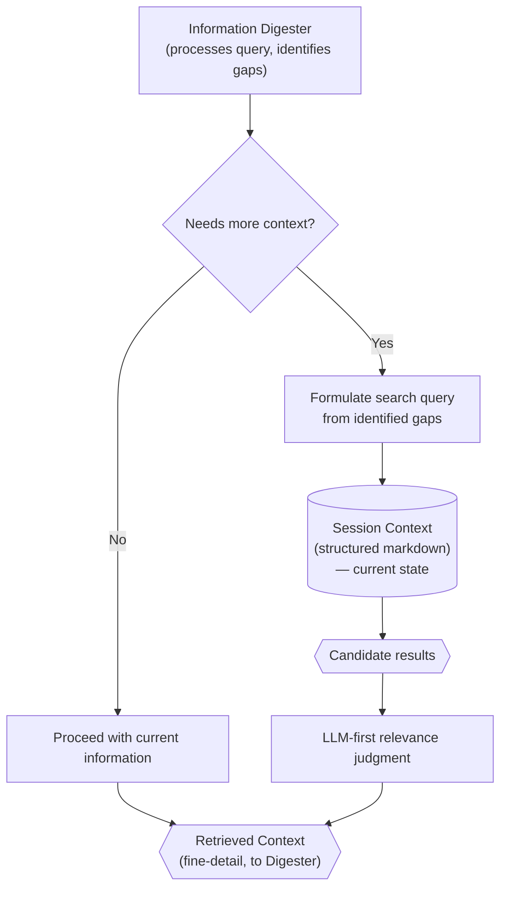

# Enhanced Context Retrieval

> **Category:** Tool Spec

> **File:** `architecture/context-retrieval.md`
> **Last Updated:** 2026-05-30
> **Status:** Implemented
> **See also:** [session-architecture.md](session-architecture.md), [query-analyst.md](query-analyst.md), [information-digestion.md](information-digestion.md)

This document defines Enhanced Context Retrieval — the search tool used by the Information Digester to explore the current Session `Context` as an external information source, without loading it directly into the Information Digester's own context window.

---

## Role

Enhanced Context Retrieval is a **tool** available to the Information Digester. It allows the Information Digester to search the current Session `Context` (the structured markdown loaded by the model for the session) as an external research source.

The Information Digester does not receive the full Session `Context` as its direct context. Instead, it receives what it treats as the user query (the `Context Enhanced Query` from the Query Analyst). When the Information Digester identifies information gaps — details the query alludes to but does not contain — it uses Enhanced Context Retrieval to explore the Session `Context` for the missing information.

Key framing:

- Enhanced Context Retrieval **searches** the current Session `Context`. It does not load it. The Information Digester queries the Session `Context`; it does not ingest it wholesale.
- It is **not** compaction. Compaction is a background system process triggered by context-window pressure (see [session-architecture.md](session-architecture.md)) and is not part of any agent's tool set.
- It is indifferent to compaction state. Whether the Session `Context` is original, compacted, or enriched with memory/recall, the retrieval tool searches whatever current state exists.
- The exact search strategy is an implementation detail.

---

## Inputs / Outputs

**Input:**

- Information needs derived from the Information Digester's query processing (gaps, missing details, entities to resolve)
- Current Session `Context` (structured markdown) — searched as an external data store

**Output:**

- **Retrieved context** — lower-level, finer-detail context retrieved from the Session `Context`. Consumed by the Information Digester to produce `Digested Information`.

---

## Core Principle

Enhanced context retrieval is about precision, not token efficiency alone. The goal is to reduce irrelevant context exposure so agents reason over the context most relevant to their current role.

By searching rather than loading, the Information Digester stays focused while accessing the broader session knowledge when needed.

---

## Retrieval Trigger

Enhanced Context Retrieval is used by the Information Digester when it identifies information gaps while processing the query it received. The Information Digester does not distinguish between a raw user query and a `Context Enhanced Query` — it treats whatever it receives as the query and uses retrieval when it needs more context.

Important rules:

- User query size does **not** trigger enhanced context retrieval.
- The Information Digester decides when to search; retrieval is not automatic.
- The Information Digester is unaware of whether the Session `Context` has been compacted — it searches whatever current state exists.

---

## Relationship to Compaction

Compaction is a **background system process** — not part of any agent's tool set and not shown in the agent architecture diagrams. It is triggered by model context-window pressure and summarizes the current Session `Context` to keep it manageable (see [session-architecture.md](session-architecture.md)).

Enhanced Context Retrieval is indifferent to compaction. It searches the current Session `Context` regardless of whether that context is original, compacted, or enriched with memory/recall. From the retrieval tool's perspective, the Session `Context` is simply the searchable data store that exists at retrieval time.

---

## Session Model

Session storage, compaction, and sub-session propagation are defined in [session-architecture.md](session-architecture.md).

Important retrieval-facing rules:

- `chat_history` is JSON and preserves turns.
- `Context` is structured markdown and is what the model loads. Enhanced Context Retrieval searches it as an external store.
- Sub-sessions can preserve their own isolated `Context` while propagating their `chat_history` into the primary session `chat_history`.

---

## Internal Flow

---

## Search Approach

The exact search strategy (keyword, vector, LLM-based, or combination) is an implementation detail. See Design Decisions below for the architectural approach.

---

## Relationship to Digestion and Task Context

Enhanced Context Retrieval is invoked by the Information Digester. It searches the current Session `Context` to retrieve deep, precise context.

The Information Digester compiles this retrieved context into `Digested Information`.

The Task Analyzer uses Digested Information to create each task's `context` field. This is where task-specific context exposure is established.

---

## Design Decisions

| Decision | Choice | Rationale |
|----------|--------|-----------|
| Context access | Search tool, not direct loading | The Information Digester searches Session Context as an external data store — keeps its own context window small while accessing broad session knowledge |
| Relevance judgment | LLM-judged, not token-proximity | Precision-first approach: semantic relevance matters more than keyword overlap or positional proximity |
| Compaction relationship | Indifferent to compaction state | The retrieval tool searches whatever current Context exists — it does not depend on or trigger compaction |
| Retrieval strategy | Implementation detail | Keyword, vector, LLM-based, or hybrid — the architecture only requires the ability to search without full loading |
