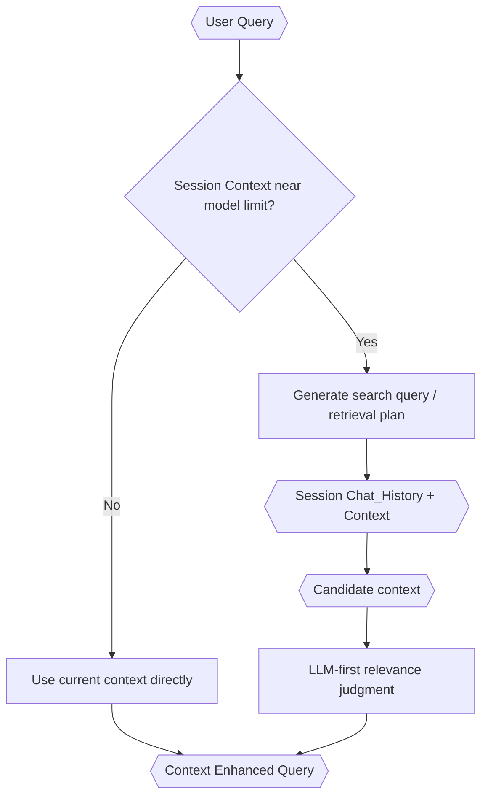

# Enhanced Context Retrieval

> **Category:** Process Spec

> **File:** `architecture/context-retrieval.md`
> **See also:** [session-architecture.md](session-architecture.md), [query-analyst.md](query-analyst.md), [information-digestion.md](information-digestion.md)
> **Last Updated:** 2026-05-27
> **Status:** Draft

This document defines when and how TINYCUA retrieves context from session `Chat_History` and `Context`.

---

## Core Principle

Enhanced context retrieval is about precision, not token efficiency alone. The goal is to reduce irrelevant context exposure so agents reason over the context most relevant to their current role.

---

## Retrieval Trigger

Enhanced context retrieval begins when accumulated session `Context` approaches model context-window pressure.

Important rules:

- User query size does **not** trigger enhanced context retrieval.
- If session `Context` is still small, the system can use it directly.
- Session `Chat_History` should preserve user, agent, and internal-agent turns in JSON form.
- Session `Context` should accumulate as structured markdown and be compacted as needed.

---

## Session Model

Session storage, compaction, and sub-session propagation are defined in [session-architecture.md](session-architecture.md).

Important retrieval-facing rules:

- `Chat_History` is JSON and preserves turns.
- `Context` is structured markdown and is what the model loads.
- Compaction summarizes current `Context`, not raw `Chat_History` from scratch.
- Sub-sessions can preserve their own isolated `Context` while propagating their `Chat_History` into the primary session `Chat_History`.

---

## Retrieval Flow

---

## LLM-First Retrieval

TINYCUA should avoid framing retrieval as conventional RAG where embedding search and hard token packing dominate the design.

The preferred architectural approach is precision-first, LLM-judged retrieval: generate search queries from the current request, search session `Chat_History` and/or `Context` for candidate matches, use an LLM to judge relevance semantically, and produce a Context Enhanced Query containing only the context needed for routing or downstream processing. The Mermaid diagram above captures this flow without prescribing implementation details.

---

## Relationship to Digestion and Task Context

Enhanced Context Retrieval produces a Context Enhanced Query.

Information Digestion can then use the Context Enhanced Query and the available session `Context` to create Digested Information.

The Task Analyzer uses Digested Information to create each task's `context` field. This is where task-specific context exposure is established.

---

## What This Document Does Not Define Yet

This version intentionally avoids defining formal retrieval metrics. Metrics can be added later after the architecture stabilizes.
