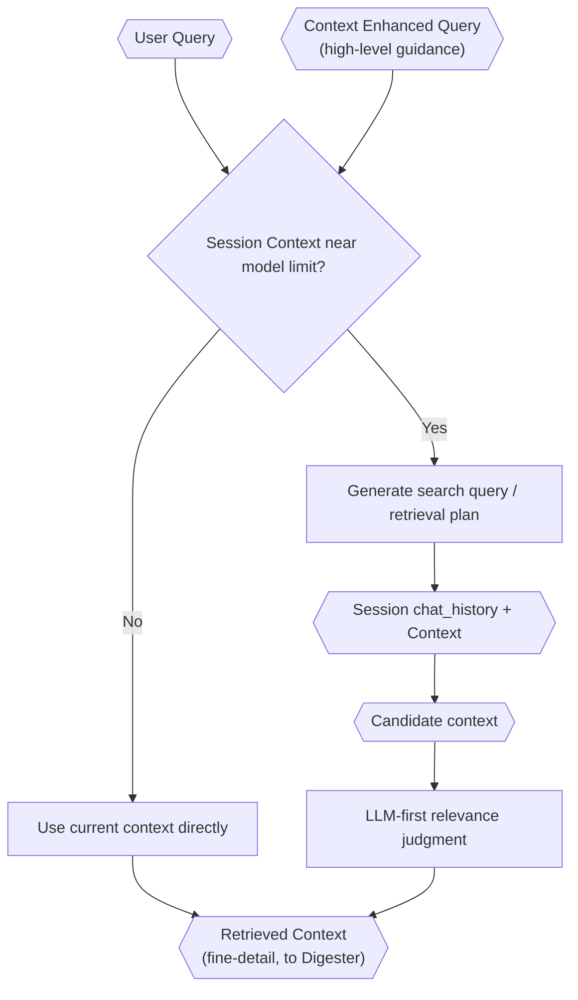

# Enhanced Context Retrieval

> **Category:** Process Spec

> **File:** `architecture/context-retrieval.md`
> **Last Updated:** 2026-05-27
> **Status:** Draft
> **See also:** [session-architecture.md](session-architecture.md), [query-analyst.md](query-analyst.md), [information-digestion.md](information-digestion.md)

This document defines the deep, precision-oriented context retrieval process used by the Information Digester to compile fine-detail context from session `chat_history` and `Context`.

---

## Role

The Enhanced Context Retrieval process is invoked by the Information Digester. It receives a `Context Enhanced Query` (high-level) as guidance and performs deep, precision-oriented search of session `chat_history` and `Context` to retrieve lower-level, finer-detail context. The retrieved context is then compiled by the Information Digester into `Digested Information`.

---

## Inputs / Outputs

**Input:**

- `context_enhanced_query` (high-level) — guidance for what to search for
- `user_query`
- Session `chat_history` (JSON turn log)
- Session `Context` (structured markdown)
- Context-window pressure trigger (accumulated `Context` size relative to model limit)

**Output:**

- **Retrieved context** — lower-level, finer-detail context retrieved from session data. Consumed by the Information Digester to produce `Digested Information`.

---

## Core Principle

Enhanced context retrieval is about precision, not token efficiency alone. The goal is to reduce irrelevant context exposure so agents reason over the context most relevant to their current role.

---

## Retrieval Trigger

Enhanced Context Retrieval is invoked by the Information Digester. Deep search of session data is triggered when accumulated session `Context` approaches model context-window pressure; when `Context` is small, the system can use it directly without deep search.

Important rules:

- User query size does **not** trigger enhanced context retrieval.
- If session `Context` is still small, the system can use it directly.
- Session `chat_history` should preserve user, agent, and internal-agent turns in JSON form.
- Session `Context` should accumulate as structured markdown and be compacted as needed.

---

## Session Model

Session storage, compaction, and sub-session propagation are defined in [session-architecture.md](session-architecture.md).

Important retrieval-facing rules:

- `chat_history` is JSON and preserves turns.
- `Context` is structured markdown and is what the model loads.
- Compaction summarizes current `Context`, not raw `chat_history` from scratch.
- Sub-sessions can preserve their own isolated `Context` while propagating their `chat_history` into the primary session `chat_history`.

---

## Internal Flow

---

## LLM-First Retrieval

TINYCUA should avoid framing retrieval as conventional RAG where embedding search and hard token packing dominate the design.

The preferred architectural approach is precision-first, LLM-judged retrieval: generate search queries from the CEQ (high-level guidance), search session `chat_history` and/or `Context` for candidate matches, use an LLM to judge relevance semantically, and produce fine-detail retrieved context for the Information Digester to compile into `Digested Information`. The Mermaid diagram above captures this flow without prescribing implementation details.

---

## Relationship to Digestion and Task Context

Enhanced Context Retrieval is invoked by the Information Digester. It receives the Context Enhanced Query (high-level, from the Query Analyst) as guidance and retrieves deep, precise context from session `chat_history` and `Context`.

The Information Digester compiles this retrieved context with other inputs into `Digested Information`.

The Task Analyzer uses Digested Information to create each task's `context` field. This is where task-specific context exposure is established.

