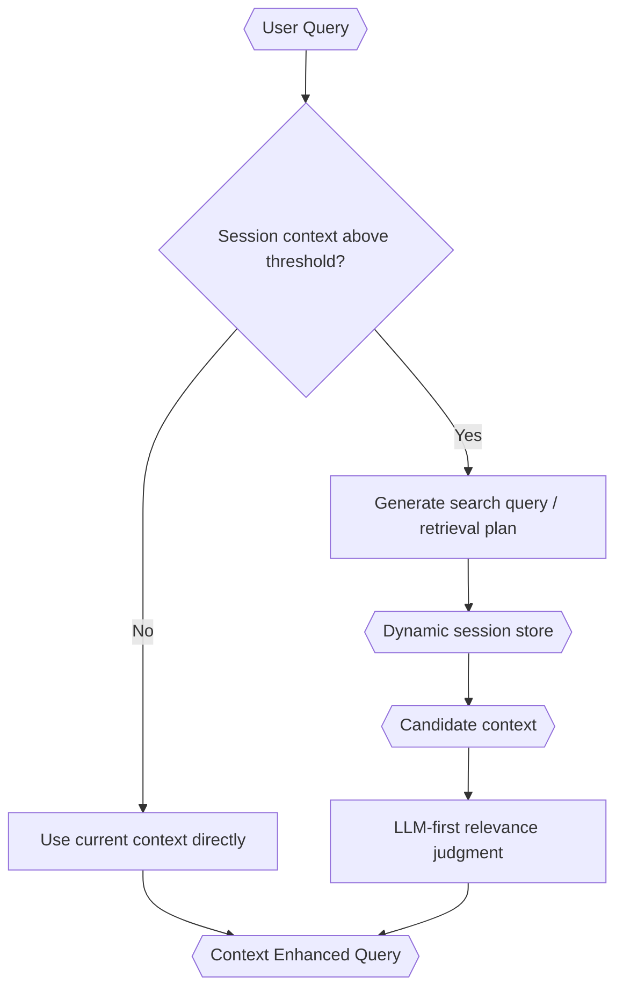

# Enhanced Context Retrieval

> **Category:** Process Spec

> **File:** `architecture/context-retrieval.md`
> **Last Updated:** 2026-05-27
> **Status:** Draft

This document defines when and how TINYCUA retrieves context from accumulated session history.

---

## Core Principle

Enhanced context retrieval is about precision, not token efficiency alone. The goal is to reduce irrelevant context exposure so agents reason over the context most relevant to their current role.

---

## Retrieval Trigger

Enhanced context retrieval begins when accumulated session context reaches a configured token-size threshold.

Important rules:

- User query size does **not** trigger enhanced context retrieval.
- If the session context is still small, the system can use the context directly.
- Every user-query/agent-response turn should be stored in a dynamically retrievable form.
- Session context accumulates over time and should be compacted as needed.

---

## Session Storage

Each turn should be stored with enough structure for later retrieval.

```yaml
session_turn:
  turn_id: turn_001
  user_query: "..."
  agent_response: "..."
  timestamp: "..."
  entities:
    - "..."
  topics:
    - "..."
  retrievable_notes:
    - "..."
```

Compacted summaries may replace or supplement older raw turns as the session grows.

---

## Retrieval Flow



---

## LLM-First Retrieval

TINYCUA should avoid framing retrieval as conventional RAG where embedding search and hard token packing dominate the design.

Preferred direction:

1. Generate one or more search queries from the current request.
2. Search the dynamic session store by keyword, topic, entity, recency, or summary.
3. Use an LLM or fast LLM to judge relevance semantically.
4. Produce a Context Enhanced Query containing only the context needed for routing or downstream processing.

---

## Relationship to Digestion and Task Context

Enhanced Context Retrieval produces a Context Enhanced Query.

Information Digestion can then use the Context Enhanced Query and the available session context to create Digested Information.

Task Analysis uses Digested Information to create each task's `context` field. This is where task-specific context exposure is established.

---

## What This Document Does Not Define Yet

This version intentionally avoids defining formal retrieval metrics. Metrics can be added later after the architecture stabilizes.
