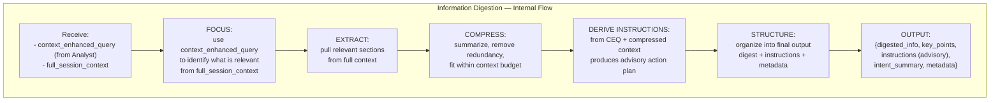

# Information Digestion

> **Category:** Agent Spec

> **File:** `architecture/information-digestion.md`
> **See also:** [Overview.md](overview.md), [Query_Analyst.md](query-analyst.md), [Task_Analysis.md](task-analysis.md)

---

## Role

The Information Digestion agent receives **two inputs** and produces a structured output containing:
- `digested_info` + `key_points` — the compressed context
- `instructions` — **advisory** guidance for the Worker (what to do with the context)
- `metadata` — size estimates, remaining context summary

The Context Enhanced Query tells it *what* to focus on; the full session context provides the *raw material* to extract from. The instructions are derived from both — capturing the user's intent from the CEQ and grounding it in what the context actually contains.

---

## Inputs / Outputs

**Input 1:** `context_enhanced_query` — the query enriched with relevant context by the Query Analyst
**Input 2:** `full_session_context` — the complete session context (history, documents, files)

**Output:**
```json
{
  "digested_info": "compressed content relevant to the task",
  "key_points": ["point 1", "point 2"],
  "instructions": {
    "action": "compare_and_analyze",
    "parameters": {
      "targets": ["Paper A", "Paper B"],
      "aspect": "methodology_differences"
    },
    "constraints": ["focus on methodology", "include citations"],
    "advisory": true
  },
  "original_intent_summary": "Compare two research papers",
  "relevant_context_size": "medium",
  "remaining_context_summary": "Additional papers not in focus..."
}
```

---

## Internal Flow



---

## Pseudo-code

```python
class InformationDigestion:
    """
    Takes Context Enhanced Query + Full Session Context
    and produces:
    - compressed digest (what the context says)
    - advisory instructions (what to do with it)
    - metadata
    """
    
    def digest(self, context_enhanced_query, full_session_context):
        # Phase 1: Use the enhanced query to focus extraction
        focus_areas = self.identify_focus_areas(context_enhanced_query)
        
        # Phase 2: Pull relevant sections from full context
        relevant_sections = self.extract_relevant(
            context=full_session_context,
            focus=focus_areas
        )
        
        # Phase 3: Compress (summarize, deduplicate, fit budget)
        compressed = self.compress(relevant_sections)
        
        # Phase 4: Derive instructions from CEQ + compressed context
        instructions = self.derive_instructions(
            enhanced_query=context_enhanced_query,
            compressed_context=compressed
        )
        
        # Phase 5: Structure final output
        return {
            "digested_info": compressed["summary"],
            "key_points": compressed["key_points"],
            "instructions": instructions,  # advisory, not strict
            "original_intent_summary": self.summarize_intent(context_enhanced_query),
            "relevant_context_size": self.estimate_size(compressed),
            "remaining_context_summary": compressed["left_out"]
        }
    
    def identify_focus_areas(self, enhanced_query):
        """Parse the CEQ to determine what parts of context are relevant."""
        return {
            "primary_topic": extract_topic(enhanced_query),
            "key_entities": extract_entities(enhanced_query),
            "time_range": extract_time_reference(enhanced_query),
        }
    
    def extract_relevant(self, context, focus):
        """Pull only the parts of full_session_context that match focus areas."""
        return filter_by_relevance(context, focus)
    
    def compress(self, relevant_sections):
        """Summarize while preserving key information, within token budget."""
        return llm_summarize(
            content=relevant_sections,
            max_tokens=self.token_budget,
            format="structured"
        )
    
    def derive_instructions(self, enhanced_query, compressed_context):
        """
        Generate advisory instructions for the Worker.
        Uses the CEQ to capture user intent,
        then grounds it in what the context actually contains.
        
        The output is ADVISORY (advisory=true) so the
        Task Analysis agent can adapt if needed.
        """
        intent = self.extract_intent(enhanced_query)
        
        return {
            "action": intent["action"],      # e.g., "compare", "summarize", "search"
            "parameters": intent["params"],   # e.g., targets, aspects
            "constraints": intent["constraints"],  # e.g., focus areas, exclusions
            "advisory": True  # Task Analysis may adapt
        }
    
    def extract_intent(self, enhanced_query):
        """
        Parse the user's intent from the Context Enhanced Query.
        Produces structured action + parameters.
        """
        return llm_parse_intent(enhanced_query)
```

---

## Why both inputs?

| Input | Purpose |
|-------|---------|
| `context_enhanced_query` | **What to focus on** — the query already enriched with retrieved context tells us what matters and what the user intends |
| `full_session_context` | **Where to extract from** — the complete context provides all raw information the Worker might need |

---

## Key Design Decisions

| Decision | Choice | Rationale |
|----------|--------|-----------|
| Loop type | **Linear (no loop)** | Purely extractive/transformative — no tools, no branching. Single LLM pass. |
| Instructions | **Advisory** (`advisory: true`) | SLMs hallucinate less with flexibility; Task Analysis can adapt if needed |
| Original query included? | **No** | Task Analysis would lazily default to raw query; recovery belongs at orchestration level |
| Who generates instructions? | **Information Digestion** (not Query Analyst) | Digestion sees both intent (CEQ) and material (full context) — best positioned |
| What if digest is insufficient? | **Reviewer escalates to outer loop** | Not a raw-query crutch — the system-level fix is re-digest or re-classify |
