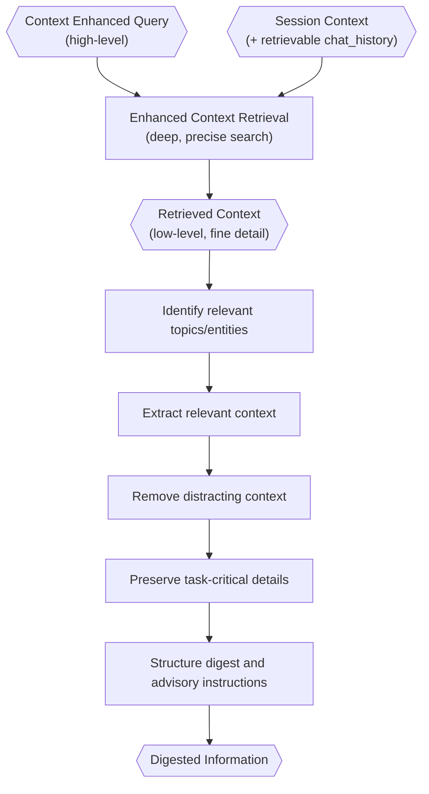

# Information Digester

> **Category:** Agent Spec

> **File:** `architecture/information-digestion.md`
> **Last Updated:** 2026-05-27
> **Status:** Draft
> **See also:** [overview.md](overview.md), [query-analyst.md](query-analyst.md), [session-architecture.md](session-architecture.md), [context-retrieval.md](context-retrieval.md), [primary-agent.md](primary-agent.md), [worker-orchestration.md](worker-orchestration.md), [task-analysis.md](task-analysis.md), [state-objects.md](state-objects.md)

---

## Role

The Information Digester performs Enhanced Context Retrieval to compile lower-level, finer-detail context, then turns it into precision-oriented `Digested Information`.

It should preserve task-critical details and remove distracting context. The purpose is not merely token reduction; the purpose is reducing irrelevant context exposure.

The Information Digester is a privileged narrowing boundary: it may inspect broad session `Context` and perform deep retrieval, but downstream agents should receive only the consolidated output they need.

---

## Inputs / Outputs

**Input:**

- `context_enhanced_query` (high-level) — guidance for deep retrieval
- session `Context` when needed
- retrievable session `chat_history` when needed
- caller: `primary_agent` or `worker`

**Tools:**

- **Enhanced Context Retrieval** — deep, precision-oriented search of session `chat_history` and `Context` to retrieve fine-detail context. See [context-retrieval.md](context-retrieval.md).

**Output:**

The digest is sent to downstream agents as structured text; storage format is an implementation detail. Canonical output schema and section descriptions are in [state-objects.md](state-objects.md).

---

## Internal Flow

---

## Downstream Use

In Worker Mode, the Task Analyzer uses Digested Information to create a sequential roadmap. Each task receives its own `context` field.

In Primary Agent Mode, the Primary Agent may invoke Information Digestion if the Context Enhanced Query needs broader context consolidation before response composition.

---

## Advisory Instructions

Instructions are advisory. They guide downstream agents but do not rigidly constrain them.

The Task Analyzer can adapt the plan if the digest suggests a better task roadmap. The Primary Agent can adapt presentation while staying within the provided information.

---

## Design Decisions

| Decision | Choice | Rationale |
|----------|--------|-----------|
| Deep retrieval location | Information Digester | Query Analyst stays fast with high-level scan; deep, precise retrieval belongs in the precision stage |
| Retrieval approach | Precision-first, LLM-judged | Generate search queries from CEQ, search session data, use LLM to judge relevance semantically |
| Main objective | Precision-oriented digestion | Reduce irrelevant context exposure, not only token count |
| Boundary | Privileged narrowing boundary | Digestion can inspect broad context without leaking broad context downstream |
| Instructions | Advisory | Allows downstream agents to adapt without drifting from context |

| Known gaps | Explicitly signaled | Prevents downstream agents from hallucinating to fill missing information |
