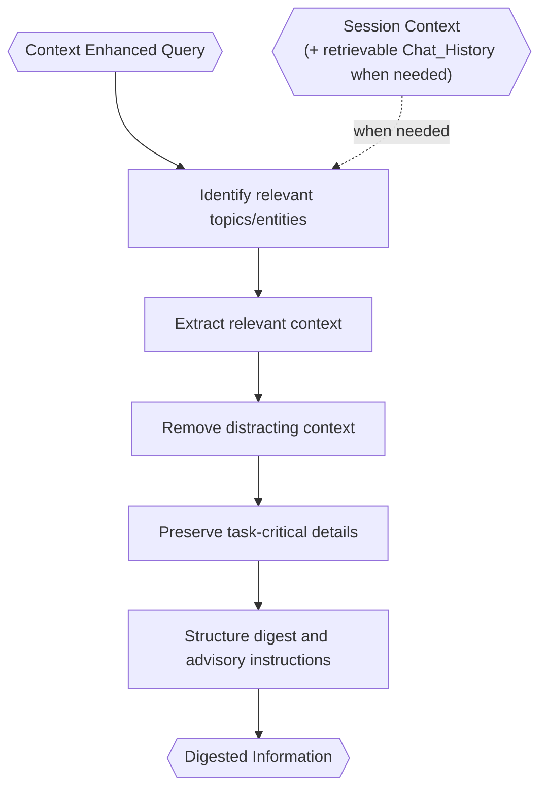

# Information Digester

> **Category:** Agent Spec

> **File:** `architecture/information-digestion.md`
> **See also:** [overview.md](overview.md), [query-analyst.md](query-analyst.md), [session-architecture.md](session-architecture.md), [context-retrieval.md](context-retrieval.md), [task-analysis.md](task-analysis.md)

---

## Role

The Information Digester turns broad session `Context` into precision-oriented `Digested Information`.

It should preserve task-critical details and remove distracting context. The purpose is not merely token reduction; the purpose is reducing irrelevant context exposure.

The Information Digester is a privileged narrowing boundary: it may inspect broad session `Context`, but downstream agents should receive only the consolidated output they need.

---

## Inputs / Outputs

**Input:**

- `context_enhanced_query`
- session `Context` when needed
- retrievable session `Chat_History` when needed
- caller: `primary_agent` or `worker`

**Output:**

```yaml
digested_information:
  digested_info: "compressed relevant context"
  key_points:
    - "..."
  context_candidates:
    - "candidate context for downstream task contexts"
  entity_map:
    entity_name: "relevant details"
  relevance_notes:
    - "why selected context matters"
  known_gaps:
    - "information that may be missing"
  instructions:
    action: "..."
    constraints:
      - "..."
    advisory: true
  original_intent_summary: "..."
```

---

## Internal Flow



---

## Downstream Use

In Worker Mode, the Task Analyzer uses Digested Information to create a sequential roadmap. Each task receives its own `context` field.

In Primary Agent Mode, the Primary Agent may invoke Information Digestion if the Context Enhanced Query needs broader context consolidation before response composition.

---

## Advisory Instructions

Instructions are advisory. They guide downstream agents but do not rigidly constrain them.

The Task Analyzer can adapt the plan if the digest suggests a better task roadmap. The Primary Agent can adapt presentation while staying within the provided information.

---

## Design Decisions

| Decision | Choice | Rationale |
|----------|--------|-----------|
| Main objective | Precision-oriented digestion | Reduce irrelevant context exposure, not only token count |
| Boundary | Privileged narrowing boundary | Digestion can inspect broad context without leaking broad context downstream |
| Instructions | Advisory | Allows downstream agents to adapt without drifting from context |
| Output support | Context candidates and known gaps | Helps the Task Analyzer create task-specific context |
| Original query included? | No raw-query crutch by default | Downstream agents should work from CEQ/digest, not default to broad history |
