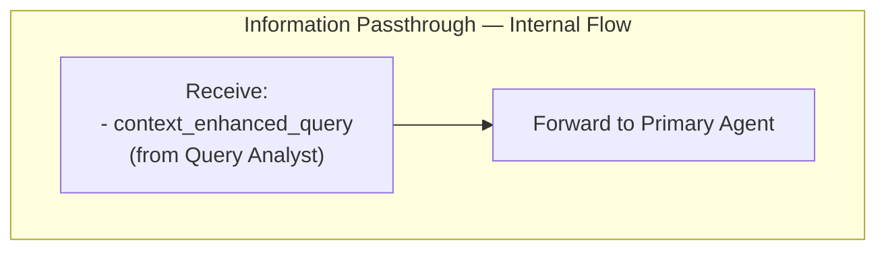

# Information Passthrough

> **Category:** Process Spec

> **File:** `architecture/information-passthrough.md`
> **See also:** [overview.md](overview.md), [query-analyst.md](query-analyst.md), [primary-agent.md](primary-agent.md)

---

## Role

This is **not an agent**. It is a deterministic non-agent process that receives the **Context Enhanced Query** from the Query Analyst and forwards it directly to the Primary Agent without any transformation.

Used in **Passthrough Mode** when the Query Analyst's Mode Decision selects `passthrough`.

---

## Inputs / Outputs

**Input:** `context_enhanced_query` — from Query Analyst
**Output:** `context_enhanced_query` — forwarded unchanged to Primary Agent

---

## Internal Flow

---

## Design Notes

- No LLM call
- No transformation
- No looping
- Exists purely as a routing node for Passthrough Mode
- The Primary Agent may receive mode metadata from the router, but the Context Enhanced Query itself is forwarded unchanged
