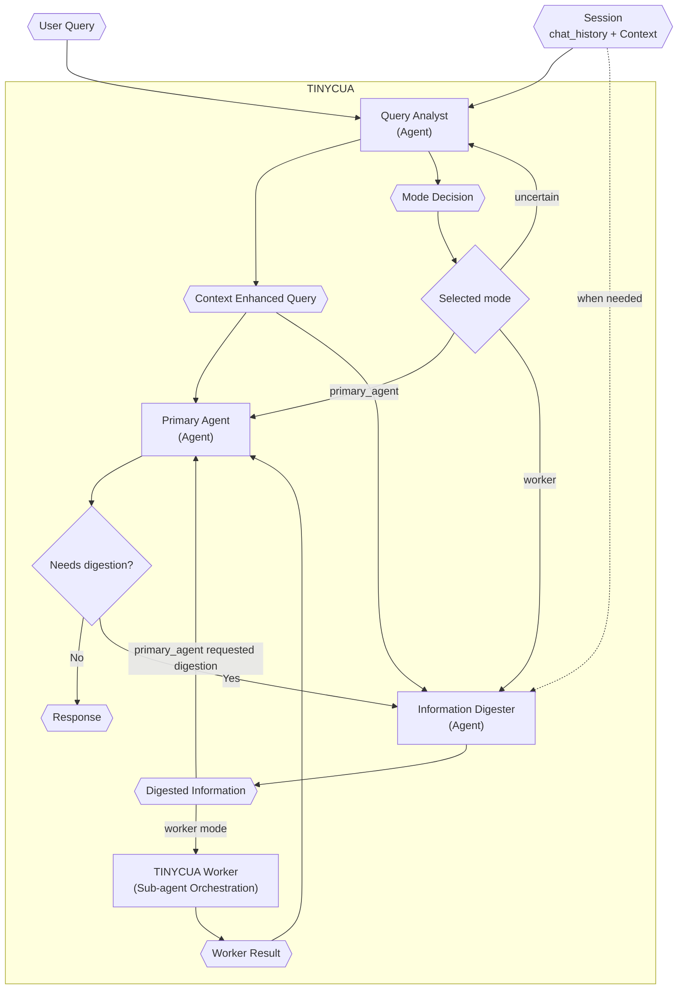

# TINYCUA Architecture Overview

> **Category:** Architecture Overview
> **File:** `architecture/overview.md`
> **Last Updated:** 2026-05-27
> **Status:** Draft
> **See also:** [session-architecture.md](session-architecture.md), [state-objects.md](state-objects.md), [query-analyst.md](query-analyst.md)

This document describes the top-level orchestration of TINYCUA and how its agents connect.

---

## Architecture Thesis

TINYCUA is not only decomposing work; it is decomposing **context exposure**.

As session `Context` grows, smaller language models are more likely to hallucinate because they must attend to, filter, and reason over more irrelevant information. TINYCUA's hypothesis is that precision improves when each internal agent receives only the context needed for its specific responsibility.

Work decomposition is therefore a means to context decomposition.

---

## Routing Modes

The Query Analyst produces a `Mode Decision`:

- **Primary Agent Mode:** Query Analyst → Primary Agent. The Primary Agent may invoke Information Digestion if it needs consolidated context before answering.
- **Worker Mode:** Query Analyst → Information Digester → TINYCUA Worker → Primary Agent
- **Uncertain Mode:** Query Analyst must choose an explicit `uncertain_next_action`, such as exploring more or asking the user.

Worker Mode is an internal specialized-agent orchestration presented externally as one TINYCUA agent.

---

## Worker Summary

The Worker is a sequential roadmap executor. It is not a parallel dependency scheduler.

1. The Task Analyzer creates and optionally refines the sequential task list.
2. The Task Executor runs the current task using only that task's `context` plus shallow roadmap awareness.
3. The Task Reviewer accepts, retries, replans, escalates, and updates relevant future task contexts.
4. Accepted task results are aggregated into the Worker Result.

See [worker-orchestration.md](worker-orchestration.md) for the full Worker flow.

---

## Key State Objects

The architecture should make state explicit so human-in-the-loop continuation can resume the correct internal agent.

Important objects:

- Session
- Session chat_history
- Session Context
- Context Enhanced Query
- Mode Decision
- Digested Information
- Task List
- Task Result
- Reviewer Decision
- Worker Result
- Agent State / Continuation State

See [state-objects.md](state-objects.md) for object definitions.

---

## Agent Reference

| Component | File | Type | Role |
|-----------|------|------|------|
| Query Analyst | [query-analyst.md](query-analyst.md) | ReAct Agent | Retrieves context when session `Context` is large and produces CEQ + Mode Decision |
| Information Digester | [information-digestion.md](information-digestion.md) | LLM Agent | Produces precision-oriented Digested Information |
| TINYCUA Worker | [worker-orchestration.md](worker-orchestration.md) | Sub-agent Orchestration | Runs Task Analyzer, Task Executor, and Task Reviewer sequentially |
| Task Analyzer | [task-analysis.md](task-analysis.md) | ReAct Agent | Creates the sequential task roadmap |
| Task Executor | [task-execution.md](task-execution.md) | ReAct Agent | Executes one task with task-specific context |
| Task Reviewer | [task-reviewer.md](task-reviewer.md) | Hybrid Decision Agent | Reviews results and updates future task contexts |
| Primary Agent | [primary-agent.md](primary-agent.md) | ReAct Agent | Produces final user-facing response |

---

## Agent Loop Types

| Agent | Loop Type | Tools | Notes |
|-------|-----------|-------|-------|
| Query Analyst | Context retrieval + classification | Enhanced Context Retrieval | Produces `primary_agent`, `worker`, or `uncertain` decision |
| Information Digester | Precision-oriented digestion | Optional retrieval/read tools | Removes distracting context and preserves task-critical information |
| Task Analyzer | Effort-controlled planning | Optional info/research tools | Produces a sequential roadmap, not a dependency graph |
| Task Executor | ReAct | Task tools | Produces result + execution log |
| Task Reviewer | Hybrid decision | Validation + optional inspection tools | Accepts, retries, replans, escalates, and propagates context |
| Primary Agent | Response composition | Formatting/verification tools | Should not bypass Worker guarantees with new research |

---

## Color Legend (for diagrams)

| Shape | Meaning |
|-------|---------|
| Hexagon (`{{ }}`) | Data/state object |
| Rectangle (`[ ]`) | Agent or process |
| Diamond (`{ }`) | Decision |
| Dashed edge | Optional or limited context exposure |

---
