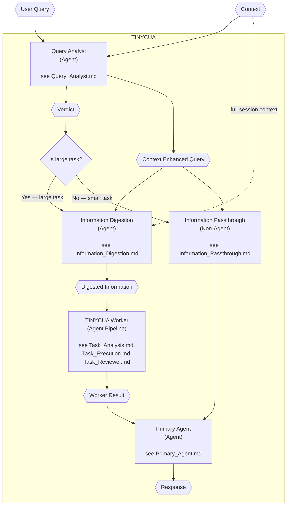

# TINYCUA Architecture Overview

> **Category:** Process Spec

> **File:** `architecture/overview.md`

> **Last Updated:** 2026-05-25
> **Status:** Draft

This document describes the **top-level orchestration** of TINYCUA — the two-mode flow and how agents connect.

---

## Two-Mode Architecture

TINYCUA has exactly **two modes**, determined by the Query Analyst's verdict:

- **Passthrough Mode** (small task): Query Analyst → Information Passthrough → Primary Agent
- **Worker Mode** (large task): Query Analyst → Information Digestion → TINYCUA Worker → Primary Agent



---

## Agent Reference

| Agent | File | Type | Role |
|-------|------|------|------|
| **Query Analyst** | [Query_Analyst.md](query-analyst.md) | ReAct Agent | Retrieves context, produces Verdict + CEQ |
| **Information Digestion** | [Information_Digestion.md](information-digestion.md) | Linear LLM | Compresses CEQ + full context into digest + instructions |
| **Information Passthrough** | [Information_Passthrough.md](information-passthrough.md) | Non-Agent | Forwards CEQ directly to Primary Agent |
| **Task Analysis** (inside Worker) | [Task_Analysis.md](task-analysis.md) | ReAct Agent | Decomposes task into subtask list |
| **Task Execution** (inside Worker) | [Task_Execution.md](task-execution.md) | ReAct Agent | Executes a single subtask with tools |
| **Task Reviewer** (inside Worker) | [Task_Reviewer.md](task-reviewer.md) | Decision Agent | Reviews task result, updates context |
| **Primary Agent** | [Primary_Agent.md](primary-agent.md) | ReAct Agent | Produces final user-facing response |
| **Analysis: Digest vs Query** | [analysis_digested_info_vs_query.md](analysis_digested_info_vs_query.md) | Decision Record | Resolves whether Worker should receive original query alongside digest |

---

## Data Flow Summary

```
User Query + Context
    │
    ▼
[Query Analyst]
    ├── Verdict ──────────────────────────► "Is large task?" decision
    └── Context Enhanced Query ─────┐
                                    │
                    ┌───────────────┴───────────────┐
                    ▼                               ▼
        [Information Digestion]         [Information Passthrough]
                    │                               │
                    ▼                               │
        Digested Information +                      │
        Advisory Instructions                       │
                    │                               │
                    ▼                               │
        [TINYCUA Worker]                            │
            Task Analysis →                         │
            Task Execution →                        │
            Task Reviewer                           │
                    │                               │
                    ▼                               │
        Worker Result                               │
                    └───────────┐ ┌─────────────────┘
                                ▼ ▼
                        [Primary Agent]
                                │
                                ▼
                            Response
```

---

## Agent Loop Types

| Agent | Loop Type | Tools | Default Max Iterations |
|-------|-----------|-------|----------------------|
| Query Analyst | Iterative context retrieval + ReAct (bounded) | `Enhanced Context Retrieval Tool` | 3 |
| Information Digestion | Linear (no loop) | None (dual-input LLM call) | 1 |
| Task Analysis | ReAct (bounded) | (optional) info/research tools | 3 |
| Task Execution | ReAct (open-ended, bounded) | Various (search, read, code) | Per-task max |
| Task Reviewer | Linear (decision) | None | 1 |
| Primary Agent | ReAct (bounded) | (optional) format/verify tools | 3 |

---

## Color Legend (for all diagrams)

| Shape | Color | Meaning |
|-------|-------|---------|
| Hexagon ({{ }}) | Light green (#C8E79D) | **Data** — information, lists, results |
| Rectangle ([ ]) | Light pink (#F4CCCC) | **Agent** — LLM-powered or intelligent component |
| Rectangle ([ ]) | Light purple (#E6E0F0) | **Non-Agent Process** — deterministic logic |
| Diamond ({ }) | Light orange (#FFE0B2) | **Decision** — branching/condition logic |
| Dashed border | Various | **Internal loop boundary** |
