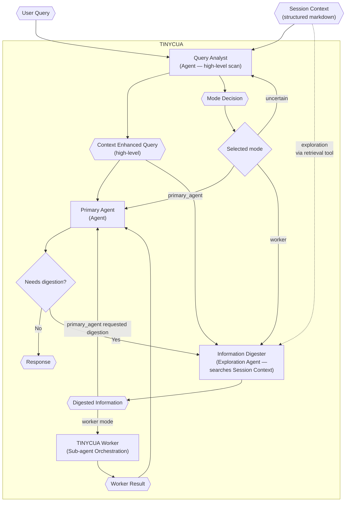

# TINYCUA Architecture Overview

> **Category:** Architecture Overview

> **File:** `architecture/overview.md`
> **Last Updated:** 2026-05-27
> **Status:** Implemented
> **See also:** [session-architecture.md](session-architecture.md), [state-objects.md](state-objects.md), [query-analyst.md](query-analyst.md), [information-digestion.md](information-digestion.md), [worker-orchestration.md](worker-orchestration.md)

This document describes the top-level orchestration of TINYCUA and how its agents connect.

---

## Architecture Thesis

TINYCUA is not only decomposing work; it is decomposing **context exposure**.

As session `Context` grows, smaller language models are more likely to hallucinate because they must attend to, filter, and reason over more irrelevant information. TINYCUA's hypothesis is that precision improves when each internal agent receives only the context needed for its specific responsibility.

Work decomposition is therefore a means to context decomposition.

---

## Routing Modes

The Query Analyst produces a `Mode Decision`:

- **Primary Agent Mode:** Query Analyst (high-level scan) → Primary Agent. The Primary Agent may invoke Information Digestion if it needs consolidated, precise context before answering.
- **Worker Mode:** Query Analyst (high-level scan) → Information Digester (explores Session Context via Enhanced Context Retrieval) → TINYCUA Worker → Primary Agent
- **Uncertain Mode:** Query Analyst must choose an explicit `uncertain_next_action`, such as exploring more or asking the user.

Worker Mode is an internal specialized-agent orchestration presented externally as one TINYCUA agent.

---

## Worker Summary

The Worker is a sequential roadmap executor. It is not a parallel dependency scheduler.

1. Task Creation runs at Worker start: when effort is high, the Task Assessor selects complex tasks and the Task Analyzer is invoked repeatedly to build a nested task tree (see [task-creation.md](task-creation.md)).
2. The Task Executor runs the current task using only that task's `context` plus shallow roadmap awareness.
3. The Result Reviewer accepts, retries, replans, escalates, and propagates context to future tasks.
4. Accepted task results are aggregated into the Worker Result.

See [worker-orchestration.md](worker-orchestration.md) for the full Worker flow.

---

## Key State Objects

The architecture should make state explicit so human-in-the-loop continuation can resume the correct internal agent.

Important objects:

- Session
- Session Context
- Context Enhanced Query
- Mode Decision
- Digested Information
- Task List
- Task Result
- Reviewer Decision
- Worker Result
- Agent State / Continuation State

See [state-objects.md](state-objects.md) for object definitions.

---

## Agent Reference

| Component | File | Type | Role |
|-----------|------|------|------|
| Query Analyst | [query-analyst.md](query-analyst.md) | ReAct Agent | Performs fast, high-level context scan and produces CEQ + Mode Decision |
| Information Digester | [information-digestion.md](information-digestion.md) | Exploration Agent | Explores the current Session `Context` via Enhanced Context Retrieval and produces precision-oriented Digested Information |
| TINYCUA Worker | [worker-orchestration.md](worker-orchestration.md) | Sub-agent Orchestration | Runs Task Creation, Task Assessor, Task Analyzer, Task Executor, and Result Reviewer sequentially |
| Task Creation | [task-creation.md](task-creation.md) | Process Spec | Upfront decomposition loop: iteratively invokes the Task Analyzer to build a nested task tree |
| Task Assessor | [task-assessor.md](task-assessor.md) | Agent Spec | Selects which tasks should be decomposed further during Task Creation |
| Task Analyzer | [task-analysis.md](task-analysis.md) | Linear Agent | Creates the sequential task roadmap (single pass: input → output) |
| Task Executor | [task-execution.md](task-execution.md) | ReAct Agent | Executes one task with task-specific context |
| Result Reviewer | [result-reviewer.md](result-reviewer.md) | Hybrid Decision Agent | Reviews results and updates future task contexts |
| Primary Agent | [primary-agent.md](primary-agent.md) | ReAct Agent | Produces final user-facing response |

---

## Agent Loop Types

| Agent | Loop Type | Tools | Notes |
|-------|-----------|-------|-------|
| Query Analyst | High-level context scan + classification | None (scans session context directly) | Produces `primary_agent`, `worker`, or `uncertain` decision |
| Information Digester | Precision-oriented exploration | Enhanced Context Retrieval (searches Session Context as external source) | Searches Session Context via retrieval tool; produces precision-oriented Digested Information |
| Task Creation | Iterative decomposition loop | None (orchestrates Task Analyzer) | Invokes Task Analyzer iteratively at Worker start; effort controls nesting depth |
| Task Assessor | Linear (single-pass selection) | None | Selects which tasks to decompose between Task Creation passes; decomposition is delegated to the Task Analyzer |
| Task Analyzer | Linear (single-pass) | Optional info/research tools | Single-pass roadmap generation from structured input; multi-pass decomposition is handled by the Task Creation loop |
| Task Executor | ReAct | Task tools | Produces result + execution log |
| Result Reviewer | Hybrid decision | Validation + optional inspection tools | Accepts, retries, replans, escalates, and propagates context |
| Primary Agent | Response composition | Formatting/verification tools | Should not bypass Worker guarantees with new research |

---

## Diagram Legend

| Shape | Meaning |
|-------|---------|
| Hexagon (`{{ }}`) | Data/state object |
| Rectangle (`[ ]`) | Agent or process |
| Diamond (`{ }`) | Decision |
| Dashed edge | Optional or limited context exposure |

---
