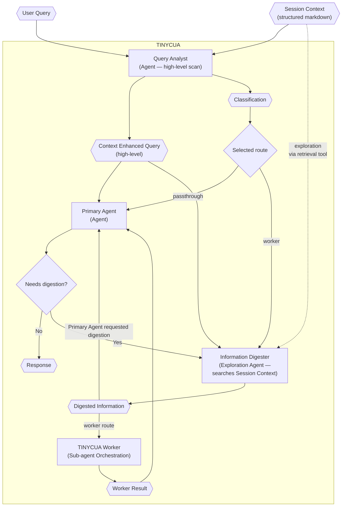

# TINYCUA Architecture Overview

> **Category:** Architecture Overview

> **File:** `architecture/overview.md`
> **Last Updated:** 2026-05-30
> **Status:** Implemented
> **See also:** [session-architecture.md](session-architecture.md), [state-objects.md](state-objects.md), [query-analyst.md](query-analyst.md), [information-digestion.md](information-digestion.md), [worker-orchestration.md](worker-orchestration.md), [primary-agent.md](primary-agent.md), [task-analysis.md](task-analysis.md), [task-assessor.md](task-assessor.md), [task-creation.md](task-creation.md), [task-execution.md](task-execution.md), [result-reviewer.md](result-reviewer.md)

This document describes the top-level orchestration of TINYCUA and how its agents connect.

---

## Architecture Thesis

TINYCUA is not only decomposing work; it is decomposing **context exposure**.

As session `Context` grows, smaller language models are more likely to hallucinate because they must attend to, filter, and reason over more irrelevant information. TINYCUA's hypothesis is that precision improves when each internal agent receives only the context needed for its specific responsibility.

Work decomposition is therefore a means to context decomposition.

---

## Routing / Classification

The Query Analyst produces a `Classification` — a label chosen from configurable options:

- **Passthrough:** Query Analyst (high-level scan) → Primary Agent. The Primary Agent may invoke Information Digestion if it needs consolidated, precise context before answering.
- **Worker:** Query Analyst (high-level scan) → Information Digester (explores Session Context via Enhanced Context Retrieval) → TINYCUA Worker → Primary Agent

`uncertain` is not a label. If the agent cannot decide, it does not produce a terminal
classification; the loop retries or keeps the agent active (allowing HITL through
passthrough on the next user query).

Worker Mode is an internal specialized-agent orchestration presented externally as one TINYCUA agent.

---

## Worker Summary

The Worker is a sequential roadmap executor. It is not a parallel dependency scheduler.

1. Task Creation runs at Worker start: when effort is high, the Task Assessor and Task Analyzer work iteratively to build a nested task tree (see [task-creation.md](task-creation.md)).
2. The Task Executor runs the current task using only that task's `context` plus shallow roadmap awareness.
3. The Result Reviewer accepts, retries, replans, escalates, and propagates context to future tasks.
4. Accepted task results are aggregated into the Worker Result.

See [worker-orchestration.md](worker-orchestration.md) for the full Worker flow.

---

## Key State Objects

The architecture should make state explicit so human-in-the-loop continuation can resume the correct internal agent.

Important objects:

- Session
- Session Context
- Context Enhanced Query
- Classification
- Digested Information
- Task Tree
- Task Result
- Reviewer Decision
- Worker Result
- Agent State / Continuation State

See [state-objects.md](state-objects.md) for object definitions.

---

## Component Reference

| Component | File | Type | Role |
|-----------|------|------|------|
| Query Analyst | [query-analyst.md](query-analyst.md) | Agent Spec | Performs fast, high-level context scan and produces CEQ + Classification |
| Information Digester | [information-digestion.md](information-digestion.md) | Agent Spec | Explores the current Session `Context` via Enhanced Context Retrieval and produces precision-oriented Digested Information |
| TINYCUA Worker | [worker-orchestration.md](worker-orchestration.md) | Process Spec | Runs Task Creation, Task Assessor, Task Analyzer, Task Executor, and Result Reviewer sequentially |
| Task Creation | [task-creation.md](task-creation.md) | Process Spec | Upfront decomposition loop: iteratively invokes the Task Analyzer to build a nested task tree |
| Task Assessor | [task-assessor.md](task-assessor.md) | Agent Spec | Selects which tasks should be decomposed further during Task Creation |
| Task Analyzer | [task-analysis.md](task-analysis.md) | Agent Spec | Creates the sequential task roadmap (iterates internally but has no routing decision branches) |
| Task Executor | [task-execution.md](task-execution.md) | Agent Spec | Executes one task with task-specific context |
| Result Reviewer | [result-reviewer.md](result-reviewer.md) | Agent Spec | Reviews results and updates future task contexts |
| Primary Agent | [primary-agent.md](primary-agent.md) | Agent Spec | Produces final user-facing response |

---

## Agent Loop Types

> **Note:** Task Creation is a Process Spec but is included here for Worker-internal completeness.

| Agent | Loop Type | See |
|-------|-----------|-----|
| Query Analyst | High-level context scan + classification | [query-analyst.md](query-analyst.md) |
| Information Digester | Precision-oriented exploration | [information-digestion.md](information-digestion.md) |
| Task Creation | Iterative decomposition loop | [task-creation.md](task-creation.md) |
| Task Assessor | Input→output (no internal routing branches) | [task-assessor.md](task-assessor.md) |
| Task Analyzer | Input→output (no internal routing branches) | [task-analysis.md](task-analysis.md) |
| Task Executor | ReAct | [task-execution.md](task-execution.md) |
| Result Reviewer | Hybrid decision | [result-reviewer.md](result-reviewer.md) |
| Primary Agent | Response composition | [primary-agent.md](primary-agent.md) |

---

## Diagram Legend

| Shape | Meaning |
|-------|---------|
| Hexagon (`{{ }}`) | Data/state object |
| Rectangle (`[ ]`) | Agent or process |
| Diamond (`{ }`) | Decision |
| Dashed edge | Optional or limited context exposure |

---
