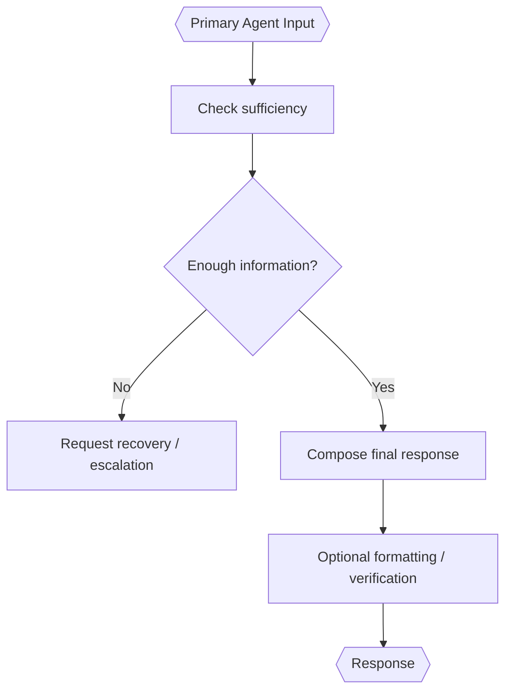

# Primary Agent

> **Category:** Agent Spec

> **File:** `architecture/primary-agent.md`
> **See also:** [overview.md](overview.md), [information-passthrough.md](information-passthrough.md), [information-digestion.md](information-digestion.md), [worker-orchestration.md](worker-orchestration.md)

---

## Role

The Primary Agent is the final agent that produces the user-facing response.

It may receive:

- `Context Enhanced Query` from Passthrough Mode;
- `Digested Information` from Digestion-Only Mode;
- `Worker Result` from Worker Mode.

---

## Worker Mode Guardrail

In Worker Mode, the Primary Agent should synthesize the Worker Result. It should not silently perform new research that bypasses Worker guarantees.

If the Worker Result is insufficient, the Primary Agent should request recovery or escalation rather than inventing missing information or independently researching around the Worker.

---

## Inputs / Outputs

**Input:**

```yaml
primary_agent_input:
  mode: passthrough | digestion_only | worker
  context_enhanced_query: "optional"
  digested_information: "optional"
  worker_result: "optional"
```

**Output:** final user-facing `Response`.

---

## Internal Flow



---

## Tool Use Policy

The Primary Agent may use tools for:

- formatting;
- consistency checks;
- citation formatting;
- final response verification against provided input.

It should not use tools for new research in Worker Mode unless the Worker Result explicitly allows that recovery path.

---

## Design Decisions

| Decision | Choice | Rationale |
|----------|--------|-----------|
| Final role | Synthesis | Final response should be based on routed/accepted information |
| Worker mode research | Restricted | Prevents bypassing Worker context controls |
| Insufficient input | Escalate/recover | Avoids hallucinating missing details |
| Modes handled | Passthrough, digestion-only, worker | Keeps one final response interface |
