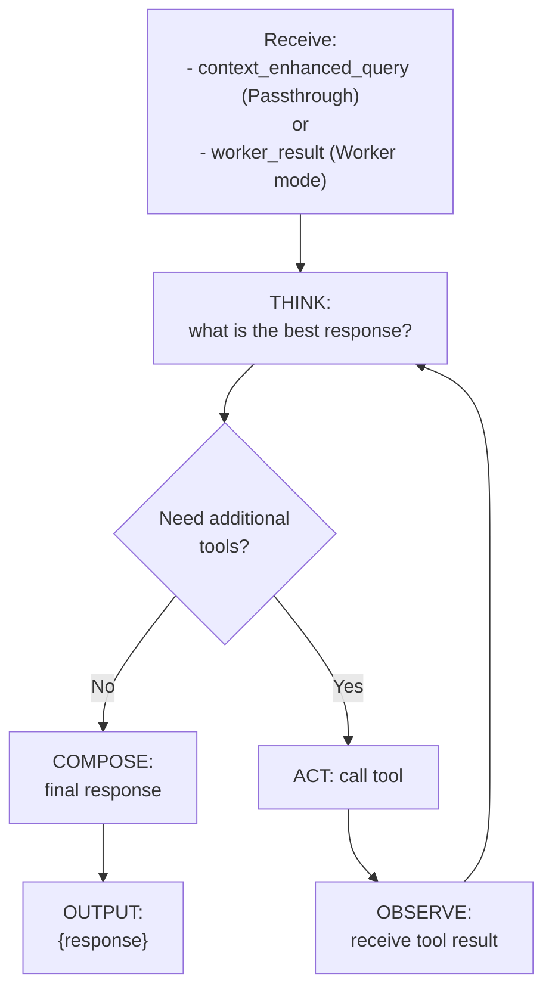

# Primary Agent

> **Category:** Agent Spec

> **File:** `architecture/primary-agent.md`
> **See also:** [Overview.md](overview.md), [Information_Passthrough.md](information-passthrough.md), [Task_Reviewer.md](task-reviewer.md)

---

## Role

The Primary Agent is the **final agent** that produces the user-facing response. It receives different inputs depending on the mode:

- **Passthrough mode:** `Context Enhanced Query` (from Information Passthrough)
- **Worker mode:** `Worker Result` (from TINYCUA Worker, which itself used the Digested Information)

The Primary Agent is a **standard ReAct agent** that can call tools to format, verify, or enrich the final response before delivering it to the user.

---

## Inputs / Outputs

**Input (Passthrough mode):** `Context Enhanced Query` — the query enriched with context by the Query Analyst
**Input (Worker mode):** `Worker Result` — the aggregated output of all tasks executed by the TINYCUA Worker

**Output:** Final `Response` to the user

**Tools:** (optional) `format_response()`, `verify_facts()`, `search_web()`

---

## Internal Flow

---

## Design Decisions

| Decision | Choice | Rationale |
|----------|--------|-----------|
| Loop type | ReAct (bounded) | May need to verify facts or format output; bounded to prevent over-processing |
| Tool access | Formatting/verification only | Not for new research — that should have been done by the Worker |
| Input ambiguity | Same agent handles both modes | Primary Agent doesn't need to know which mode was used — it just processes what it receives |
