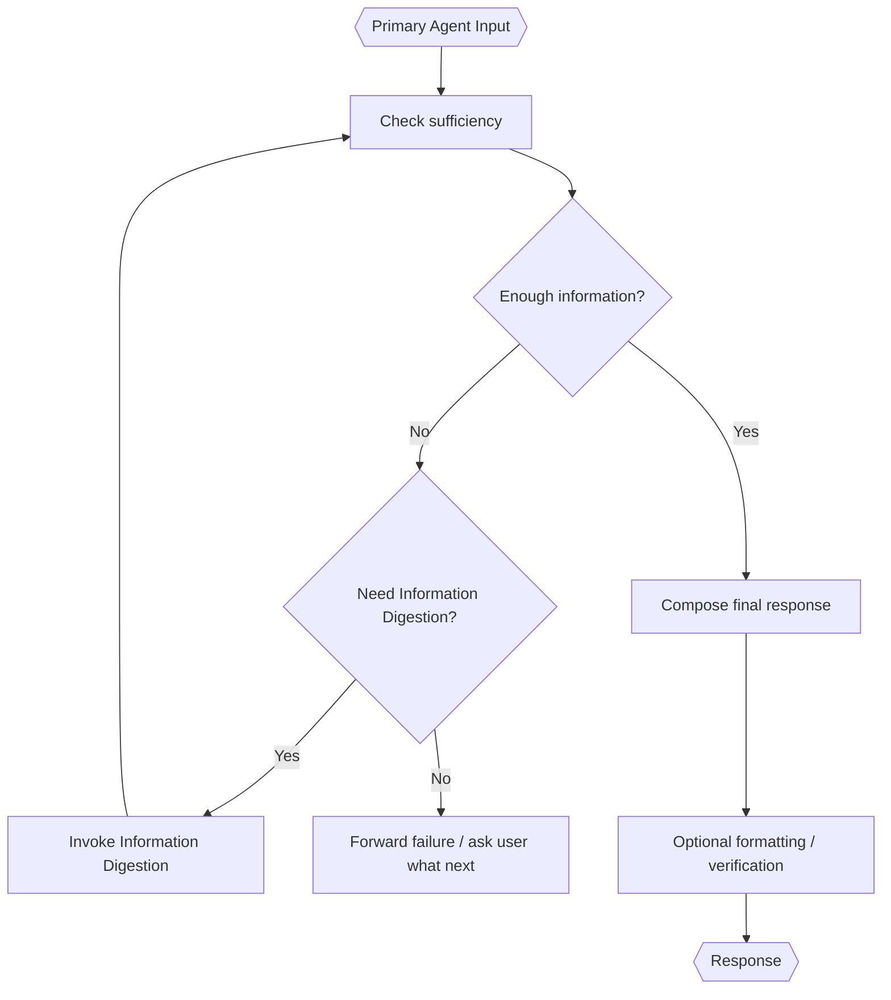

# Primary Agent

> **Category:** Agent Spec

> **File:** `architecture/primary-agent.md`
> **Last Updated:** 2026-05-30
> **Status:** Implemented
> **See also:** [overview.md](overview.md), [information-digestion.md](information-digestion.md), [worker-orchestration.md](worker-orchestration.md), [state-objects.md](state-objects.md), [query-analyst.md](query-analyst.md)

---

## Role

The Primary Agent is the final agent that produces the user-facing response.

It may receive:

- `Context Enhanced Query` from Primary Agent Mode;
- `Digested Information` after it chooses to invoke Information Digestion;
- `Worker Result` from Worker Mode.

Outside Worker Mode, the Primary Agent owns the decision to invoke Information Digestion. The top-level router does not need a separate digestion-only route.

---

## Worker Mode Guardrail

In Worker Mode, the Primary Agent should synthesize the Worker Result. It should not silently perform new research that bypasses Worker guarantees.

If the Worker Result is insufficient, the Primary Agent should forward the failure to the user and ask what should be done next rather than inventing missing information or independently researching around the Worker.

If the user continues discussing, the Primary Agent can answer conversationally. If the Primary Agent decides the next user input requires action, it should terminate its current turn and begin the loop again from the Query Analyst.

---

## Inputs / Outputs

**Input:**

- `mode` — routing source: `primary_agent` or `worker`.
- `context_enhanced_query` — optional CEQ from Primary Agent mode.
- `digested_information` — optional Digested Information after invoking Information Digestion.
- `worker_result` — optional Worker Result from Worker mode.

**Output:** final user-facing `Response`.

---

## Internal Flow

---

## Tool Use Policy

The Primary Agent may use tools for formatting and verification of the final response. It should not use tools for new research in Worker Mode unless the Worker Result explicitly allows that recovery path.

If it decides a new action is needed, it should start a new top-level loop through Query Analyst instead of silently continuing inside the old Primary Agent turn.

---

## Design Decisions

| Decision | Choice | Rationale |
|----------|--------|-----------|
| Final role | Synthesis | Final response should be based on routed/accepted information |
| Worker mode research | Restricted | Prevents bypassing Worker context controls |
| Optional digestion | Primary Agent decision | Keeps top-level routing simpler and lets Primary Agent decide whether CEQ needs consolidation |
| Insufficient Worker result | Ask user what next | Avoids hallucinating missing details or bypassing Worker guarantees |
| Modes handled | Primary-agent and worker | Keeps one final response interface |
