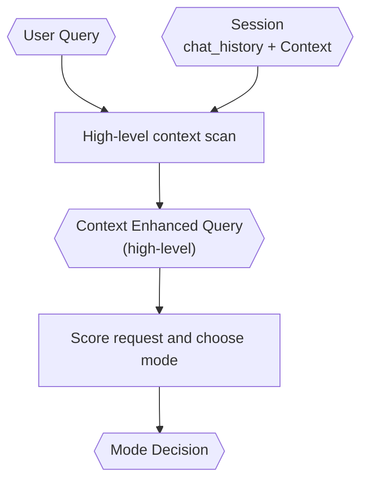

# Query Analyst

> **Category:** Agent Spec

> **File:** `architecture/query-analyst.md`
> **Last Updated:** 2026-05-27
> **Status:** Implemented
> **See also:** [overview.md](overview.md), [session-architecture.md](session-architecture.md), [context-retrieval.md](context-retrieval.md), [information-digestion.md](information-digestion.md), [task-classification.md](task-classification.md), [state-objects.md](state-objects.md), [primary-agent.md](primary-agent.md)

---

## Role

The Query Analyst prepares the request for routing with a fast, high-level scan. It produces:

1. a `Context Enhanced Query` (high-level), and
2. a `Mode Decision`.

The Query Analyst scans session `Context` directly (no search tool needed). Deep, precise context retrieval is the responsibility of the Information Digester.

---

## Inputs / Outputs

**Input:**

- `user_query`
- `session.chat_history`
- `session.context`

**Output:**

- `Context Enhanced Query` (CEQ) — user query enriched with high-level session context. See [context-retrieval.md](context-retrieval.md) for the deep retrieval flow used by the Information Digester.
- `Mode Decision` — routing verdict. Canonical schema in [state-objects.md](state-objects.md). Key fields: `mode` (`primary_agent | worker | uncertain`), `score`, `confidence`, `uncertain_next_action` (`ask_user | explore | null`).

---

## Context Scan

The Query Analyst scans session context directly — it receives `session.context` and `session.chat_history` as inputs and performs a fast, high-level scan. No retrieval tool is used.

Rules:

- The Query Analyst uses session `Context` as-is for a high-level overview.
- User query size does not trigger deep retrieval (that is the Information Digester's responsibility).
- Session `chat_history` stores user/agent/internal-agent turns in JSON.
- Session `Context` accumulates as structured markdown and is compacted as needed.

Deep context retrieval is defined in [context-retrieval.md](context-retrieval.md).

---

## Internal Flow

---

## Classification

The Query Analyst should avoid a simple binary small/large verdict. It should use a score-based mode decision.

Scoring is multi-dimensional, using a rubric rather than a binary judgment. See [task-classification.md](task-classification.md) for the scoring dimensions and rubric.

---

## Safeguards

The Query Analyst must guard against three failure modes: Worker overuse, unsafe Primary Agent routing, and open-ended uncertainty. See [task-classification.md](task-classification.md) for the full safeguard rubric.

---

## Design Decisions

| Decision | Choice | Rationale |
|----------|--------|-----------|
| Context scan | Fast, high-level scan | Query Analyst must be fast; deep retrieval is the Information Digester's responsibility |
| Verdict shape | Mode decision | Supports primary-agent routing, Worker routing, and explicit uncertainty handling |
| Classification style | Score-based with reasons | Prevents lazy overuse of Worker mode and unsafe Primary Agent routing |
| Enhancement approach | High-level, session-context direct scan | QA receives session context directly; no search tool needed — it scans what it already has |
