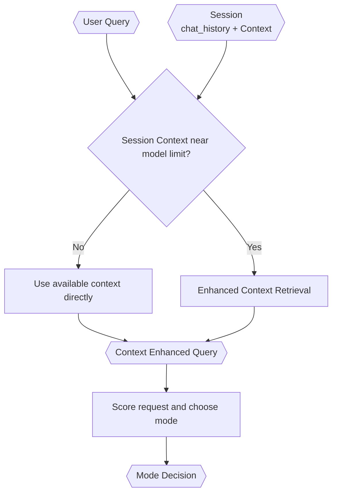

# Query Analyst

> **Category:** Agent Spec

> **File:** `architecture/query-analyst.md`
> **Last Updated:** 2026-05-27
> **Status:** Draft
> **See also:** [overview.md](overview.md), [session-architecture.md](session-architecture.md), [context-retrieval.md](context-retrieval.md), [information-digestion.md](information-digestion.md), [task-classification.md](task-classification.md), [state-objects.md](state-objects.md)

---

## Role

The Query Analyst prepares the request for routing. It produces:

1. a `Context Enhanced Query`, and
2. a `Mode Decision`.

Enhanced context retrieval is triggered by accumulated session `Context` size, not by user query size.

---

## Inputs / Outputs

**Input:**

- `user_query`
- `session.chat_history`
- `session.context`
- `session.context_token_estimate`

**Output:**

- `Context Enhanced Query` (CEQ) — enriched user query. See [context-retrieval.md](context-retrieval.md) for retrieval flow.
- `Mode Decision` — routing verdict. Canonical schema in [state-objects.md](state-objects.md). Key fields: `mode` (`primary_agent | worker | uncertain`), `score`, `confidence`, `uncertain_next_action` (`ask_user | explore | null`).

---

## Retrieval Trigger

Enhanced context retrieval starts only when accumulated session `Context` approaches model context-window pressure.

Rules:

- If session `Context` is small, use it directly.
- User query size does not trigger enhanced retrieval.
- Session `chat_history` stores user/agent/internal-agent turns in JSON.
- Session `Context` accumulates as structured markdown and is compacted as needed.

See [context-retrieval.md](context-retrieval.md).

---

## Internal Flow

---

## Classification

The Query Analyst should avoid a simple binary small/large verdict. It should use a score-based mode decision.

Scoring is multi-dimensional, using a rubric rather than a binary judgment. See [task-classification.md](task-classification.md) for the scoring dimensions and rubric.

---

## Safeguards

The Query Analyst must guard against three failure modes: Worker overuse, unsafe Primary Agent routing, and open-ended uncertainty. See [task-classification.md](task-classification.md) for the full safeguard rubric.

---

## Design Decisions

| Decision | Choice | Rationale |
|----------|--------|-----------|
| Retrieval trigger | Session `Context` size threshold | Large accumulated context increases irrelevant context exposure; user query size alone is not the issue |
| Verdict shape | Mode decision | Supports primary-agent routing, Worker routing, and explicit uncertainty handling |
| Classification style | Score-based with reasons | Prevents lazy overuse of Worker mode and unsafe Primary Agent routing |
| Retrieval framing | Precision-first, LLM-first | Avoids overfitting to conventional RAG and hard token budgets |
