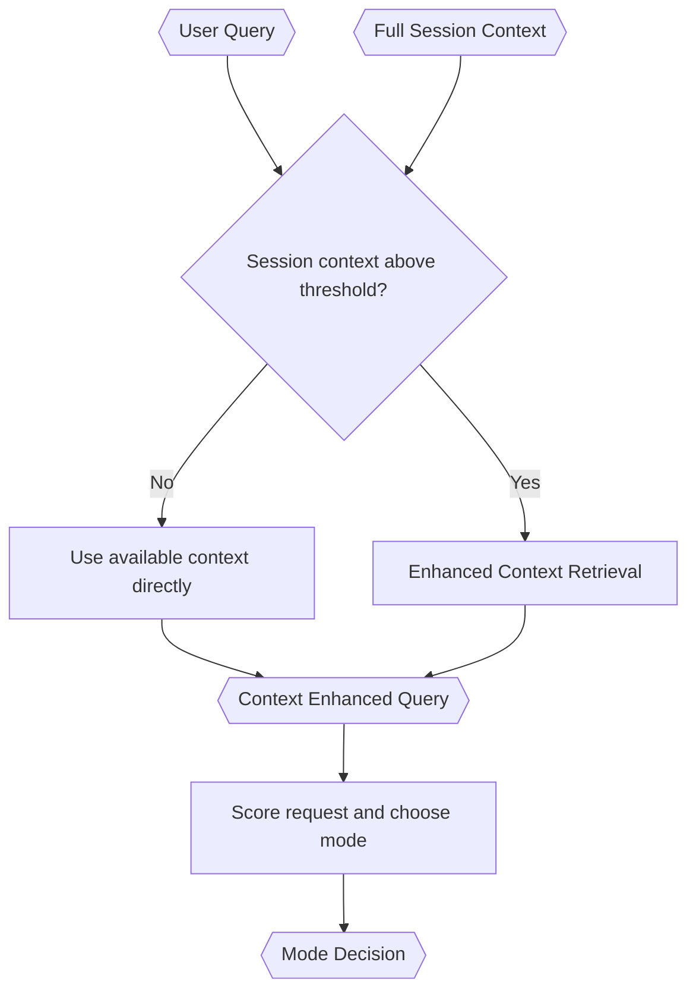

# Query Analyst

> **Category:** Agent Spec

> **File:** `architecture/query-analyst.md`
> **See also:** [overview.md](overview.md), [context-retrieval.md](context-retrieval.md), [task-classification.md](task-classification.md)

---

## Role

The Query Analyst prepares the request for routing. It produces:

1. a `Context Enhanced Query`, and
2. a `Mode Decision`.

Enhanced context retrieval is triggered by accumulated session context size, not by user query size.

---

## Inputs / Outputs

**Input:**

- `user_query`
- `full_session_context`
- `session_context_token_estimate`

**Output:**

```yaml
context_enhanced_query: "..."
mode_decision:
  mode: passthrough | digestion_only | worker | uncertain
  score: 0-10
  confidence: 0.0-1.0
  reasons:
    - "..."
  direct_response_safety_reason: "..."
  decomposition_benefit: "..."
  uncertainty_reason: "..."
```

---

## Retrieval Trigger

Enhanced context retrieval starts only when accumulated session context reaches a configured token-size threshold.

Rules:

- If session context is small, use it directly.
- User query size does not trigger enhanced retrieval.
- Every user-query/agent-response turn should be stored in a dynamically retrievable form.
- Session context should accumulate over time and be compacted as needed.

See [context-retrieval.md](context-retrieval.md).

---

## Internal Flow



---

## Classification

The Query Analyst should avoid a simple binary small/large verdict. It should use a score-based mode decision.

Scoring dimensions:

- number of user intents;
- number of entities, files, or documents involved;
- external tool need;
- number of sequential steps;
- amount of session context needed;
- ambiguity;
- hallucination risk if answered directly;
- expected answer complexity.

See [task-classification.md](task-classification.md) for the full rubric.

---

## Safeguards

For Worker mode, the Query Analyst must explain the decomposition benefit.

For Passthrough mode, it must explain why direct response is safe.

For Uncertain mode, it must state what is uncertain and choose a safer follow-up path, such as additional analysis, digestion-only routing, or user clarification.

---

## Design Decisions

| Decision | Choice | Rationale |
|----------|--------|-----------|
| Retrieval trigger | Session context size threshold | Large accumulated context increases irrelevant context exposure; user query size alone is not the issue |
| Verdict shape | Mode decision | Supports passthrough, digestion-only, worker, and uncertain middle ground |
| Classification style | Score-based with reasons | Prevents lazy overuse of Worker mode and unsafe passthrough |
| Retrieval framing | Precision-first, LLM-first | Avoids overfitting to conventional RAG and hard token budgets |
