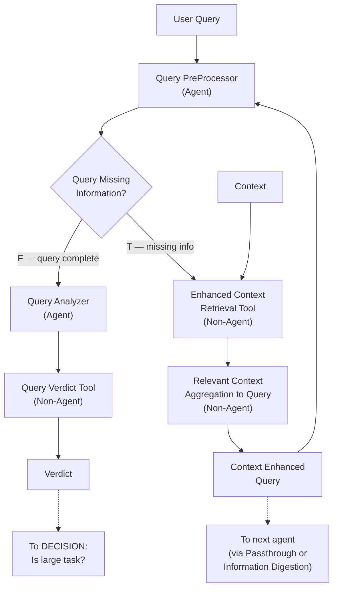

# Query Analyst

> **Category:** Agent Spec

> **File:** `architecture/query-analyst.md`
> **See also:** [Overview.md](overview.md), [Information_Digestion.md](information-digestion.md), [Information_Passthrough.md](information-passthrough.md)

---

## Role

The Query Analyst is a **specialized ReAct agent** that does two things:
1. **Retrieves and aggregates context** relevant to the user query (using a context retrieval tool)
2. **Produces a Verdict** on whether the task is large or small

## Inputs / Outputs

**Input:** User query + Context (chat history, stored newest-first)

**Output 1:** `Context Enhanced Query` — query enriched with relevant context (passed to downstream agents)
**Output 2:** `Verdict` — `{ "is_large_task": true/false, "confidence": 0.0-1.0 }`

**Tool:** `Enhanced Context Retrieval Tool` — searches and retrieves relevant context from history

---

## Internal Flow



---

## Pseudo-code

```python
class QueryAnalyst:
    """
    A specialized ReAct agent that retrieves context and produces
    a Context Enhanced Query + Verdict.
    """
    
    def analyze(self, user_query, context_history):
        # Phase 1: Pre-process the raw query
        processed_query = self.preprocess(user_query)
        
        # Phase 2: Iterative context retrieval loop
        # (continues until query has enough information or max iterations reached)
        max_iterations = 3
        for i in range(max_iterations):
            if not self.is_missing_information(processed_query):
                break
            
            # Retrieve relevant context (newest-first, bounded)
            retrieved = self.enhanced_context_retrieval(
                query=processed_query,
                context_history=context_history,
                depth=i  # search deeper each iteration
            )
            
            # Aggregate retrieved context into the query
            processed_query = self.aggregate_context_to_query(
                query=processed_query,
                retrieved_context=retrieved
            )
        
        # Phase 3: Analyze the enriched query and produce verdict
        context_enhanced_query = processed_query
        
        # Phase 4: Analyze and produce verdict
        analysis = self.analyze_query(context_enhanced_query)
        verdict = self.produce_verdict(analysis)
        
        return {
            "context_enhanced_query": context_enhanced_query,
            "verdict": verdict  # { "is_large_task": bool, "confidence": float }
        }
    
    def is_missing_information(self, query):
        """
        Check if the query is missing context.
        Uses fast heuristics, no LLM call.
        """
        signals = self.extract_signals(query)
        return (
            signals["has_pronoun"] or
            signals["is_continuation"] or
            (signals["is_short"] and not signals["has_new_topic"]) or
            signals["has_direct_reference"]
        )
    
    def extract_signals(self, query):
        return {
            "has_pronoun": any(p in query.lower() for p in ["it","they","this","those"]),
            "is_continuation": any(c in query.lower() for c in ["also","now","then","next","further"]),
            "is_short": len(query.split()) < 10,
            "has_direct_reference": any(r in query.lower() for r in ["the","that","those"]),
            "has_new_topic": any(n in query.lower() for n in ["switch","different","instead","forget"]),
        }
    
    def enhanced_context_retrieval(self, query, context_history, depth=0):
        """
        Search chat history from newest to oldest.
        Goes deeper each iteration (depth parameter).
        """
        entries_per_call = 2
        start = depth * entries_per_call
        return context_history[start:start + entries_per_call]
    
    def aggregate_context_to_query(self, query, retrieved_context):
        """
        Merge retrieved context into the query to produce
        a Context Enhanced Query string.
        """
        context_str = " ".join(retrieved_context)
        return f"[Context: {context_str}] Query: {query}"
    
    def produce_verdict(self, analysis):
        """
        Determine if task is large or small.
        Based on query complexity, context depth needed,
        number of retrieval iterations, etc.
        """
        is_large = (
            analysis["retrieval_iterations"] > 1 or
            analysis["query_length"] > 200 or
            analysis["has_multi_step_intent"]
        )
        return {
            "is_large_task": is_large,
            "confidence": analysis["confidence"]
        }
```

---

## Context Retrieval Signals

| Signal | Example | Action |
|--------|---------|--------|
| Pronouns ("it", "they", "this") | "Summarize **it**" | Retrieve context |
| Continuation ("also", "now", "then") | "**Now** do the same" | Retrieve context |
| Short + ambiguous (< 10 words) | "Do that again" | Retrieve context |
| Direct reference ("the", "that") | "Fix **the** bug" | Retrieve context |
| Standalone (clear subject + verb) | "What is the capital of France?" | F — skip retrieval |
| New topic ("switch", "instead") | "**Switch** to Python" | F — skip retrieval |

---

## Design Decisions

| Decision | Choice | Rationale |
|----------|--------|-----------|
| Loop type | Iterative context retrieval + ReAct (bounded) | Query may need multiple retrieval passes; bounded to 3 to prevent infinite loops |
| Output | Two outputs (CEQ + Verdict) | Separation of concerns — the enriched query is data, the verdict is routing |
| Context search strategy | Newest-first, bounded depth | Continuation queries most often reference recent context |
| Missing info detection | Heuristics-based (no LLM) | Fast (<1ms), covers 90% of cases; avoids LLM cost/hallucination |
