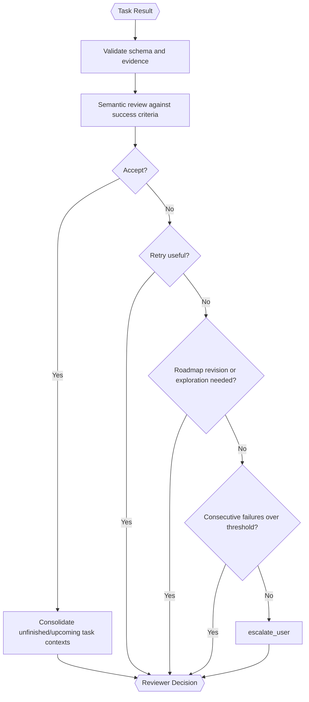

# Result Reviewer (Inside TINYCUA Worker)

> **Category:** Agent Spec

> **File:** `architecture/result-reviewer.md`
> **Last Updated:** 2026-05-30
> **Status:** Implemented
> **See also:** [overview.md](overview.md), [session-architecture.md](session-architecture.md), [worker-orchestration.md](worker-orchestration.md), [task-analysis.md](task-analysis.md), [task-creation.md](task-creation.md), [task-execution.md](task-execution.md), [task-assessor.md](task-assessor.md), [state-objects.md](state-objects.md)

---

## Role

The Result Reviewer evaluates each task result and decides the next Worker transition.

This is distinct from the [Task Assessor](task-assessor.md), which runs during upfront Task Creation to select tasks for decomposition. The Result Reviewer operates during execution, after each task completes.

Its primary responsibilities are:

1. review completion against success criteria;
2. determine what context should update future tasks;
3. decide whether to accept, retry, replan, or escalate.

---

## Hybrid Reviewer

The Result Reviewer should be hybrid:

- deterministic checks for schema validity, missing fields, ordering consistency, and citations where applicable;
- LLM-based semantic review for correctness, sufficiency, context propagation, and recovery decisions.

---

## Inputs / Outputs

**Input:**

- Current `task` — canonical schema in [state-objects.md](state-objects.md). Key fields: `task_id`, `task_name`, `task_context`, `success_criteria`.
- `task_result` — result of the task's execution. Canonical schema in [state-objects.md](state-objects.md).
- `execution_log` — sub-session execution log (actions and outcomes from the Task Executor's sub-session). See [session-architecture.md](session-architecture.md).
- `shallow_task_list` — task IDs and names from the Task Tree for scope awareness (no full task details).

The Result Reviewer should not receive a broad accumulated context dump by default. Accumulation happens by updating relevant future task contexts after accepted results.

**Output:**

- `Reviewer Decision` — canonical schema in [state-objects.md](state-objects.md).

---

## Internal Flow

---

## Context Propagation

After accepting a task, the Result Reviewer decides which unfinished or upcoming tasks need context updates.

This avoids dumping every previous task result into every future task. Context updates may modify task context — they can replace or add to existing content. The architecture does not prescribe a specific consolidation strategy.

---

## Status-to-Action Semantics

| Status | Orchestration Action |
|--------|----------------------|
| `accepted` | Consolidate context for unfinished/upcoming tasks. Aggregate Worker Result when no tasks remain. |
| `retry` | Create a new Task Executor for the same task with failure information recorded in the task context. |
| `replan` | Call the [Task Analyzer](task-analysis.md) to decompose the current task into sub-tasks. |
| `escalate_user` | Pause the current agent sub-session and ask the user for clarification. |

The Worker only terminates successfully when the final unfinished task is accepted and no remaining unfinished tasks exist.

---

## Repeated Failure Behavior

The Worker tracks a volatile universal consecutive-failure counter. Any task success resets the counter to zero. After N consecutive failures, the Worker escalates to the user with an explanation of the failure point.

This is not only per-task. It protects the whole Worker from retry/replan loops.

---

## Design Decisions

| Decision | Choice | Rationale |
|----------|--------|-----------|
| Reviewer style | Hybrid | Combines reliable validation with semantic judgment |
| Context update | Targeted propagation | Preserves precision and avoids context pollution |
| Replanning | Call the Task Analyzer to decompose the current task | Keeps decomposition responsibility in the Task Analyzer. During execution, the Result Reviewer calls the Task Analyzer fresh to break down the current task — not overhaul the entire roadmap. The same agent is used by Task Creation upfront. See [task-analysis.md](task-analysis.md) for the agent and [task-creation.md](task-creation.md) for upfront decomposition. |
| Failure escalation | Consecutive failure threshold | Prevents infinite retry loops and supports HITL recovery |
