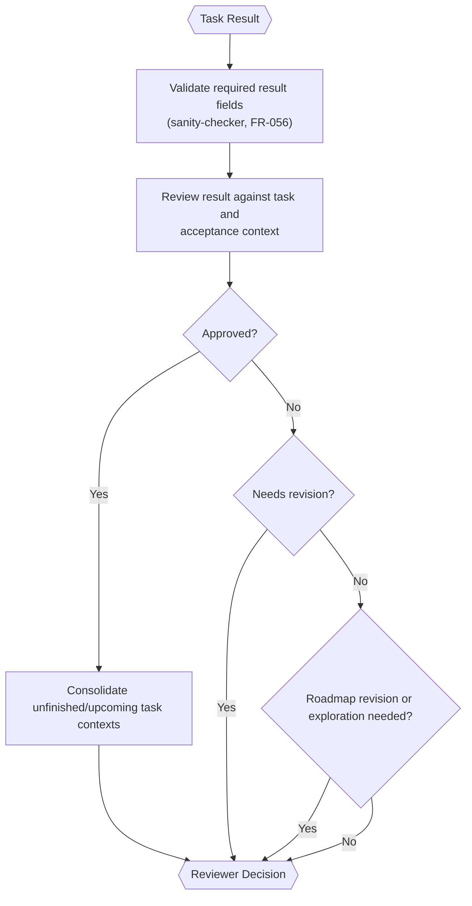

# Result Reviewer (Inside TINYCUA Worker)

> **Category:** Agent Spec

> **File:** `architecture/result-reviewer.md`
> **Last Updated:** 2026-05-30
> **Status:** Implemented
> **See also:** [overview.md](overview.md), [session-architecture.md](session-architecture.md), [worker-orchestration.md](worker-orchestration.md), [task-analysis.md](task-analysis.md), [task-creation.md](task-creation.md), [task-execution.md](task-execution.md), [task-assessor.md](task-assessor.md), [state-objects.md](state-objects.md)

---

## Role

The Result Reviewer evaluates each task result and decides the next Worker transition.

This is distinct from the [Task Assessor](task-assessor.md), which runs during upfront Task Creation to select tasks for decomposition. The Result Reviewer operates during execution, after each task completes.

Its primary responsibilities are:

1. review completion against success criteria;
2. determine what context should update future tasks;
3. decide whether to approve, send back for revision, or replan.

---

## Hybrid Reviewer

The Result Reviewer should be hybrid:

- deterministic checks for schema validity and missing required fields;
- **sanity-checker (FR-056)** — a deterministic pre-pass that flags obviously broken results (empty output, schema mismatch, missing required artifacts) before the LLM review runs, so semantic review effort is not wasted on structurally invalid results;
- LLM-based semantic review for correctness, sufficiency, context propagation, and recovery decisions. The reviewer records a concise free-form report with its decision; no evidence tags or clause-proof payload are required.

---

## Inputs / Outputs

**Input:**

- Current `task` — canonical schema in [state-objects.md](state-objects.md). Key fields: `task_id`, `task_name`, `task_context`, `success_criteria`.
- `task_result` — result of the task's execution. Canonical schema in [state-objects.md](state-objects.md).
- `execution_log` — sub-session execution log (actions and outcomes from the Task Executor's sub-session). See [session-architecture.md](session-architecture.md).
- `shallow_task_list` — task IDs and names from the Task Tree for scope awareness (no full task details).

The Result Reviewer should not receive a broad accumulated context dump by default. Accumulation happens by updating relevant future task contexts after accepted results.

**Output:**

- `Reviewer Decision` — canonical schema in [state-objects.md](state-objects.md).

---

## Internal Flow

> **State-driven queue (FR-067):** the next nodes are selected from the active task's
> state, not from a fixed label-driven shape — see
> [worker-orchestration.md](worker-orchestration.md) for the state-driven queue
> semantics.

---

## Context Propagation

After approving a task, the Result Reviewer decides which unfinished or upcoming tasks need context updates.

This avoids dumping every previous task result into every future task. Context updates may modify task context — they can replace or add to existing content. The architecture does not prescribe a specific consolidation strategy.

---

## Status-to-Action Semantics

| Status | Orchestration Action |
|--------|----------------------|
| `approved` | Consolidate context for unfinished/upcoming tasks. Aggregate Worker Result when no tasks remain. |
| `needs_revision` / `rejected` | Send the task back to the Task Executor with failure information recorded in the task context. `rejected` is aliased to `needs_revision` (FR-057). |
| `replan` | Call the [Task Analyzer](task-analysis.md) to decompose the current task into sub-tasks. |

The Worker only terminates successfully when the final unfinished task is approved and no remaining unfinished tasks exist.

---

## Recovery Model (FR-060 / FR-063)

The reviewer uses a structured recovery budget instead of a single aggregated failure
counter that escalates to HITL:

- Per-method budgets: 15 structured retries + 10 focused retries + 3 judge retries = 30
  total per task.
- Partial results are preserved across re-entries; `accumulated_tool_results` persists
  so revisited work is not lost.
- A no-progress guard halts re-entry when no new information has been produced since the
  last attempt.
- Re-entries into the same task are unlimited until a budget is exhausted or the
  no-progress guard fires.
- Same-error guard (FR-078): the same error raised 3× in succession forces an
  alternative action (replan or revised instruction) instead of another retry.

This replaces the prior aggregated failure threshold → HITL escalation.

---

## Design Decisions

| Decision | Choice | Rationale |
|----------|--------|-----------|
| Reviewer style | Hybrid | Combines reliable validation with semantic judgment |
| Context update | Targeted propagation | Preserves precision and avoids context pollution |
| Replanning | Call the Task Analyzer to decompose the current task | Keeps decomposition responsibility in the Task Analyzer. During execution, the Result Reviewer calls the Task Analyzer fresh to break down the current task — not overhaul the entire roadmap. The same agent is used by Task Creation upfront. See [task-analysis.md](task-analysis.md) for the agent and [task-creation.md](task-creation.md) for upfront decomposition. |
| Failure escalation | Recovery model with per-method budgets (FR-060/063) | Prevents infinite retry loops via structured budgets, partial-result preservation, no-progress guard, and same-error guard (FR-078) instead of a single HITL threshold |
