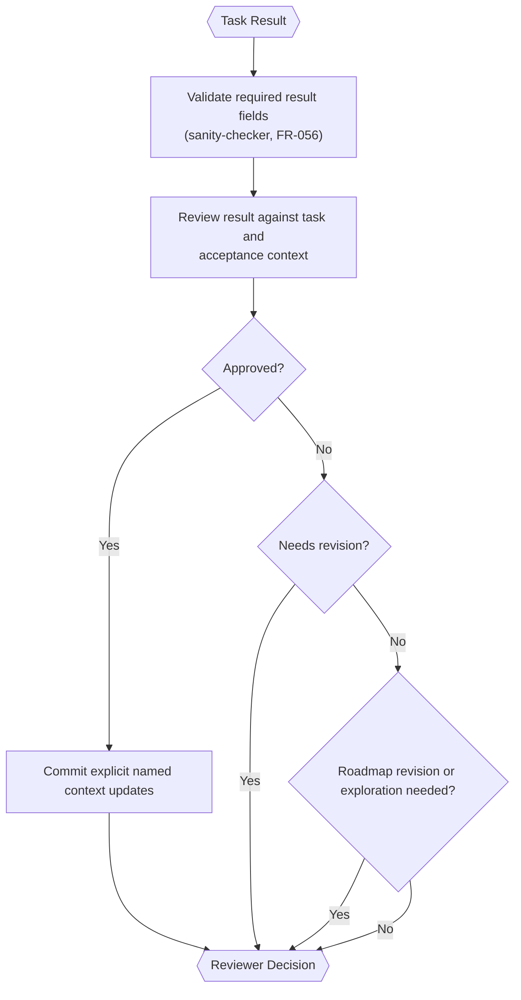

# Result Reviewer (Inside TINYCUA Worker)

> **Category:** Agent Spec

> **File:** `architecture/result-reviewer.md`
> **Last Updated:** 2026-05-30
> **Status:** Implemented
> **See also:** [overview.md](overview.md), [session-architecture.md](session-architecture.md), [worker-orchestration.md](worker-orchestration.md), [task-analysis.md](task-analysis.md), [task-creation.md](task-creation.md), [task-execution.md](task-execution.md), [task-assessor.md](task-assessor.md), [state-objects.md](state-objects.md)

---

## Role

The Result Reviewer evaluates each task result and decides the next Worker transition.

This is distinct from the [Task Assessor](task-assessor.md), which runs during upfront Task Creation to select tasks for decomposition. The Result Reviewer operates during execution, after each task completes.

Its primary responsibilities are:

1. review completion against success criteria;
2. explicitly identify any useful context that should update a named future task;
3. decide whether to approve, send back for revision, or replan.

---

## Hybrid Reviewer

The Result Reviewer should be hybrid:

- deterministic checks for schema validity and missing required fields;
- **sanity-checker (FR-056)** — a deterministic pre-pass that flags obviously broken results (empty output, schema mismatch, missing required artifacts) before the LLM review runs, so semantic review effort is not wasted on structurally invalid results;
- LLM-based semantic review for correctness, sufficiency, context propagation, and recovery decisions. The reviewer records a concise free-form report with its decision; no evidence tags or clause-proof payload are required. It matches material claims to proportionate evidence and prioritizes explicit verification commands.

---

## Inputs / Outputs

**Input:**

- Current `task` — canonical schema in [state-objects.md](state-objects.md). Key fields: `task_id`, `task_name`, `task_context`, `success_criteria`.
- `task_result` — result of the task's execution. Canonical schema in [state-objects.md](state-objects.md).
- Bounded executor evidence — tool names, command/path/URL/query identifiers, outcomes,
  and audit references from the Task Executor. Full tool output bodies are not replayed.
- `shallow_task_list` — task IDs and names from the Task Tree for scope awareness (no full task details).
- The active task's bounded review digest: open/deferred/recently addressed findings and recent event summaries. Full event rationale is loaded only through `task_inspect(event_id=...)`.

The Result Reviewer should not receive a broad accumulated context dump by default. Cross-task context changes happen only through explicit validated `context_updates`.

Root acceptance criteria are context during leaf review and semantic gates when the root
task itself is reviewed. Behavioral claims require behavioral checks, artifact claims
require artifact inspection, and external claims require authoritative evidence. Existing
exact evidence may be reused; unrelated suites are not run merely because tools exist.
Generated criteria never override the original user request or immutable constraints.

**Output:**

- `Reviewer Decision` — canonical schema in [state-objects.md](state-objects.md).

---

## Internal Flow

> **State-driven queue (FR-067):** the next nodes are selected from the active task's
> state, not from a fixed label-driven shape — see
> [worker-orchestration.md](worker-orchestration.md) for the state-driven queue
> semantics.

---

## Context Propagation

Review events and findings stay on the active task across retry, replan, postponement, and resume. They never enter sibling prompts automatically. Approval is rejected while that task owns unresolved `OPEN` findings.

Cross-task transfer occurs only through validated `task_review_decision.context_updates` targeting an existing unfinished task. Approved results, review events, findings, and copied context metadata are not otherwise propagated.

---

## Status-to-Action Semantics

| Status | Orchestration Action |
|--------|----------------------|
| `approved` | Commit only explicit validated context updates. Aggregate Worker Result when no tasks remain. |
| `needs_revision` | Send the task back to the Task Executor with failure information recorded in the task context. Stored legacy `rejected` decisions parse as the same behavior but are no longer model-facing. |
| `replan` | Call the [Task Analyzer](task-analysis.md) to decompose the current task into sub-tasks. |
| `postpone_siblings` | Defer a non-root task until normal sibling work is terminal or also sibling-postponed. |
| `postpone_final` | Defer the revisited task until no normal or sibling-deferred work remains globally. |
| `compromise` | Record a non-empty unsuccessful result and rationale as an explicit terminal limitation. |

Postponement requires a fresh non-empty unsuccessful execution result and is monotonic:
a non-root task may move once from `postpone_siblings` to `postpone_final`; a root task
skips the sibling phase. Normal work drains first, sibling-postponed work becomes eligible
after its siblings are terminal or postponed, and final-postponed work drains globally
last. `compromise` requires a fresh non-empty unsuccessful result, prior final
postponement, and a rationale. Compromised work counts as terminal for routing but remains
unsuccessful and visible to parent verification and final aggregation.

---

## Recovery Model (FR-060 / FR-063)

The reviewer uses a structured recovery budget instead of a single aggregated failure
counter that escalates to HITL:

- Per-method budgets: 15 structured retries + 10 focused retries + 3 judge retries = 30
  total per task.
- Partial results are preserved across re-entries; `accumulated_tool_results` persists
  so revisited work is not lost.
- A no-progress guard halts re-entry when no new information has been produced since the
  last attempt.
- Re-entries into the same task are unlimited until a budget is exhausted or the
  no-progress guard fires.
- Same-error guard (FR-078): the same error raised 3× in succession forces an
  alternative action (replan or revised instruction) instead of another retry.

This replaces the prior aggregated failure threshold → HITL escalation.

---

## Design Decisions

| Decision | Choice | Rationale |
|----------|--------|-----------|
| Reviewer style | Hybrid | Combines reliable validation with semantic judgment |
| Context update | Targeted propagation | Preserves precision and avoids context pollution |
| Replanning | Call the Task Analyzer to decompose the current task | Keeps decomposition responsibility in the Task Analyzer. During execution, the Result Reviewer calls the Task Analyzer fresh to break down the current task — not overhaul the entire roadmap. The same agent is used by Task Creation upfront. See [task-analysis.md](task-analysis.md) for the agent and [task-creation.md](task-creation.md) for upfront decomposition. |
| Failure escalation | Recovery model with per-method budgets (FR-060/063) | Prevents infinite retry loops via structured budgets, partial-result preservation, no-progress guard, and same-error guard (FR-078) instead of a single HITL threshold |
