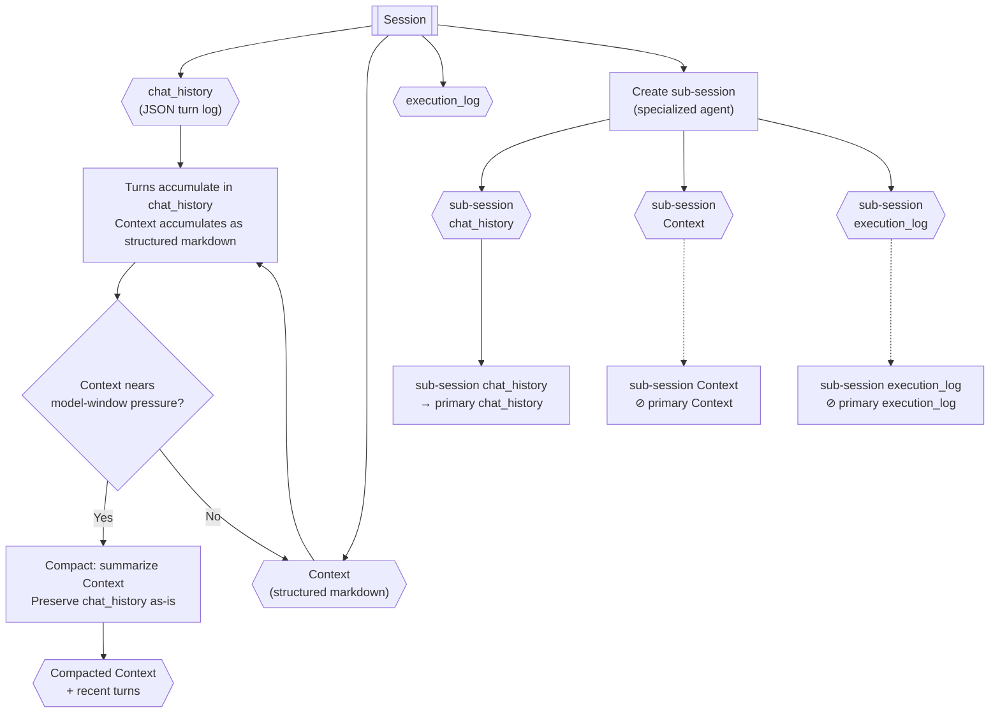

# Session Architecture

> **Category:** Process Spec

> **File:** `architecture/session-architecture.md`
> **Last Updated:** 2026-05-27
> **Status:** Implemented
> **See also:** [context-retrieval.md](context-retrieval.md), [state-objects.md](state-objects.md), [overview.md](overview.md), [worker-orchestration.md](worker-orchestration.md), [information-digestion.md](information-digestion.md)

This document defines the session model used by TINYCUA for chat history, model context, and internal context isolation.

---

## Role

A session is the unit that stores conversation history and the context loaded by a model.

For now, a session has three primary parts:

1. `chat_history` — the preserved exchange/turn log.
2. `Context` — the structured markdown context loaded by the model.
3. `execution_log` — captures actions and outcomes from sub-session execution.

Additional session fields can be added later, but these three are the required foundation.

---

## Inputs / Outputs

**Input:**

- User messages and agent responses (accumulate into `chat_history`)
- Sub-session results (propagated per propagation rules)
- Context compaction triggers (model context-window pressure)

**Output:**

- Session object with `chat_history`, `Context`, and `execution_log` — canonical schema in [state-objects.md](state-objects.md)
- Session propagation rules (sub-session → primary session)
- Context compaction rules

---

## Internal Flow



---

## Session Object

```yaml
session:
  session_id: "<session id>"
  owner_type: primary | tinycua_internal | future_sub_agent
  owner_name: "<agent or user name>"
  chat_history: "<JSON turn log entries>"
  context: "<structured markdown>"
  execution_log: "<sub-session actions and outcomes>"
```

`owner_type` distinguishes the primary user-facing session, TINYCUA internal specialized-agent sessions, and future explicit sub-agent sessions.

---

## chat_history

`chat_history` is the exchange/turn log between the user and agents. It should be stored as JSON.

It should also preserve communication between TINYCUA internal agents, not only user-facing messages.

Architectural shape:

```yaml
chat_history:
  - type: "<agent or user name>"
    message: "<turn content>"
  # Additional fields (id, timestamp, session) are implementation details.
```

Required fields:

- `type` — the agent or user name.
- `message`

Tool interactions are preserved in chat_history alongside user and agent messages for auditability. Storage representation is an implementation detail.

---

## Context

`Context` is the information loaded by the model. It should be structured markdown, not JSON.

Context is derived from `chat_history`, compacted information, retrieved notes, and current task/session needs. It should stay focused on what the model needs for the current session. The exact section structure is an implementation detail.

---

## Execution Log

The Execution Log captures the actions taken and their outcomes during a sub-session's execution. It lives on the sub-session, not embedded within a Task Result.

- Each sub-session has its own `execution_log`.
- The Task Executor sub-session records its actions and outcomes into its execution log.
- Retries create new Task Executor sub-sessions, so each retry starts with a fresh execution log.
- The Result Reviewer accesses the sub-session's execution log to evaluate task results.
- Sub-session `execution_log` is not automatically propagated to primary session `execution_log`.

See [state-objects.md](state-objects.md) for the canonical Execution Log schema.

---

## Context Compaction

Compaction is a **background system process** — not part of any agent's tool set and not shown in the agent architecture diagrams. It is triggered by model context-window pressure, not by user query size.

Compaction summarizes the current `Context`, not the raw `chat_history` from scratch. The compacted information replaces the original `Context` content; `chat_history` is preserved separately. The exact structure of the compacted `Context` is an implementation detail.

This lets TINYCUA preserve exchange history while keeping model-loaded context manageable.

---

## Sub-Sessions

TINYCUA may propagate a primary session into internal sub-sessions for specialized processing. See the architecture overview for the current agent registry.

Each sub-session has its own `chat_history` and `Context`.

Important propagation rules:

- The primary session tracks sub-session `chat_history` — it is appended to the primary session's `chat_history` so the parent preserves an auditable record of internal communication.
- Sub-sessions are not aware of the parent session; each sub-session manages only its own `chat_history` and `Context`.
- Sub-session `Context` is **not** automatically added to primary session `Context`.
- Parent session `Context` should only receive consolidated information when the architecture explicitly decides to update it.

This preserves context isolation while still preserving an auditable history of internal communication.

---

## Sub-Sessions Are Not Future Sub Agents

TINYCUA is sub-agentic internally, but not every specialized TINYCUA component is a future standalone Sub Agent.

The sub-session system exists to manage context isolation between specialized parts of the same TINYCUA agent. Query Analyst, Task Analysis, Task Execution, and Result Reviewer can have separate sessions, but they are still internal parts of TINYCUA.

Future explicit Sub Agents will be a separate concept. A future Sub Agent session is not necessarily just a sub-session of the parent TINYCUA session.

---

## Relationship to Enhanced Context Retrieval

Enhanced Context Retrieval is a tool used by the Information Digester. It searches the current Session `Context` as an external data store — without loading the full `Context` into the Information Digester's own context window.

The Information Digester receives what it treats as the user query (the `Context Enhanced Query` from the Query Analyst). When it identifies information gaps, it uses Enhanced Context Retrieval to explore the Session `Context` for missing details.

Important rules:

- Enhanced Context Retrieval searches whatever current Session `Context` exists — it is indifferent to whether the context is original, compacted, or enriched with memory/recall.
- Compaction (above) is a separate background system process triggered by context-window pressure. Enhanced Context Retrieval is not compaction and is not triggered by context-window pressure.
- User query size alone does not trigger enhanced retrieval.

See [context-retrieval.md](context-retrieval.md).

---

## Design Decisions

| Decision | Choice | Rationale |
|----------|--------|-----------|
| Context isolation | Sub-sessions with own `chat_history` and `Context` | Each specialized component receives only the context it needs without inheriting the full parent session |
| Compaction trigger | Background system process, not agent-driven | Keeps compaction out of agent diagrams and tool sets. Triggered by model context-window pressure, not user query size |
| Sub-session Context propagation | Not automatically propagated to primary | Preserves context isolation — parent Context only receives consolidated information when explicitly decided |
| Sub-session chat_history propagation | Appended to primary chat_history | Preserves an auditable record of internal agent communication without leaking full execution context |
