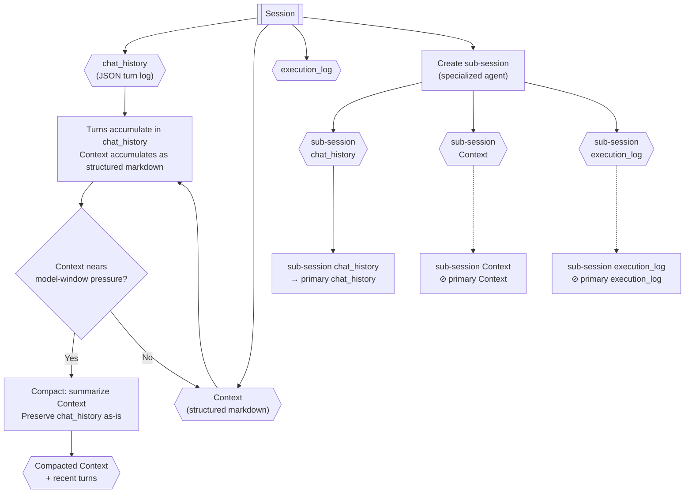

# Session Architecture

> **Category:** Process Spec

> **File:** `architecture/session-architecture.md`
> **Last Updated:** 2026-05-27
> **Status:** Draft

This document defines the session model used by TINYCUA for chat history, model context, and internal context isolation.

---

## Role

A session is the unit that stores conversation history and the context loaded by a model.

For now, a session has three primary parts:

1. `chat_history` — the preserved exchange/turn log.
2. `Context` — the structured markdown context loaded by the model.
3. `Execution_Log` — tool calls, observations, diffs, and decision trace from sub-session execution.

Additional session fields can be added later, but these three are the required foundation.

---

## Internal Flow



---

## Session Object

```yaml
session:
  session_id: session_001
  owner_type: primary | tinycua_internal | future_sub_agent
  owner_name: "Primary Agent"
  chat_history: []
  context: "structured markdown"
  execution_log: []  # tool calls, results, and diffs from sub-session execution
```

`owner_type` distinguishes the primary user-facing session, TINYCUA internal specialized-agent sessions, and future explicit sub-agent sessions.

---

## chat_history

`chat_history` is the exchange/turn log between the user and agents. It should be stored as JSON so turns can be preserved and replayed structurally.

It should also preserve communication between TINYCUA internal agents, not only user-facing messages.

Suggested shape:

```json
[
  {
    "message_id": "msg_001",
    "session_id": "session_primary",
    "type": "User",
    "message": "Update the architecture docs.",
    "timestamp": "2026-05-27T00:00:00Z"
  },
  {
    "message_id": "msg_002",
    "session_id": "session_query_analyst",
    "type": "Query Analyst",
    "message": "The request should route to Worker mode.",
    "timestamp": "2026-05-27T00:00:01Z"
  },
  {
    "message_id": "msg_003",
    "session_id": "session_task_executor_task_001",
    "type": "Task Executor",
    "message": "Task 001 completed with result ...",
    "timestamp": "2026-05-27T00:00:02Z"
  }
]
```

Minimum fields:

- `type` — the agent or user name. This field stores the agent's name directly; there is no fixed enum to maintain — the agent's own documented name is the source of truth.
- `message`

Tool calls and tool results may be represented as messages or attached metadata. They should be preserved as much as practical, but large tool payloads may be truncated.

---

## Context

`Context` is the information loaded by the model. It should be structured markdown, not JSON.

Example:

```markdown
# Session Context

## Compacted Information

- Previous discussion established that Worker tasks are sequential.
- Task context should be structured markdown and consolidated over time.

## Recent Turns

- User asked to update session architecture.
- Primary Agent planned a new session architecture document.

## Known Constraints

- User query size does not trigger enhanced context retrieval.
- Context retrieval starts when accumulated session `Context` reaches model context-window pressure.
```

`Context` is derived from `chat_history`, compacted information, retrieved notes, and current task/session needs. It should stay focused on what the model needs for the current session.

---

## Execution Log

The Execution Log captures tool calls, observations, diffs, and decision traces generated during a sub-session's execution. It lives on the sub-session, not embedded within a Task Result.

- Each sub-session has its own `execution_log`.
- The Task Executor sub-session records actions, tool calls, observations, and diffs into its execution log.
- Retries create new Task Executor sub-sessions, so each retry starts with a fresh execution log.
- The Task Reviewer accesses the sub-session's execution log to evaluate task results.
- Sub-session `execution_log` is not automatically propagated to primary session `execution_log`.

See [state-objects.md](state-objects.md) for the canonical Execution Log schema.

---

## Context Compaction

Compaction is triggered by model context-window pressure, not by user query size.

Compaction summarizes the current `Context`, not the raw `chat_history` from scratch. After compaction:

1. compacted information is placed near the beginning of `Context`;
2. new relevant turns are appended after the compacted information;
3. `chat_history` remains the structural source of preserved turns as much as practical.

This lets TINYCUA preserve exchange history while keeping model-loaded context manageable.

---

## Sub-Sessions

TINYCUA may propagate a primary session into internal sub-sessions for specialized processing.

Examples:

- Query Analyst session
- Information Digester session
- Task Analyzer session
- Task Executor session
- Task Reviewer session

Each sub-session has its own `chat_history` and `Context`.

Important propagation rules:

- The primary session tracks sub-session `chat_history` — it is appended to the primary session's `chat_history` so the parent preserves an auditable record of internal communication.
- Sub-sessions are not aware of the parent session; each sub-session manages only its own `chat_history` and `Context`.
- Sub-session `Context` is **not** automatically added to primary session `Context`.
- Parent session `Context` should only receive consolidated information when the architecture explicitly decides to update it.

This preserves context isolation while still preserving an auditable history of internal communication.

---

## Sub-Sessions Are Not Future Sub Agents

TINYCUA is sub-agentic internally, but not every specialized TINYCUA component is a future standalone Sub Agent.

The sub-session system exists to manage context isolation between specialized parts of the same TINYCUA agent. Query Analyst, Task Analysis, Task Execution, and Task Reviewer can have separate sessions, but they are still internal parts of TINYCUA.

Future explicit Sub Agents will be a separate concept. A future Sub Agent session is not necessarily just a sub-session of the parent TINYCUA session.

---

## Relationship to Enhanced Context Retrieval

Enhanced Context Retrieval uses session `Context` and/or retrievable `chat_history` records to construct a Context Enhanced Query.

The trigger is accumulated session `Context` size relative to model context-window pressure. User query size alone does not trigger enhanced retrieval.

See [context-retrieval.md](context-retrieval.md).

> **See also:** [context-retrieval.md](context-retrieval.md), [state-objects.md](state-objects.md), [overview.md](overview.md)
