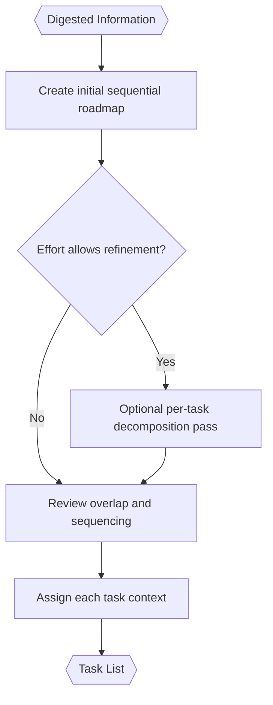

# Task Analyzer (Inside TINYCUA Worker)

> **Category:** Agent Spec

> **File:** `architecture/task-analysis.md`
> **Last Updated:** 2026-05-27
> **Status:** Draft
> **See also:** [overview.md](overview.md), [worker-orchestration.md](worker-orchestration.md), [state-objects.md](state-objects.md), [task-execution.md](task-execution.md), [task-reviewer.md](task-reviewer.md)

---

## Role

The Task Analyzer receives `Digested Information` and creates a sequential task roadmap for the Worker.

The roadmap is not a dependency graph and is not intended to be parallelized at the top level. If parallel work is useful, it belongs inside an individual task's execution strategy.

---

## Inputs / Outputs

**Input:**

- `Digested Information`
- `Worker Config` with `effort`

**Output:** `Task List` — canonical schema in [state-objects.md](state-objects.md). Required task fields: `task_id`, `name`, `description`, `context` (structured markdown), `success_criteria`, `confidence`.

Avoid rigid visible fields such as `required_tools`, `expected_output`, `max_depth`, or dependencies.

The `context` field should be structured markdown. It should remain small and focused. Updating context means consolidating information, not blindly appending more information.

---

## Long-Term Tasks vs Short-Term Todos

The Task Analyzer produces long-term tasks: the sequential roadmap needed to satisfy the user request.

The Task Executor may create short-term todos while executing one task. Those todos belong in the execution log, not in the top-level roadmap.

---

## Effort-Controlled Decomposition

The Task Analyzer may run one or more refinement passes depending on Worker effort. See [state-objects.md](state-objects.md) for the `Worker Config` schema and effort-level semantics (`none | low | medium | high`).

---

## Internal Flow

---

## Replanning Requests

The Task Reviewer may ask the Task Analyzer to revise the roadmap when:

- a task is too broad;
- a task should be split;
- task ordering is wrong;
- a result reveals missing context;
- repeated failures suggest the roadmap is flawed.

Replanning requests from the Reviewer are handled by the Task Analyzer. The Task Analyzer may revise the current task context or split the task.

The Reviewer should request replanning rather than directly rewriting the decomposition semantics.

---

## Design Decisions

| Decision | Choice | Rationale |
|----------|--------|-----------|
| Roadmap shape | Sequential list | Keeps orchestration simple and avoids dependency-graph complexity |
| Task schema | Lightweight | Reduces prompt overhead and rigidity |
| Success definition | Semantic success criteria | Avoids overfitting to predicted exact outputs |
| Decomposition depth | Effort-controlled | Allows faster or more thorough Worker behavior |
