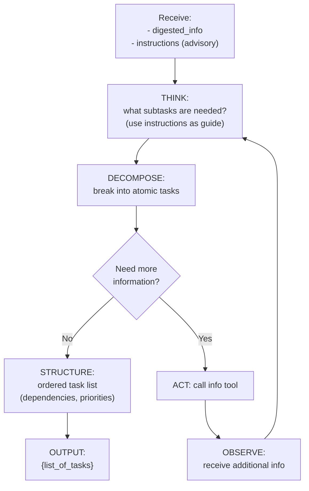

# Task Analysis (Inside TINYCUA Worker)

> **Category:** Agent Spec

> **File:** `architecture/task-analysis.md`
> **See also:** [Overview.md](overview.md), [Information_Digestion.md](information-digestion.md), [Task_Execution.md](task-execution.md), [Task_Reviewer.md](task-reviewer.md)

---

## Role

The Task Analysis Agent receives the **Digested Information** (which includes advisory instructions) from Information Digestion and breaks it down into a structured list of atomic tasks for the Worker to execute.

It can optionally call external tools if it needs more information to properly decompose the task.

---

## Inputs / Outputs

**Input:** `Digested Information` (from Information Digestion) — contains `digested_info`, `key_points`, `instructions` (advisory), `original_intent_summary`

**Output:** `List of Tasks` — each task has:
- `task_id`: unique identifier
- `description`: what to do
- `required_tools`: tools needed (if any)
- `expected_output`: what success looks like
- `max_depth`: how many sub-iterations allowed
- `dependencies`: task IDs that must complete first

**Tools:** (optional) `search_knowledge()`, `lookup_schema()`

---

## Internal Flow



---

## How instructions are used

The `instructions` from Information Digestion are **advisory** — the Task Analysis agent follows them as a guide but can adapt:

```python
class TaskAnalysis:
    def decompose(self, digested_info, instructions):
        # Use instructions as a starting point, not a strict command
        if instructions and instructions.get("advisory", False):
            # Guide decomposition, but validate against actual context
            action = instructions.get("action", "analyze")
            params = instructions.get("parameters", {})
            
            # Check if the instructions make sense given the digest
            if self.validate_instructions(instructions, digested_info):
                # Follow instructions
                tasks = self.create_tasks_from_instructions(action, params)
            else:
                # Instructions don't match context — override
                tasks = self.create_tasks_from_digest(digested_info)
        else:
            # No instructions — derive from digest alone
            tasks = self.create_tasks_from_digest(digested_info)
        
        return self.structure_task_list(tasks)
```

---

## Design Decisions

| Decision | Choice | Rationale |
|----------|--------|-----------|
| Instructions are | **Advisory** (not strict) | Task Analysis may discover a better approach; SLMs need flexibility |
| Loop type | ReAct (bounded) | May need to look up additional info before decomposing; max 3 iterations |
| Output format | Structured task list | Each task has metadata (tools, deps, max_depth) for deterministic execution |
