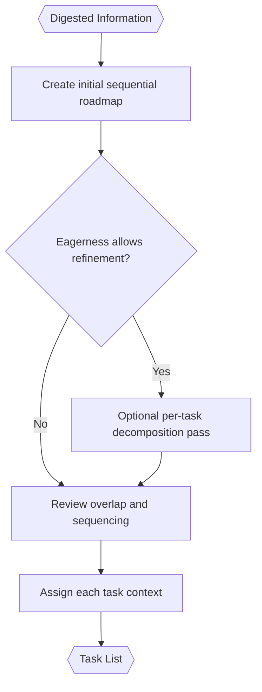

# Task Analysis (Inside TINYCUA Worker)

> **Category:** Agent Spec

> **File:** `architecture/task-analysis.md`
> **See also:** [overview.md](overview.md), [worker-orchestration.md](worker-orchestration.md), [state-objects.md](state-objects.md), [task-execution.md](task-execution.md), [task-reviewer.md](task-reviewer.md)

---

## Role

The Task Analysis Agent receives `Digested Information` and creates a sequential task roadmap for the Worker.

The roadmap is not a dependency graph and is not intended to be parallelized at the top level. If parallel work is useful, it belongs inside an individual task's execution strategy.

---

## Inputs / Outputs

**Input:** `Digested Information`

**Output:** `Task List`

```yaml
task_list:
  tasks:
    - task_id: task_001
      name: "Short task name"
      description: "What this task should accomplish"
      context: "Only the context this task needs"
      success_criteria:
        - "Semantic condition for success"
      confidence: 0.0-1.0
```

Required task fields:

- `task_id`
- `name`
- `description`
- `context`
- `success_criteria`
- `confidence`

Avoid rigid visible fields such as `required_tools`, `expected_output`, `max_depth`, or dependencies.

---

## Long-Term Tasks vs Short-Term Todos

Task Analysis produces long-term tasks: the sequential roadmap needed to satisfy the user request.

Task Execution may create short-term todos while executing one task. Those todos belong in the execution log, not in the top-level roadmap.

---

## Eagerness-Controlled Decomposition

Task Analysis may run one or more refinement passes depending on Worker eagerness.

| Eagerness | Task Analysis Behavior |
|-----------|------------------------|
| High | Create an initial roadmap quickly and allow Reviewer recovery to refine later. |
| Medium | Create the roadmap and perform limited overlap/sequencing review. |
| Low | More thoroughly decompose and refine before execution begins. |

---

## Internal Flow



---

## Replanning Requests

Task Reviewer may ask Task Analysis to revise the roadmap when:

- a task is too broad;
- a task should be split;
- task ordering is wrong;
- a result reveals missing context;
- repeated failures suggest the roadmap is flawed.

The Reviewer should request replanning rather than directly rewriting the decomposition semantics.

---

## Design Decisions

| Decision | Choice | Rationale |
|----------|--------|-----------|
| Roadmap shape | Sequential list | Keeps orchestration simple and avoids dependency-graph complexity |
| Task schema | Lightweight | Reduces prompt overhead and rigidity |
| Success definition | Semantic success criteria | Avoids overfitting to predicted exact outputs |
| Decomposition depth | Eagerness-controlled | Allows faster or more cautious Worker behavior |
