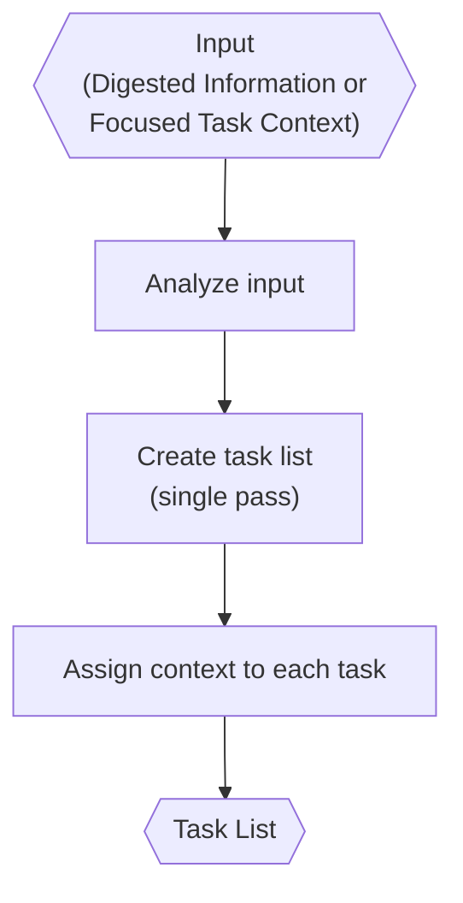

# Task Analyzer (Inside TINYCUA Worker)

> **Category:** Agent Spec

> **File:** `architecture/task-analysis.md`
> **Last Updated:** 2026-05-29
> **Status:** Implemented
> **See also:** [overview.md](overview.md), [worker-orchestration.md](worker-orchestration.md), [task-creation.md](task-creation.md), [task-assessor.md](task-assessor.md), [state-objects.md](state-objects.md), [information-digestion.md](information-digestion.md), [task-execution.md](task-execution.md), [result-reviewer.md](result-reviewer.md)

---

## Role

The Task Analyzer receives input (`Digested Information` or a focused task context) and creates a sequential task list. Each invocation performs a **single pass** — it takes input and produces a task list. The Task Analyzer does not refine its own output or perform multiple passes internally.

Multi-pass decomposition, where individual tasks are recursively broken down into sub-tasks, is handled by the **Task Creation** process. See [task-creation.md](task-creation.md) for the decomposition loop, nested task tree structure, and effort-controlled depth.

The roadmap is not a dependency graph and is not intended to be parallelized at the top level. If parallel work is useful, it belongs inside an individual task's execution strategy.

---

## Inputs / Outputs

**Input:**

- `Digested Information` (from the Information Digester)
- `Worker Config` with `effort`
- When invoked during decomposition: the current task's `context` as focused input (see [task-creation.md](task-creation.md))

**Output:** `Task List` — canonical schema in [state-objects.md](state-objects.md). Required task fields: `task_id`, `name`, `description`, `context` (structured markdown), `success_criteria`, `confidence`. A task may optionally contain a nested `tasks` field holding a sub-list (added by the Task Creation process, not by the Task Analyzer itself).

The `context` field should be structured markdown. See [state-objects.md](state-objects.md) for the canonical schema and context update rules.

---

## Internal Flow

Each individual invocation of the Task Analyzer is a single pass: it receives structured input and returns a sequential list of tasks. There is no refinement or multi-pass logic inside the Task Analyzer itself.

---

## Long-Term Tasks vs Short-Term Todos

The Task Analyzer produces long-term tasks: the sequential roadmap needed to satisfy the user request.

The Task Executor may create short-term todos while executing one task. Those todos belong in the execution log, not in the top-level roadmap.

---

## Replanning Requests

The Result Reviewer may ask the Task Analyzer to revise the roadmap when the current plan is insufficient. This covers three categories:

- **granularity** — a task is too broad or should be split;
- **structure** — task ordering is wrong or a completed task reveals missing context;
- **systemic failure** — repeated failures indicate the roadmap itself is flawed.

When the Result Reviewer requests replanning during execution, it calls the **Task Analyzer directly** with the current task's context. The Task Analyzer decomposes that specific task into a sub-list — it is not overhauling the entire roadmap, only breaking down the current task. This is the same linear input→output behavior the Task Analyzer always performs. The full Task Creation loop runs only at Worker start for upfront planning. See [task-creation.md](task-creation.md) for the upfront decomposition loop.

The Task Analyzer may split the current task into sub-tasks. The Result Reviewer should request replanning rather than directly rewriting the decomposition semantics.

---

## Design Decisions

| Decision | Choice | Rationale |
|----------|--------|-----------|
| Roadmap shape | Sequential list | Keeps orchestration simple and avoids dependency-graph complexity |
| Task schema | Lightweight | Reduces prompt overhead and rigidity |
| Success definition | Semantic success criteria | Avoids overfitting to predicted exact outputs |
| Decomposition | Delegated to Task Creation | The Task Analyzer is stateless single-pass. Multi-pass decomposition is handled by the [Task Creation](task-creation.md) outer loop, which invokes the Task Analyzer fresh for each decomposition decision. |
