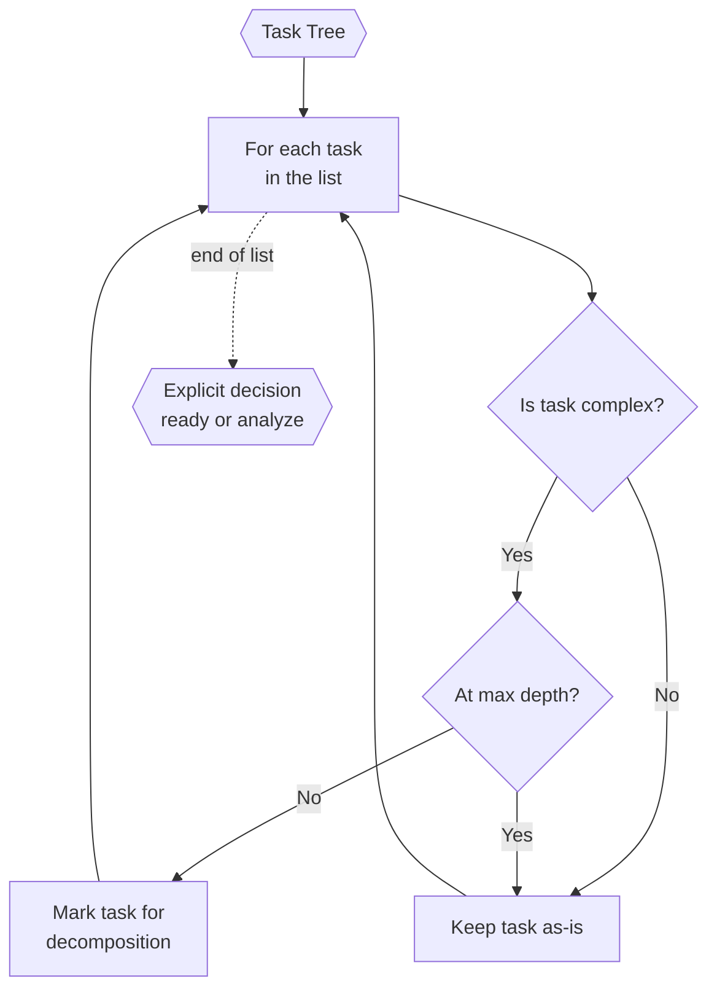

# Task Assessor (Inside TINYCUA Worker)

> **Category:** Agent Spec

> **File:** `architecture/task-assessor.md`
> **Last Updated:** 2026-07-26
> **Status:** Implemented
> **See also:** [overview.md](overview.md), [worker-orchestration.md](worker-orchestration.md), [task-creation.md](task-creation.md), [task-analysis.md](task-analysis.md), [result-reviewer.md](result-reviewer.md), [state-objects.md](state-objects.md)

---

## Role

The Task Assessor reviews a task tree and decides whether its paired Task Analyzer should run. It is used during upfront Task Creation, execution-time local replanning, and to validate a newly requested task cancellation.

The Task Assessor does not perform decomposition itself. It acts as a gate: given a list of tasks, it identifies which ones are complex enough to warrant breakdown. The actual decomposition is delegated to the [Task Analyzer](task-analysis.md).

This is distinct from the execution-time [Result Reviewer](result-reviewer.md), which evaluates task execution results and decides whether to accept, retry, replan, or escalate.

---

## Inputs / Outputs

**Input:**

- `Task Tree` — the current tree of tasks (from the initial Task Analyzer pass or from a previous decomposition round)
- `Worker Config` with `effort` — controls how many assessment passes are allowed (max depth)

**Output:**

- One explicit `task_assessment_decision` with a non-empty rationale.
- `ready` with no selected task IDs skips only the paired Task Analyzer.
- `analyze` with one or more valid unfinished task references invokes the paired Task Analyzer. References are canonicalized and deduplicated before handoff.

For roadmap modes, the Task Assessor produces selection decisions only. In cancellation-review mode, `ready` approves one bound cancellation request and `analyze` rejects it with one target-bound finding; the state store records that decision atomically.

---

## How It Works

For each task in scope, the Task Assessor evaluates complexity, nesting depth, and whether further decomposition is useful. Missing or terminal targets are rejected. The assessor is read-only: it commits only the validated decision handoff and never mutates task state.

---

## Internal Flow

---

## Relationship to Task Creation

The Task Assessor is invoked between passes of the Task Creation loop. It reviews the current task list and selects which tasks deserve further decomposition. During execution-time replanning, the same assessor evaluates only the active task or local region before a local analyzer pass.

See [task-creation.md](task-creation.md) for the full Task Creation flow and effort-controlled pass limits.

## Cancellation Review

`task_shrink(action="cancel")` creates a pending request; it does not immediately make a task terminal. The next Task Assessor reviews the bound request exactly once. Approval is allowed only when cancellation removes no original-request obligation or hard constraint and the parent outcome remains achievable. Failure, difficulty, and temporary blockage are rejected reasons. Approval cancels the unattempted subtree; rejection routes to the paired Analyzer for a non-cancellation repair. Previously approved, rejected, and legacy cancelled tasks are not reassessed.

---

## Distinction from Result Reviewer

| | Task Assessor | Result Reviewer |
|---|---|---|
| **When** | Upfront Task Creation or execution-time local replan | During execution, after each task completes |
| **Input** | Task list (not yet executed) | Task result + execution log |
| **Decides** | Which tasks to decompose further | Accept / retry / replan / escalate |
| **Output** | Selection of tasks for decomposition | Reviewer Decision (see [state-objects.md](state-objects.md)) |
| **Scope** | Pre-execution planning | Post-execution quality assurance |

---

## Design Decisions

| Decision | Choice | Rationale |
|----------|--------|-----------|
| Responsibility | Selection only, no decomposition | Keeps the Task Assessor focused. Decomposition is the Task Analyzer's job. |
| Scope | Full roadmap upfront; active task/local region during replan | The same validated decision boundary avoids running an analyzer that has no useful work. |
| Criteria | Complexity + depth + nature | Simple multi-factor gate avoids over-decomposing trivial tasks while allowing deep nesting for genuinely complex work. |
