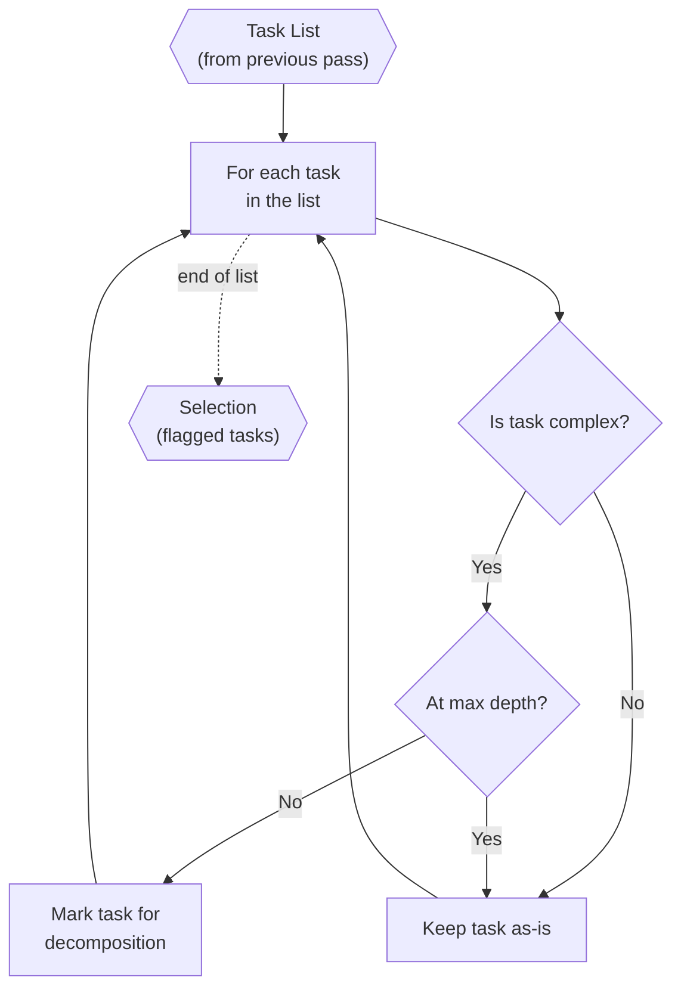

# Task Assessor (Inside TINYCUA Worker)

> **Category:** Agent Spec

> **File:** `architecture/task-assessor.md`
> **Last Updated:** 2026-05-29
> **Status:** Implemented
> **See also:** [overview.md](overview.md), [worker-orchestration.md](worker-orchestration.md), [task-creation.md](task-creation.md), [task-analysis.md](task-analysis.md), [result-reviewer.md](result-reviewer.md), [state-objects.md](state-objects.md)

---

## Role

The Task Assessor reviews a task list and selects which individual tasks should be decomposed further into sub-tasks. It runs **only within the Task Creation upfront process** — never during execution.

The Task Assessor does not perform decomposition itself. It acts as a gate: given a list of tasks, it identifies which ones are complex enough to warrant breakdown. The actual decomposition is delegated to the [Task Analyzer](task-analysis.md).

This is distinct from the execution-time [Result Reviewer](result-reviewer.md), which evaluates task execution results and decides whether to accept, retry, replan, or escalate.

---

## Inputs / Outputs

**Input:**

- `Task List` — the current list of tasks (from the initial Task Analyzer pass or from a previous decomposition round)
- `Worker Config` with `effort` — controls how many assessment passes are allowed (max depth)

**Output:**

- Selection of tasks to decompose — a subset of the input task list marked for decomposition
- For each selected task: the task is flagged for the Task Creation loop to invoke the Task Analyzer on it

The Task Assessor does not modify tasks or produce sub-lists. It produces selection decisions only.

---

## How It Works

For each task in the current list, the Task Assessor evaluates:

1. **Complexity** — is this task broad enough to benefit from decomposition? Simple, atomic tasks should remain as-is.
2. **Depth** — has the task already reached the maximum nesting depth allowed by `effort`? If so, do not decompose further.
3. **Nature** — is this task inherently indivisible? Some tasks (e.g., a single API call, a simple read) do not benefit from splitting.

Tasks that are complex AND not at max depth are selected for decomposition. The Task Creation loop then invokes the Task Analyzer on each selected task to produce its sub-list.

---

## Internal Flow

---

## Relationship to Task Creation

The Task Assessor is invoked between passes of the Task Creation loop. It reviews the current task list and selects which tasks deserve further decomposition. Task Creation then invokes the Task Analyzer on each selected task to produce sub-lists. If effort allows more passes, the loop repeats with the Task Assessor reviewing the now-expanded list.

See [task-creation.md](task-creation.md) for the full Task Creation flow and effort-controlled pass limits.

---

## Distinction from Result Reviewer

| | Task Assessor | Result Reviewer |
|---|---|---|
| **When** | Upfront, during Task Creation | During execution, after each task completes |
| **Input** | Task list (not yet executed) | Task result + execution log |
| **Decides** | Which tasks to decompose further | Accept / retry / replan / escalate |
| **Output** | Selection of tasks for decomposition | Reviewer Decision (see [state-objects.md](state-objects.md)) |
| **Scope** | Pre-execution planning | Post-execution quality assurance |

---

## Design Decisions

| Decision | Choice | Rationale |
|----------|--------|-----------|
| Responsibility | Selection only, no decomposition | Keeps the Task Assessor focused. Decomposition is the Task Analyzer's job. |
| Scope | Task Creation upfront only | Task Assessment is a planning concern. During execution, the Result Reviewer handles replanning by calling the Task Analyzer directly. |
| Criteria | Complexity + depth + nature | Simple multi-factor gate avoids over-decomposing trivial tasks while allowing deep nesting for genuinely complex work. |
