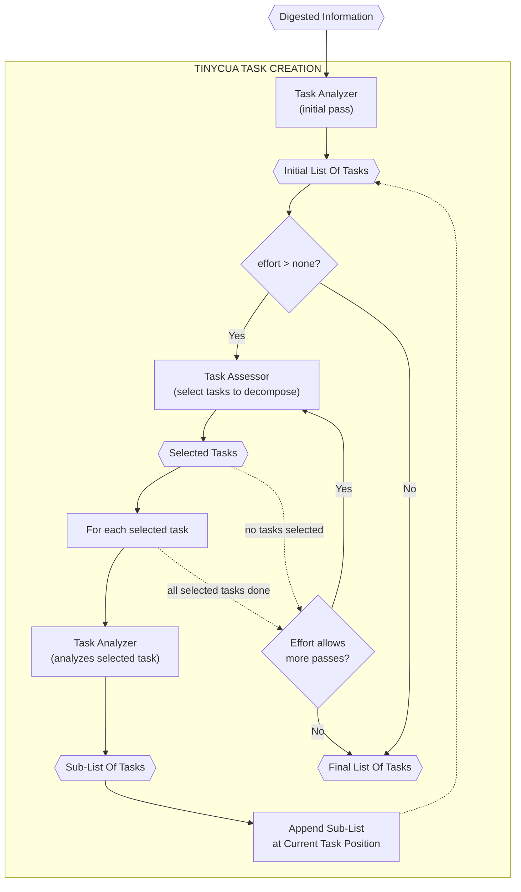

# Task Creation (Inside TINYCUA Worker)

> **Category:** Process Spec

> **File:** `architecture/task-creation.md`
> **Last Updated:** 2026-05-29
> **Status:** Implemented
> **See also:** [overview.md](overview.md), [worker-orchestration.md](worker-orchestration.md), [task-analysis.md](task-analysis.md), [task-assessor.md](task-assessor.md), [result-reviewer.md](result-reviewer.md), [state-objects.md](state-objects.md)

---

## Role

Task Creation is the upfront process that invokes the [Task Analyzer](task-analysis.md) iteratively to build a nested task tree. It runs **once at Worker start**, before any task execution begins.

The Task Analyzer itself is a stateless ReAct agent with a single input→output contract (no internal routing branches). Each invocation receives input and produces a task list. Task Creation is the outer loop that calls the Task Analyzer fresh for each decomposition decision. The Task Analyzer never refines its own output; multi-pass decomposition is achieved by the Task Creation loop re-invoking it.

During execution, when the Result Reviewer needs to decompose a task, it calls the Task Analyzer directly (not the full Task Creation loop). See [task-analysis.md](task-analysis.md) for the Task Analyzer's replanning behavior.

---

## Inputs / Outputs

**Input:**

- `Digested Information`
- `Worker Config` with `effort`

**Output:** `Task List` — a sequential roadmap that may contain nested sub-lists. When the Task Creation loop decomposes complex tasks, the output contains container tasks (with a `tasks` sub-list) and leaf tasks (executable units). Canonical schema in [state-objects.md](state-objects.md).

---

## How It Works

Task Creation is an iterative decomposition loop that builds a nested task tree before execution begins.

**Initial pass:** The Task Analyzer receives `Digested Information` and produces an initial `List of Tasks`.

**Effort gating:** The `effort` setting controls whether decomposition occurs. See [Effort-Controlled Decomposition](#effort-controlled-decomposition) below for the full behavior at each level.

**Decomposition loop:** Each pass, the Task Assessor reviews the current task list and selects which tasks are complex enough to warrant decomposition (see [task-assessor.md](task-assessor.md)). For each selected task, the Task Analyzer is invoked fresh with the task's context as focused input and produces a sub-list. The sub-tasks are appended at the current task's position, and the original parent task becomes a container (see [state-objects.md](state-objects.md) for the nested task list schema).

**Pass depth:** The loop repeats until the effort setting allows no more passes. Each pass represents one additional layer of nesting. The maximum pass depth is not an absolute nesting limit — it only controls how many decomposition passes Task Creation performs upfront. During execution, the Result Reviewer may call the Task Analyzer directly to decompose further.

---

## Task Tree Structure

The Task Creation loop produces a nested task tree — a `List of Tasks` can contain a `List of Tasks`. The canonical schema with leaf tasks, container tasks, and the `tasks` sub-list field is defined in [state-objects.md](state-objects.md).

Only **leaf tasks** (tasks without a `tasks` sub-list) are executed by the Task Executor. **Container tasks** exist for structure and organization — their `name` and `description` describe the container's purpose, but the actual work is defined by their child tasks.

---

## Internal Flow

The Task Assessor runs between passes: it reviews the current list and selects which tasks are complex enough to warrant decomposition. The Task Creation loop then iterates through only the selected tasks, invoking the Task Analyzer on each. After all selected tasks are decomposed, if effort allows more passes, the loop returns to the Task Assessor with the now-expanded list.

---

## Effort-Controlled Decomposition

The `effort` setting controls how many passes of the Task Assessor → Task Analyzer cycle are performed. It does not change the Task Analyzer's internal behavior — the Task Analyzer always follows the same input→output contract regardless of effort.

- **`none`** — Task Creation runs only the initial pass. The Task Analyzer is invoked once with `Digested Information` and produces a flat task list. The Task Assessor is not invoked. No iterative decomposition occurs.

- **`high`** — Task Creation performs the initial pass plus one or more decomposition passes. Each pass: the Task Assessor selects complex tasks, then the Task Analyzer is invoked fresh on each selected task to produce sub-lists. This repeats for progressively deeper nesting, limited by how many passes the effort setting allows. The max depth is a pass-count control for Task Creation upfront planning — it is not an absolute nesting limit on the final task tree.

The Task Assessor acts as a gate between passes — it decides which tasks deserve further decomposition rather than blindly iterating over every task. The Task Analyzer never refines its own output; it always produces a new list from new input.

See [state-objects.md](state-objects.md) for the `Worker Config` schema and effort-level semantics.

---

## Replanning During Execution

Task Creation runs only at Worker start for upfront planning. During execution, when the Result Reviewer needs to decompose a task or revise the roadmap, it calls the **Task Analyzer directly** — not the full Task Creation loop. See [task-analysis.md](task-analysis.md) for the Task Analyzer's replanning behavior, and [result-reviewer.md](result-reviewer.md) for the `replan` decision.

The Task Analyzer's output mechanics are identical regardless of who calls it: it receives input (a task's context or remaining roadmap) and produces a task list. The difference is scope:

- **Task Creation (upfront):** iterates through the full task list, calling the Task Analyzer repeatedly to build a complete nested tree.
- **Result Reviewer (mid-execution):** calls the Task Analyzer once to decompose the current task. The output sub-list is inserted at the current position and execution continues. The Result Reviewer is not overhauling the entire roadmap — only breaking down the task at hand.

This separation keeps the Task Creation loop as an upfront orchestration concern while the Task Analyzer remains a reusable, stateless agent available throughout the Worker's lifecycle.

---

## Design Decisions

| Decision | Choice | Rationale |
|----------|--------|-----------|
| Decomposition strategy | Iterative loop invoking the Task Analyzer fresh | Keeps the Task Analyzer stateless with a simple input→output contract. The loop handles complexity control (effort, max depth) without burdening the agent. |
| Nested structure | Container tasks with `tasks` sub-list | Preserves the sequential roadmap structure while allowing arbitrary nesting depth. Leaf tasks are the only executable units. |
| In-place list modification | Append sub-tasks at current position | Ensures the iteration naturally visits newly decomposed tasks in the same pass, allowing progressively deeper decomposition without restarting the loop. |
| Scope | Upfront planning only | Task Creation runs once at Worker start. During execution, the Result Reviewer calls the Task Analyzer directly — the same agent, but without the full loop orchestration. |
