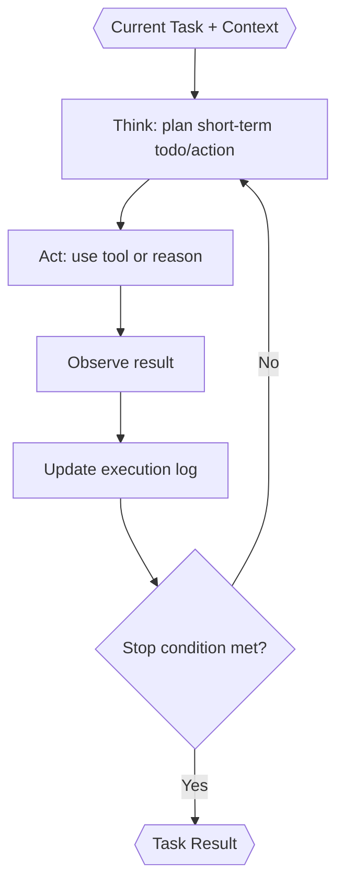

# Task Executor (Inside TINYCUA Worker)

> **Category:** Agent Spec

> **File:** `architecture/task-execution.md`
> **Last Updated:** 2026-07-31
> **Status:** Implemented
> **See also:** [overview.md](overview.md), [session-architecture.md](session-architecture.md), [worker-orchestration.md](worker-orchestration.md), [task-analysis.md](task-analysis.md), [result-reviewer.md](result-reviewer.md), [state-objects.md](state-objects.md)

---

## Role

The Task Executor executes one task from the sequential roadmap.

It receives only the current task's information plus shallow roadmap awareness. It should not receive the full parent session `Context` or full previous task details by default.

The original user request and immutable constraints outrank generated acceptance clauses, roadmap descriptions, and model assumptions. The Executor does not intentionally implement pending sibling outcomes. It reports unavoidable sibling effects with their cause and evidence; substantial sibling work is a scope mismatch for Reviewer-led replanning. Pre-existing compliant work is verified and reported as a no-change success.

A pending task cancellation is always assessed before Executor dispatch. Only an Assessor-approved cancellation is skipped; failed, blocked, and rejected-cancellation tasks remain executable or follow their normal recovery path.

---

## Inputs / Outputs

**Input:**
- Current `task` from the Task Tree — canonical schema in [state-objects.md](state-objects.md). Key fields: `task_id`, `task_name`, `task_description`, `task_context` (structured markdown), `success_criteria`, `confidence`, `task_result`.

- `shallow_task_list` — task IDs and names from the Task Tree for scope awareness (no full task details).
- Failure context from the Result Reviewer on retry — the Reviewer's output schema (see [state-objects.md](state-objects.md)) defines the retry contract.

Retries create a new Task Executor sub-session. The new executor automatically receives every current active-task `OPEN` finding and the complete rationale from each finding's latest linked review event. Linked events are deduplicated; addressed, deferred, invalid, sibling, superseded, and unrelated review prose is excluded. Executor does not receive `task_inspect` because relevant remediation context is injected deterministically.

**Output:**

- `Task Result` — canonical schema in [state-objects.md](state-objects.md).

Execution actions (tool calls, observations, decision trace) are recorded in the sub-session's `execution_log` — see [session-architecture.md](session-architecture.md). The Task Result points back to its sub-session but does not embed the full execution log.

The complete Task Result report is the primary review target and records the Executor's completion claim, not independent verification. Runtime-owned Executor tool evidence is presented separately with exact URLs, bounded invocation metadata, explicit output-preview truncation, and optional audit paths. During final root review, the Reviewer commits its falsification plan before this claim is revealed and must gather its own observations for empirical support.

---

## Internal Flow

---

## Stop Conditions

Task Execution stops when success criteria are met, a structural issue is discovered, or the executor cannot proceed. If a later roadmap task is needed first, Task Execution should return `blocked` with a sequencing explanation.

---

## Execution Log

Execution actions are captured in the Task Executor sub-session's `execution_log`, not embedded in the Task Result. This separation means:

- The execution log is evidence for the Result Reviewer, who accesses the sub-session log.
- Actions, observations, changes, and decision traces are recorded.
- Retries create new Task Executor sub-sessions, so each retry starts with a fresh execution log — the old log is not carried forward.

See [session-architecture.md](session-architecture.md) and [state-objects.md](state-objects.md) for the Execution Log schema and session-level storage rules.

If the Task Executor asks the user for clarification, the user reply resumes the same Task Executor sub-session. Clarification is not a terminal state.

---

## Design Decisions

| Decision | Choice | Rationale |
|----------|--------|-----------|
| Context scope | Current task context only | Prevents unrelated context from polluting execution |
| Roadmap awareness | Shallow task list | Helps scope control without exposing future task details |
| Review history | Role-specific active-task projection | Executor receives complete current-open remediation detail; Reviewer receives a compact all-status ledger; full events remain inspectable without crossing tasks |
| Output | Result + sub-session execution log | Gives Reviewer evidence for the active outcome and any unavoidable scope effects |
| Failure handling | Return explicit status | Reviewer decides retry, replan, escalation, or context update |

---

## Cumulative Review Context and Artifact History

### Progression ownership

One goal-wide cumulative progress report is derived from the append-only committed
review events (``record_reviewer_decision`` in the global transition log) plus
current task state. Only ResultReviewer contributes entries through
``task_review_decision``; every model-facing decision requires a non-empty
progress-quality ``review_summary``. Executor, TaskAssessor, and TaskAnalyzer
receive a read-only approved-only projection so previously accepted knowledge
survives later reviews and replans without repeating or undoing it, while
rejection/postponement detail stays task-local in the review journal.

### Result and artifact provenance

On Reviewer COMMIT the runtime records a content-addressed logical result revision
(SHA-256 of the report), injects the trusted identities (``revision_id``,
``content_hash``, ``artifact_range``) into the staged decision immediately before
the atomic commit, and advances the review checkpoint only after the commit
succeeds (approvals only). The model cannot provide or override these fields
(``additionalProperties: false``). Committed events retain the exact result hash
and artifact revision range; later result replacement cannot destroy the report
behind an earlier verdict (FR-009).

### Storage boundary (FR-012/FR-013)

Workspace manifests, eligible changed-content blobs, result revisions, and the
review checkpoint live under session-owned system storage resolved outside
``workspace_dir`` (``SessionConfig.session_dir``; the CLI defaults to a per-run
directory beside the workspace, and experiment runs mount a sibling
``system-artifacts`` directory). Model-visible prompts, tool outcomes, task
metadata, and state projections expose only opaque ``rev-...`` identifiers and
workspace-relative paths — never the internal directory. Failures fail closed:
an unreadable store blocks pre-mutation capture, and a post-write persistence
failure marks the audit incomplete and blocks review approval until surfaced
(FR-014).
