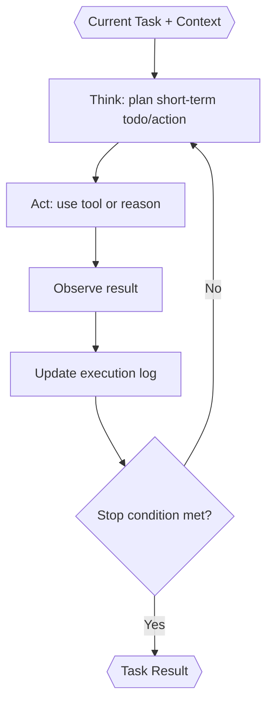

# Task Executor (Inside TINYCUA Worker)

> **Category:** Agent Spec

> **File:** `architecture/task-execution.md`
> **See also:** [overview.md](overview.md), [session-architecture.md](session-architecture.md), [worker-orchestration.md](worker-orchestration.md), [task-analysis.md](task-analysis.md), [task-reviewer.md](task-reviewer.md)

---

## Role

The Task Executor executes one task from the sequential roadmap.

It receives only the current task's information plus shallow roadmap awareness. It should not receive the full parent session `Context` or full previous task details by default.

---

## Inputs / Outputs

**Input:**

```yaml
task:
  task_id: task_001
  name: "..."
  description: "..."
  context: "..."
  success_criteria:
    - "..."
  confidence: 0.0-1.0
shallow_task_list:
  - task_id: task_001
    name: "..."
  - task_id: task_002
    name: "..."
retry_context: "optional failure context from reviewer"
```

Retries create a new Task Executor sub session. The previous failure is recorded in the task context/retry context so the new executor can continue with the relevant lesson without inheriting the full prior executor context.

**Output:**

```yaml
task_result:
  task_id: task_001
  status: completed | partial | failed | blocked | insufficient_context | incorrect_task_spec | tool_failure | out_of_scope
  result: "..."
  discovered_sequence_issues:
    - "..."
  uncertainty_notes:
    - "..."
```

Execution actions (tool calls, observations, decision trace) are recorded in the sub-session's `execution_log` — see [session-architecture.md](session-architecture.md). The Task Result points back to its sub-session but does not embed the full execution log.

---

## Internal Flow



---

## Stop Conditions

Task Execution should stop when:

- success criteria are satisfied;
- the task is out of scope;
- a sequencing issue is discovered;
- context is insufficient;
- the task appears incorrectly specified;
- a required tool/action fails;
- uncertainty is too high and should be reviewed instead of guessed.

If a later roadmap task appears to be needed first, Task Execution should return `blocked` with a sequencing explanation.

---

## Execution Log

Execution actions are captured in the Task Executor sub-session's `execution_log`, not embedded in the Task Result. This separation means:

- The execution log is evidence for the Task Reviewer, who accesses the sub-session log.
- Tool calls, observations, diffs (if file changes exist), and decision traces are recorded.
- Retries create new Task Executor sub-sessions, so each retry starts with a fresh execution log — the old log is not carried forward.

The execution log should include:

- short-term todos generated during execution;
- tool actions, observations, and diffs;
- human-in-the-loop user inputs;
- concise decision trace or reasoning summary.

See [session-architecture.md](session-architecture.md) and [state-objects.md](state-objects.md) for the Execution Log schema and session-level storage rules.

If the Task Executor asks the user for clarification, the user reply resumes the same Task Executor sub session. Clarification is not a terminal state.

---

## Design Decisions

| Decision | Choice | Rationale |
|----------|--------|-----------|
| Context scope | Current task context only | Prevents unrelated context from polluting execution |
| Roadmap awareness | Shallow task list | Helps scope control without exposing future task details |
| Output | Result + sub-session execution log | Gives Reviewer evidence for acceptance and context propagation |
| Failure handling | Return explicit status | Reviewer decides retry, replan, escalation, or context update |
