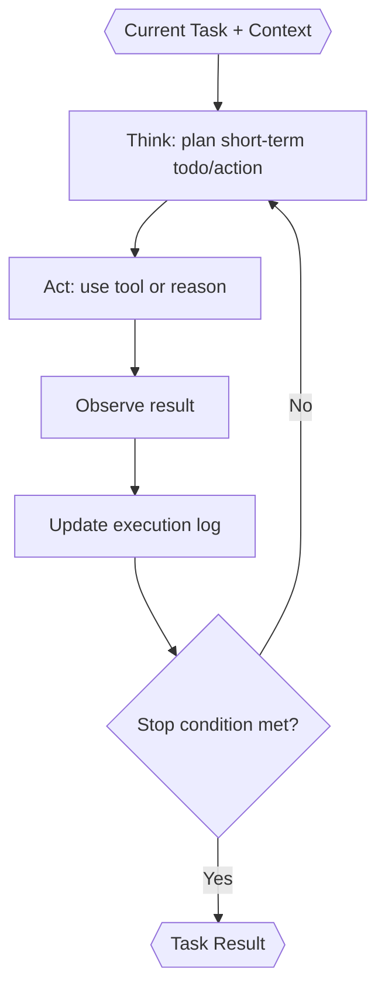

# Task Executor (Inside TINYCUA Worker)

> **Category:** Agent Spec

> **File:** `architecture/task-execution.md`
> **Last Updated:** 2026-05-30
> **Status:** Implemented
> **See also:** [overview.md](overview.md), [session-architecture.md](session-architecture.md), [worker-orchestration.md](worker-orchestration.md), [task-analysis.md](task-analysis.md), [result-reviewer.md](result-reviewer.md), [state-objects.md](state-objects.md)

---

## Role

The Task Executor executes one task from the sequential roadmap.

It receives only the current task's information plus shallow roadmap awareness. It should not receive the full parent session `Context` or full previous task details by default.

The original user request and immutable constraints outrank generated acceptance clauses, roadmap descriptions, and model assumptions. The Executor does not intentionally implement pending sibling outcomes. It reports unavoidable sibling effects with their cause and evidence; substantial sibling work is a scope mismatch for Reviewer-led replanning. Pre-existing compliant work is verified and reported as a no-change success.

---

## Inputs / Outputs

**Input:**
- Current `task` from the Task Tree — canonical schema in [state-objects.md](state-objects.md). Key fields: `task_id`, `task_name`, `task_description`, `task_context` (structured markdown), `success_criteria`, `confidence`, `task_result`.

- `shallow_task_list` — task IDs and names from the Task Tree for scope awareness (no full task details).
- Failure context from the Result Reviewer on retry — the Reviewer's output schema (see [state-objects.md](state-objects.md)) defines the retry contract.

Retries create a new Task Executor sub-session. The new executor receives the active task's bounded review digest so it can avoid repeating the same mistake, without inheriting full rationale or another task's execution context.

**Output:**

- `Task Result` — canonical schema in [state-objects.md](state-objects.md).

Execution actions (tool calls, observations, decision trace) are recorded in the sub-session's `execution_log` — see [session-architecture.md](session-architecture.md). The Task Result points back to its sub-session but does not embed the full execution log.

---

## Internal Flow

---

## Stop Conditions

Task Execution stops when success criteria are met, a structural issue is discovered, or the executor cannot proceed. If a later roadmap task is needed first, Task Execution should return `blocked` with a sequencing explanation.

---

## Execution Log

Execution actions are captured in the Task Executor sub-session's `execution_log`, not embedded in the Task Result. This separation means:

- The execution log is evidence for the Result Reviewer, who accesses the sub-session log.
- Actions, observations, changes, and decision traces are recorded.
- Retries create new Task Executor sub-sessions, so each retry starts with a fresh execution log — the old log is not carried forward.

See [session-architecture.md](session-architecture.md) and [state-objects.md](state-objects.md) for the Execution Log schema and session-level storage rules.

If the Task Executor asks the user for clarification, the user reply resumes the same Task Executor sub-session. Clarification is not a terminal state.

---

## Design Decisions

| Decision | Choice | Rationale |
|----------|--------|-----------|
| Context scope | Current task context only | Prevents unrelated context from polluting execution |
| Roadmap awareness | Shallow task list | Helps scope control without exposing future task details |
| Review history | Active-task digest by default | Open/deferred/recent findings and recent event summaries survive retry and postponement without crossing tasks |
| Output | Result + sub-session execution log | Gives Reviewer evidence for the active outcome and any unavoidable scope effects |
| Failure handling | Return explicit status | Reviewer decides retry, replan, escalation, or context update |
