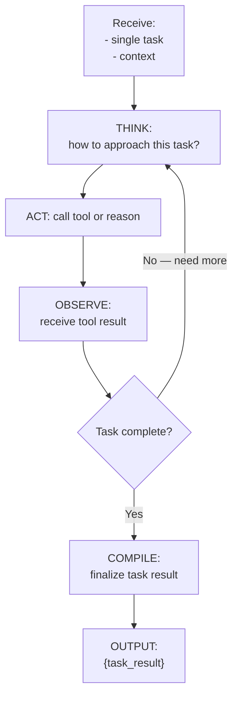

# Task Execution (Inside TINYCUA Worker)

> **Category:** Agent Spec

> **File:** `architecture/task-execution.md`
> **See also:** [Overview.md](overview.md), [Task_Analysis.md](task-analysis.md), [Task_Reviewer.md](task-reviewer.md)

---

## Role

The Task Execution Agent takes a **single task** from the list produced by Task Analysis and executes it. This is the **most tool-intensive agent** — it calls external tools, processes results, and may iterate if the task requires multiple steps.

This is the **classic ReAct loop** — think → act → observe → repeat until done.

---

## Inputs / Outputs

**Input:** Single task object:
```json
{
  "task_id": "task_003",
  "description": "Search for Paper A's methodology section",
  "required_tools": ["search_web", "read_file"],
  "expected_output": "Methodology description text",
  "max_depth": 5,
  "dependencies": []
}
```

**Output:** Task result (structure varies by task type)

**Tools:** Various — `search_web()`, `read_file()`, `run_code()`, `search_knowledge()`, etc.

---

## Internal Flow



---

## Pseudo-code

```python
class TaskExecution:
    """
    Classic ReAct agent that executes a single task.
    Bounded by max_depth to prevent infinite loops.
    """
    
    def execute(self, task, context):
        iteration = 0
        max_iter = task.get("max_depth", 5)
        result = None
        
        while iteration < max_iter:
            # Think: determine next action
            action = self.plan_next_action(task, context, result)
            
            if action["type"] == "tool_call":
                # Act: call the tool
                observation = self.call_tool(action["tool"], action["args"])
                
                # Observe: process result
                context = self.update_context(context, observation)
                result = observation
                
            elif action["type"] == "complete":
                # Task is done
                break
            
            iteration += 1
        
        return self.compile_result(task, context, result)
```

---

## Design Decisions

| Decision | Choice | Rationale |
|----------|--------|-----------|
| Loop type | ReAct (open-ended, bounded) | Classic tool-use loop; bounded by `max_depth` from task definition |
| Tool access | Full toolset | This is where actual work happens — needs access to all external tools |
| Stop condition | Task complete OR max_depth reached | Prevents infinite loops; failure at max_depth is caught by Reviewer |
