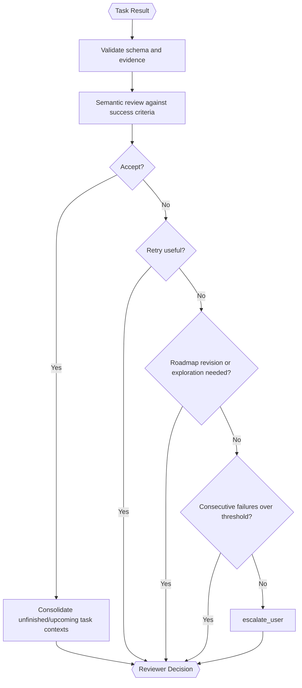

# Task Reviewer (Inside TINYCUA Worker)

> **Category:** Agent Spec

> **File:** `architecture/task-reviewer.md`
> **See also:** [overview.md](overview.md), [session-architecture.md](session-architecture.md), [worker-orchestration.md](worker-orchestration.md), [task-analysis.md](task-analysis.md), [task-execution.md](task-execution.md)

---

## Role

The Task Reviewer evaluates each task result and decides the next Worker transition.

Its primary responsibilities are:

1. review completion against success criteria;
2. determine what context should update future tasks;
3. decide whether to accept, retry, replan, or escalate.

---

## Hybrid Reviewer

Task Reviewer should be hybrid:

- deterministic checks for schema validity, missing fields, ordering consistency, and citations where applicable;
- LLM-based semantic review for correctness, sufficiency, context propagation, and recovery decisions.

---

## Inputs / Outputs

**Input:**

- original task definition;
- current task `context`;
- task success criteria;
- task result;
- sub-session execution log (tool calls, results, diffs from the Task Executor's sub-session);
- shallow full task list;
- dynamic access to individual task contexts when needed.

The Reviewer should not receive a broad accumulated context dump by default. Accumulation happens by updating relevant future task contexts after accepted results.

**Output:**

```yaml
reviewer_decision:
  task_id: task_001
  status: accepted | retry | replan | escalate_user
  reason: "..."
  confidence: 0.0-1.0
  context_updates:
    - target_task_id: task_004
      update: "..."
  retry_instructions: "..."
  replan_request: "..."
  failure_count_snapshot:
    consecutive_failures: 0
```

---

## Internal Flow



---

## Context Propagation

After accepting a task, the Reviewer decides which unfinished or upcoming tasks need context updates.

Recommended process:

1. Inspect the shallow task list.
2. Identify likely future tasks affected by the accepted result.
3. Dynamically inspect only those task contexts.
4. Write targeted context updates.

This avoids dumping every previous task result into every future task. Context updates are information consolidation: they may reduce, replace, or rewrite task context rather than only append new text.

---

## Status-to-Action Semantics

| Status | Orchestration Action |
|--------|----------------------|
| `accepted` | Consolidate context for unfinished/upcoming tasks, then check whether any unfinished tasks remain. If none remain, aggregate Worker Result. |
| `retry` | Create a new Task Executor for the same task with failure information recorded in the task context. Do not resume the old executor. |
| `replan` | Call the Task Analyzer to revise the sequential roadmap or expand task context. If the final task is decomposed into new tasks, the Worker continues. |
| `escalate_user` | Pause the current agent sub-session and ask the user for clarification. |

The Worker only terminates successfully when the final unfinished task is accepted and no remaining unfinished tasks exist.

---

## Repeated Failure Behavior

The Worker tracks a volatile universal consecutive-failure counter.

- On failure: increment the counter.
- On success: reset the counter to zero.
- If failures happen N times in a row: ask the user and explain the point of failure.

This is not only per-task. It protects the whole Worker from retry/replan loops.

---

## Design Decisions

| Decision | Choice | Rationale |
|----------|--------|-----------|
| Reviewer style | Hybrid | Combines reliable validation with semantic judgment |
| Context update | Targeted propagation | Preserves precision and avoids context pollution |
| Replanning | Request the Task Analyzer | Keeps roadmap generation responsibility in the Task Analyzer |
| Failure escalation | Consecutive failure threshold | Prevents infinite retry loops and supports HITL recovery |
