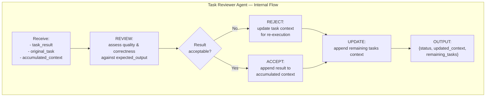

# Task Reviewer (Inside TINYCUA Worker)

> **Category:** Agent Spec

> **File:** `architecture/task-reviewer.md`
> **See also:** [Overview.md](overview.md), [Task_Analysis.md](task-analysis.md), [Task_Execution.md](task-execution.md)

---

## Role

The Task Reviewer Agent evaluates the result of a completed task and decides whether to accept it, request re-execution, or update the task list context.

It is a **decision agent** — it doesn't loop on tools, but evaluates, decides, and updates state.

---

## Inputs / Outputs

**Input:**
- `task_result` — the output from Task Execution
- `original_task` — the task definition (description, expected_output)
- `accumulated_context` — all prior results in the Worker

**Output:**
```json
{
  "status": "accepted",          // or "rejected"
  "updated_context": { ... },   // accumulated context after appending/rejecting
  "remaining_tasks": [...]      // updated list (with re-execution tasks if rejected)
}
```

**Tools:** (optional) `compare_result()`, `validate_schema()`

---

## Internal Flow



---

## Design Decisions

| Decision | Choice | Rationale |
|----------|--------|-----------|
| Loop type | **Linear** (no tool loop) | Purely evaluative — assess, decide, update. No iteration needed. |
| What happens on rejection? | Task is flagged for re-execution with updated context | The Worker loop (non-agent) handles re-iteration; Reviewer just sets the state |
| Escalation path | If task repeatedly fails → Reviewer signals outer loop | Keeps recovery at orchestration level, not inside the Worker |
