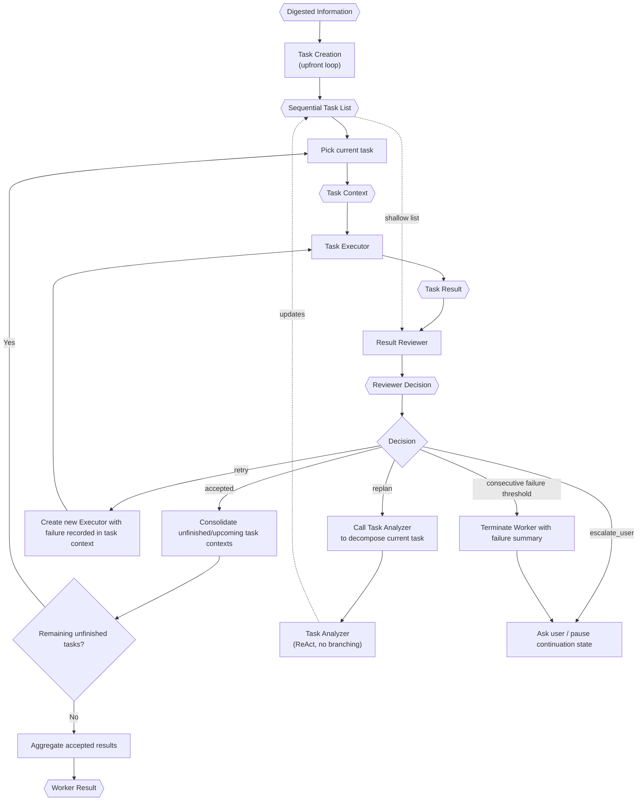

# TINYCUA Worker Orchestration

> **Category:** Process Spec

> **File:** `architecture/worker-orchestration.md`
> **Last Updated:** 2026-05-30
> **Status:** Implemented
> **See also:** [overview.md](overview.md), [session-architecture.md](session-architecture.md), [information-digestion.md](information-digestion.md), [task-creation.md](task-creation.md), [task-assessor.md](task-assessor.md), [task-analysis.md](task-analysis.md), [task-execution.md](task-execution.md), [result-reviewer.md](result-reviewer.md), [state-objects.md](state-objects.md)

This document defines the internal Worker orchestration used in Worker Mode.

---

## Role

The TINYCUA Worker is an internal orchestration of specialized TINYCUA agents. Externally, the user can experience TINYCUA as a single agent, but internally Worker Mode coordinates:

1. Task Creation (upfront loop)
2. Task Assessor (selects tasks for decomposition during Task Creation)
3. Task Analyzer (ReAct agent, no internal routing branches — called by both Task Creation and the Result Reviewer)
4. Task Executor
5. Result Reviewer

The Worker exists to reduce hallucination by decomposing context exposure. Each internal agent receives only the context required for its role.

These specialized Worker agents may use sub-sessions for context isolation, but they are still part of the same TINYCUA agent. They are not the same concept as future explicit Sub Agents. See [session-architecture.md](session-architecture.md).

---

## Inputs / Outputs

**Input:**

- `Digested Information` from the Information Digester.
- `Worker Config`, including `effort`.

**Output:** `Worker Result` for the Primary Agent.

The Worker does not expose the full internal specialized-agent structure to the user unless it needs human clarification.

---

## Sequential Roadmap Model

The Worker executes a sequential task roadmap. The top-level task list is not a dependency graph and is not a parallel execution plan.

If a task contains parallelizable work, that parallelization happens inside the Task Executor for that task. The top-level Worker still advances through the roadmap sequentially.

---

## Internal Flow

---

## Worker Effort

Worker effort is configuration that controls how much planning happens before execution. See [state-objects.md](state-objects.md) for the `Worker Config` schema and effort-level semantics.

Effort controls the depth of upfront decomposition performed by the Task Creation loop. It does not change the sequential nature of the top-level task list, nor the Task Analyzer's internal behavior. See [task-creation.md](task-creation.md) for the full decomposition loop.

---

## Human-in-the-Loop Continuation

Clarification is not task completion. If an internal agent needs user input, the Worker should store continuation state and resume that same internal point after the user replies.

Each specialized agent can have its own sub-session with its own `chat_history` and `Context`. Human-in-the-loop continuation resumes that existing sub-session.

Clarification is not termination. The Worker distinguishes between pausing (awaiting user input) and terminating (work is complete). See [state-objects.md](state-objects.md) for the continuation state schema.

This prevents a clarification turn from accidentally restarting the whole request from Query Analyst.

---

## Repeated Failure Rule

The Worker terminates with a failure summary and asks the user for next steps when the consecutive-failure threshold is reached. See [result-reviewer.md](result-reviewer.md) for the counter mechanism and escalation rules.

The Worker only terminates successfully when the final unfinished task is accepted and no remaining unfinished tasks exist. If the final task is retried, replanned, or decomposed into new tasks, the Worker continues.

---

## Worker Result

The Worker Result aggregates accepted task outputs for the Primary Agent to synthesize into a final response. See [state-objects.md](state-objects.md) for the canonical schema.

The Worker Result should contain only accepted task outputs and enough provenance for the Primary Agent to synthesize a final answer without bypassing Worker guarantees.

---

## Design Decisions

| Decision | Choice | Rationale |
|----------|--------|-----------|
| Roadmap model | Sequential execution | Keeps orchestration simple; parallel work belongs inside individual task execution, not at the top level |
| Human-in-the-loop | Clarification is not termination | Pausing for user input preserves the sub-session context; resuming avoids restarting the whole request |
| Agent structure | Internal specialized agents, not standalone | Worker agents use sub-sessions for context isolation but remain part of the same TINYCUA agent — distinct from future explicit Sub Agents |
| Worker output | Aggregated accepted results only | The Primary Agent receives only provenanced, accepted outputs — no rejected or intermediate results bypass Worker guarantees |
