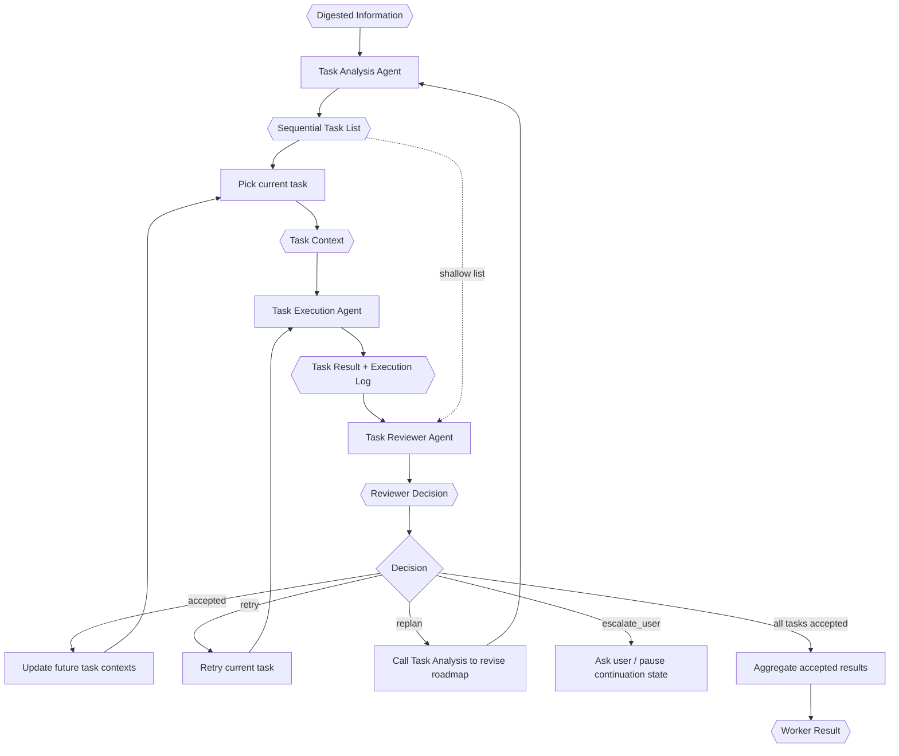

# TINYCUA Worker Orchestration

> **Category:** Process Spec

> **File:** `architecture/worker-orchestration.md`
> **Last Updated:** 2026-05-27
> **Status:** Draft

This document defines the internal Worker orchestration used in Worker Mode.

---

## Role

The TINYCUA Worker is an internal orchestration of sub-agents. Externally, the user can experience TINYCUA as a single agent, but internally Worker Mode coordinates:

1. Task Analysis
2. Task Execution
3. Task Reviewer

The Worker exists to reduce hallucination by decomposing context exposure. Each internal agent receives only the context required for its role.

---

## Inputs / Outputs

**Input:** `Digested Information` from Information Digestion.

**Output:** `Worker Result` for the Primary Agent.

The Worker does not expose the full internal sub-agent structure to the user unless it needs human clarification.

---

## Sequential Roadmap Model

The Worker executes a sequential task roadmap. The top-level task list is not a dependency graph and is not a parallel execution plan.

If a task contains parallelizable work, that parallelization happens inside Task Execution for that task. The top-level Worker still advances through the roadmap sequentially.

---

## Internal Flow



---

## Worker Eagerness

Worker eagerness controls how much planning happens before execution.

| Eagerness | Behavior |
|-----------|----------|
| High | Create a lighter roadmap and defer extra decomposition to reviewer-driven recovery. |
| Medium | Create an initial roadmap and perform limited sequencing/overlap review. |
| Low | Spend more time decomposing and refining the roadmap before execution. |

Eagerness changes the amount of upfront Task Analysis. It does not change the sequential nature of the top-level task list.

---

## Human-in-the-Loop Continuation

Clarification is not task completion. If an internal agent needs user input, the Worker should store continuation state and resume that same internal point after the user replies.

Two signaling concepts are recommended:

- `ask` / `question`: agent needs user clarification and pauses.
- `terminate`: agent has actually completed its assigned work.

This prevents a clarification turn from accidentally restarting the whole request from Query Analyst.

---

## Repeated Failure Rule

The Worker tracks a volatile universal consecutive-failure counter. If failures happen N times in a row, the Worker should ask the user and explain the current point of failure.

If any task succeeds, the counter resets to zero.

---

## Worker Result

The Worker Result should contain only accepted task outputs and enough provenance for the Primary Agent to synthesize a final answer without bypassing Worker guarantees.

```yaml
worker_result:
  accepted_results:
    - task_id: task_001
      name: "..."
      result: "..."
  unresolved_items:
    - "..."
  reviewer_notes:
    - "..."
  confidence: 0.0-1.0
```
