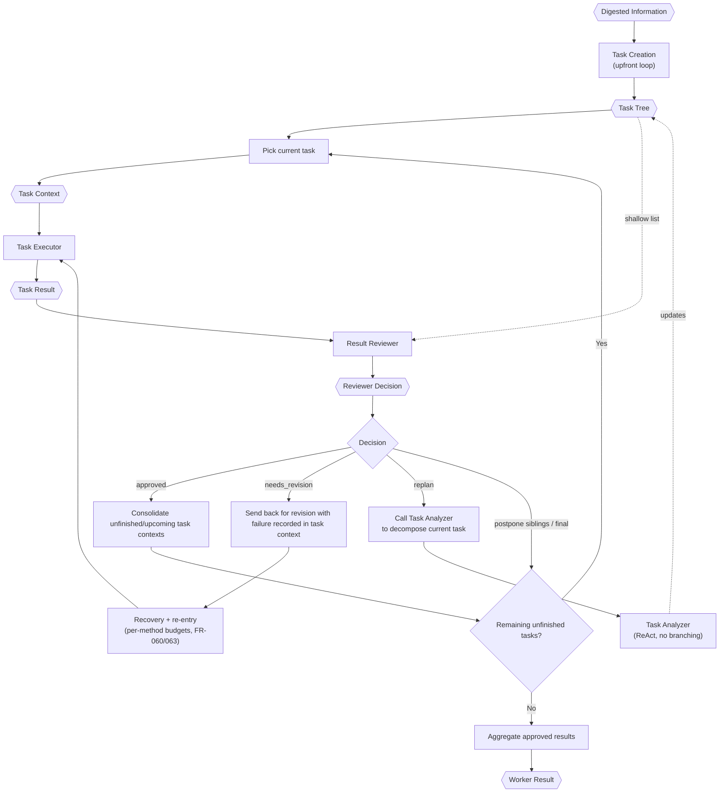

# TINYCUA Worker Orchestration

> **Category:** Process Spec

> **File:** `architecture/worker-orchestration.md`
> **Last Updated:** 2026-05-30
> **Status:** Implemented
> **See also:** [overview.md](overview.md), [session-architecture.md](session-architecture.md), [information-digestion.md](information-digestion.md), [task-creation.md](task-creation.md), [task-assessor.md](task-assessor.md), [task-analysis.md](task-analysis.md), [task-execution.md](task-execution.md), [result-reviewer.md](result-reviewer.md), [state-objects.md](state-objects.md)

This document defines the internal Worker orchestration used in Worker Mode.

---

## Role

The TINYCUA Worker is an internal orchestration of specialized TINYCUA agents. Externally, the user can experience TINYCUA as a single agent, but internally Worker Mode coordinates:

1. Task Creation (upfront loop)
2. Task Assessor (selects tasks for decomposition during Task Creation)
3. Task Analyzer (ReAct agent, no internal routing branches — called by both Task Creation and the Result Reviewer)
4. Task Executor
5. Result Reviewer

The Worker exists to reduce hallucination by decomposing context exposure. Each internal agent receives only the context required for its role.

These specialized Worker agents may use sub-sessions for context isolation, but they are still part of the same TINYCUA agent. They are not the same concept as future explicit Sub Agents. See [session-architecture.md](session-architecture.md).

---

## Inputs / Outputs

**Input:**

- `Digested Information` from the Information Digester.
- `Worker Config`, including `effort`.

**Output:** `Worker Result` for the Primary Agent.

The Worker does not expose the full internal specialized-agent structure to the user unless it needs human clarification.

---

## Sequential Roadmap Model

The Worker executes a sequential task roadmap. The top-level task list is not a dependency graph and is not a parallel execution plan.

If a task contains parallelizable work, that parallelization happens inside the Task Executor for that task. The top-level Worker still advances through the roadmap sequentially.

---

## Internal Flow

---

## Worker Effort

Worker effort is configuration that controls how much planning happens before execution. See [state-objects.md](state-objects.md) for the `Worker Config` schema and effort-level semantics.

Effort controls the depth of upfront decomposition performed by the Task Creation loop. It does not change the sequential nature of the top-level task list, nor the Task Analyzer's internal behavior. See [task-creation.md](task-creation.md) for the full decomposition loop.

---

## Human-in-the-Loop Continuation

Clarification is not task completion. If an internal agent needs user input, the Worker should store continuation state and resume that same internal point after the user replies.

Each specialized agent can have its own sub-session with its own `chat_history` and `Context`. Human-in-the-loop continuation resumes that existing sub-session.

Clarification is not termination. The Worker distinguishes between pausing (awaiting user input) and terminating (work is complete). See [state-objects.md](state-objects.md) for the continuation state schema.

This prevents a clarification turn from accidentally restarting the whole request from Query Analyst.

---

## Repeated Failure Rule

The Worker uses a structured recovery model (FR-060 / FR-063) instead of a single
aggregated failure counter that escalates to HITL:

- Per-method budgets: 15 structured + 10 focused + 3 judge retries = 30 total per task.
- Partial results and `accumulated_tool_results` persist across re-entries.
- A no-progress guard halts re-entry when no new information has been produced.
- Same-error guard (FR-078): the same error 3× forces an alternative action.

When a budget is exhausted or the no-progress guard fires, the Worker does not produce a
terminal decision — the agent stays active, ready for human-in-the-loop interaction
through passthrough routing. See [result-reviewer.md](result-reviewer.md) for the
recovery model details.

Runnable work is selected deterministically in three drains: normal work, eligible sibling-postponed work, then final-postponed work. Compromised tasks are terminal for routing but remain unsuccessful limitations. If the final task is sent back for revision, replanned, or decomposed into new tasks, the Worker continues.

---

## Worker Result

The Worker Result aggregates approved task outputs and separately labels compromised unsuccessful limitations for the Primary Agent to synthesize into a final response. See [state-objects.md](state-objects.md) for the canonical schema.

The Worker Result should contain only approved task outputs and enough provenance for the Primary Agent to synthesize a final answer without bypassing Worker guarantees.

---

## Design Decisions

| Decision | Choice | Rationale |
|----------|--------|-----------|
| Roadmap model | Sequential execution | Keeps orchestration simple; parallel work belongs inside individual task execution, not at the top level |
| Human-in-the-loop | Clarification is not termination | Pausing for user input preserves the sub-session context; resuming avoids restarting the whole request |
| Agent structure | Internal specialized agents, not standalone | Worker agents use sub-sessions for context isolation but remain part of the same TINYCUA agent — distinct from future explicit Sub Agents |
| Worker output | Accepted results plus explicit compromises | The Primary Agent receives provenanced accepted outputs without hiding terminal unsuccessful limitations |

---

## Cumulative Review Context and Artifact History

### Progression ownership

One goal-wide cumulative progress report is derived from the append-only committed
review events (``record_reviewer_decision`` in the global transition log) plus
current task state. Only ResultReviewer contributes entries through
``task_review_decision``; every model-facing decision requires a non-empty
progress-quality ``review_summary``. Executor, TaskAssessor, and TaskAnalyzer
receive a read-only approved-only projection so previously accepted knowledge
survives later reviews and replans without repeating or undoing it, while
rejection/postponement detail stays task-local in the review journal.

### Result and artifact provenance

On Reviewer COMMIT the runtime records a content-addressed logical result revision
(SHA-256 of the report), injects the trusted identities (``revision_id``,
``content_hash``, ``artifact_range``) into the staged decision immediately before
the atomic commit, and advances the review checkpoint only after the commit
succeeds (approvals only). The model cannot provide or override these fields
(``additionalProperties: false``). Committed events retain the exact result hash
and artifact revision range; later result replacement cannot destroy the report
behind an earlier verdict (FR-009).

### Storage boundary (FR-012/FR-013)

Workspace manifests, eligible changed-content blobs, result revisions, and the
review checkpoint live under session-owned system storage resolved outside
``workspace_dir`` (``SessionConfig.session_dir``; the CLI defaults to a per-run
directory beside the workspace, and experiment runs mount a sibling
``system-artifacts`` directory). Model-visible prompts, tool outcomes, task
metadata, and state projections expose only opaque ``rev-...`` identifiers and
workspace-relative paths — never the internal directory. Failures fail closed:
an unreadable store blocks pre-mutation capture, and a post-write persistence
failure marks the audit incomplete and blocks review approval until surfaced
(FR-014).
