# Expected TinyCUA Scenarios

> **Status:** Target architecture

Full end-to-end flow audits. This document references canonical node, queue, model,
config, and tool docs instead of duplicating their contracts. Each scenario shows
NodeQueue state transitions and node behavior across complete runs.

Each sequence uses small Mermaid diagrams so the document remains readable. Explanations
are concise and reference the relevant source-of-truth docs.

---

## None effort mode

### Sequence 1: First-time task creation with no extra analysis

User sends a new request. No task exists. Worker chooses `task_creation`.

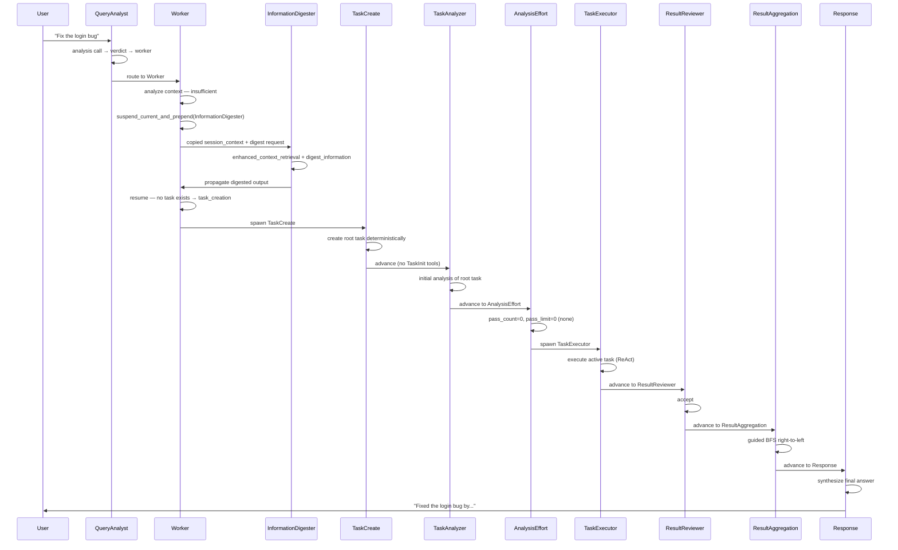
```mermaid
sequenceDiagram
    participant User
    participant QA as QueryAnalyst
    participant W as Worker
    participant ID as InformationDigester
    participant TC as TaskCreate
    participant TA as TaskAnalyzer
    participant AE as AnalysisEffort
    participant TE as TaskExecutor
    participant RR as ResultReviewer
    participant RAgg as ResultAggregation
    participant R as Response

    User->>QA: "Fix the login bug"
    QA->>QA: analysis call → verdict → worker
    QA->>W: route to Worker
    W->>W: analyze context — insufficient
    W->>W: suspend_current_and_prepend(InformationDigester)
    W->>ID: copied session_context + digest request
    ID->>ID: enhanced_context_retrieval + digest_information
    ID->>W: propagate digested output
    W->>W: resume — no task exists → task_creation
    W->>TC: spawn TaskCreate
    TC->>TC: create root task deterministically
    TC->>TA: advance (no TaskInit tools)
    TA->>TA: initial analysis of root task
    TA->>AE: advance to AnalysisEffort
    AE->>AE: pass_count=0, pass_limit=0 (none)
    AE->>TE: spawn TaskExecutor
    TE->>TE: execute active task (ReAct)
    TE->>RR: advance to ResultReviewer
    RR->>RR: accept
    RR->>RAgg: advance to ResultAggregation
    RAgg->>RAgg: guided BFS right-to-left
    RAgg->>R: advance to Response
    R->>R: synthesize final answer
    R->>User: "Fixed the login bug by..."
```

**Key contracts:** [`query_analyst.md`](query_analyst.md), [`worker.md`](worker.md),
[`information_digester.md`](information_digester.md),
[`task_create.md`](task_create.md), [`task_analyzer.md`](task_analyzer.md),
[`analysis_effort.md`](analysis_effort.md), [`task_executor.md`](task_executor.md),
[`result_reviewer.md`](result_reviewer.md), [`result_aggregation.md`](result_aggregation.md),
[`response.md`](response.md)

### Sequence 2: Existing task proceeds directly to execution

User sends a follow-up. Task exists. Worker chooses `proceed_execution` — the proceed execution edge case when a task and active task exist but no executor is queued/active.

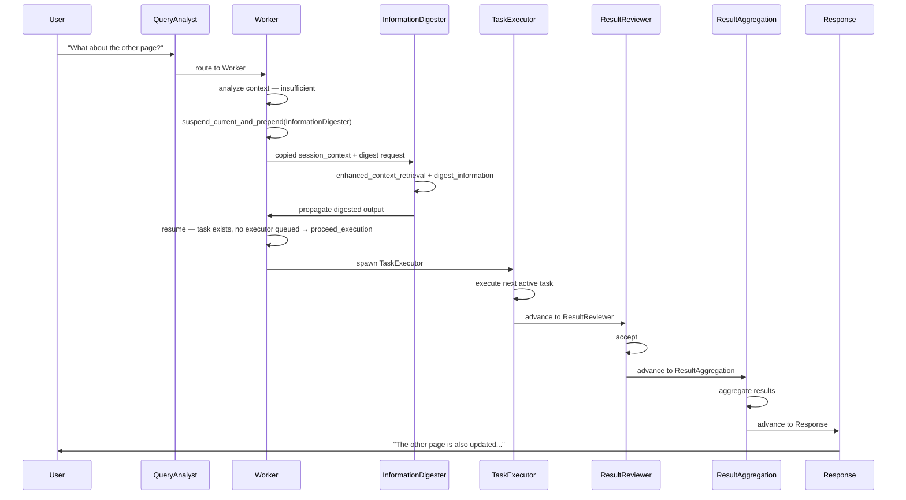
```mermaid
sequenceDiagram
    participant User
    participant QA as QueryAnalyst
    participant W as Worker
    participant ID as InformationDigester
    participant TE as TaskExecutor
    participant RR as ResultReviewer
    participant RAgg as ResultAggregation
    participant R as Response

    User->>QA: "What about the other page?"
    QA->>W: route to Worker
    W->>W: analyze context — insufficient
    W->>W: suspend_current_and_prepend(InformationDigester)
    W->>ID: copied session_context + digest request
    ID->>ID: enhanced_context_retrieval + digest_information
    ID->>W: propagate digested output
    W->>W: resume — task exists, no executor queued → proceed_execution
    W->>TE: spawn TaskExecutor
    TE->>TE: execute next active task
    TE->>RR: advance to ResultReviewer
    RR->>RR: accept
    RR->>RAgg: advance to ResultAggregation
    RAgg->>RAgg: aggregate results
    RAgg->>R: advance to Response
    R->>User: "The other page is also updated..."
```

**Key contracts:** [`worker.md`](worker.md), [`information_digester.md`](information_digester.md) — `proceed_execution` edge case.

---

## Low / medium / high effort mode

### Sequence 1: EffortNode performs one pass

Worker chooses `task_creation` with low effort (pass_limit=1).

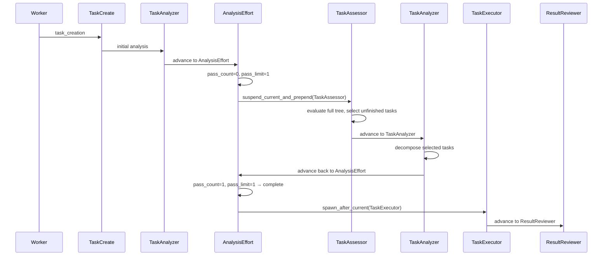
```mermaid
sequenceDiagram
    participant W as Worker
    participant TC as TaskCreate
    participant TA as TaskAnalyzer
    participant AE as AnalysisEffort
    participant TAss as TaskAssessor
    participant TAn as TaskAnalyzer
    participant TE as TaskExecutor
    participant RR as ResultReviewer

    W->>TC: task_creation
    TC->>TA: initial analysis
    TA->>AE: advance to AnalysisEffort
    AE->>AE: pass_count=0, pass_limit=1
    AE->>TAss: suspend_current_and_prepend(TaskAssessor)
    TAss->>TAss: evaluate full tree, select unfinished tasks
    TAss->>TAn: advance to TaskAnalyzer
    TAn->>TAn: decompose selected tasks
    TAn->>AE: advance back to AnalysisEffort
    AE->>AE: pass_count=1, pass_limit=1 → complete
    AE->>TE: spawn_after_current(TaskExecutor)
    TE->>RR: advance to ResultReviewer
```

**Key contract:** [`analysis_effort.md`](analysis_effort.md) — effort-gated loop.

### Sequence 2: EffortNode performs multiple passes

Worker chooses `task_creation` with medium effort (pass_limit=2).

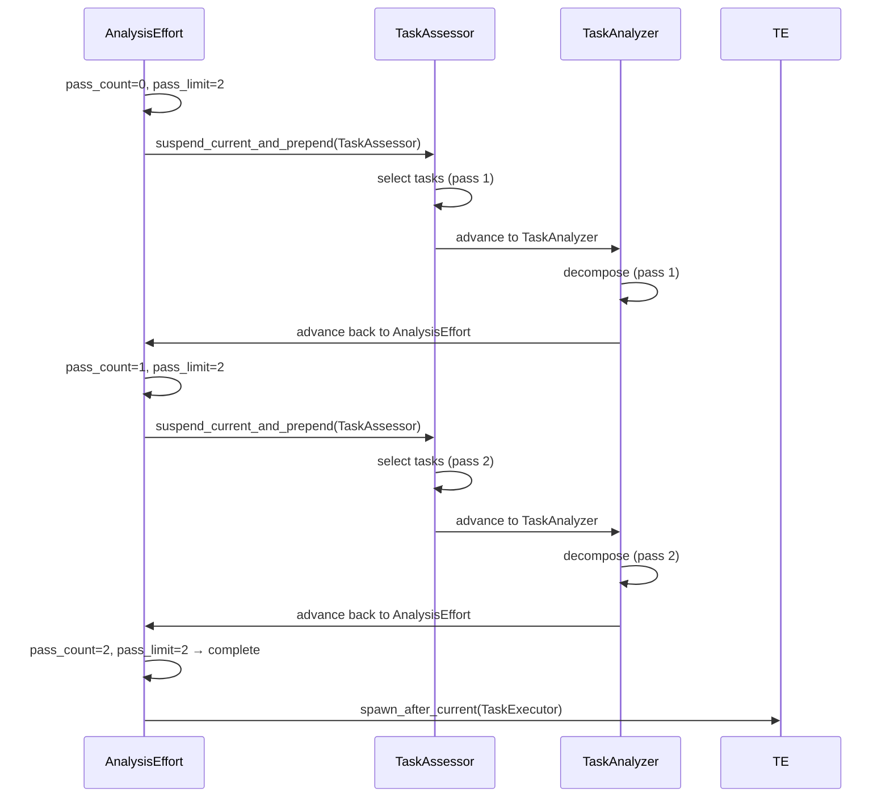
```mermaid
sequenceDiagram
    participant AE as AnalysisEffort
    participant TAss as TaskAssessor
    participant TAn as TaskAnalyzer

    AE->>AE: pass_count=0, pass_limit=2
    AE->>TAss: suspend_current_and_prepend(TaskAssessor)
    TAss->>TAss: select tasks (pass 1)
    TAss->>TAn: advance to TaskAnalyzer
    TAn->>TAn: decompose (pass 1)
    TAn->>AE: advance back to AnalysisEffort
    AE->>AE: pass_count=1, pass_limit=2
    AE->>TAss: suspend_current_and_prepend(TaskAssessor)
    TAss->>TAss: select tasks (pass 2)
    TAss->>TAn: advance to TaskAnalyzer
    TAn->>TAn: decompose (pass 2)
    TAn->>AE: advance back to AnalysisEffort
    AE->>AE: pass_count=2, pass_limit=2 → complete
    AE->>TE: spawn_after_current(TaskExecutor)
```

**Key contract:** [`analysis_effort.md`](analysis_effort.md) — multiple passes.

### Sequence 3: TaskAssessor selects no tasks

During an effort pass, TaskAssessor finds no unfinished tasks.

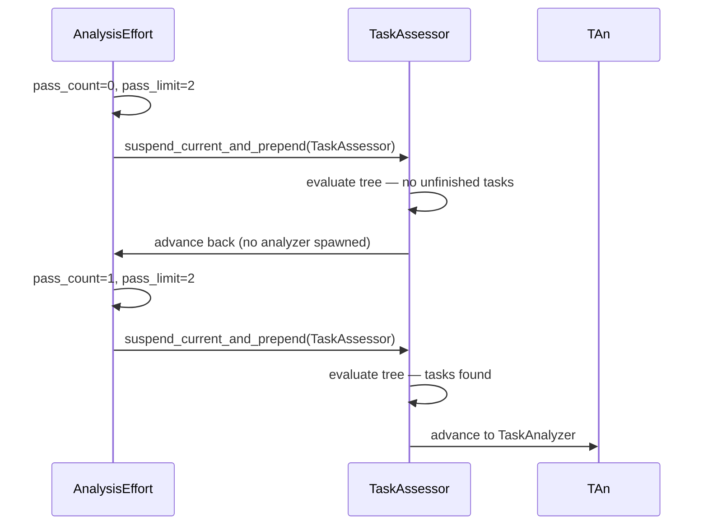
```mermaid
sequenceDiagram
    participant AE as AnalysisEffort
    participant TAss as TaskAssessor

    AE->>AE: pass_count=0, pass_limit=2
    AE->>TAss: suspend_current_and_prepend(TaskAssessor)
    TAss->>TAss: evaluate tree — no unfinished tasks
    TAss->>AE: advance back (no analyzer spawned)
    AE->>AE: pass_count=1, pass_limit=2
    AE->>TAss: suspend_current_and_prepend(TaskAssessor)
    TAss->>TAss: evaluate tree — tasks found
    TAss->>TAn: advance to TaskAnalyzer
```

**Key contract:** [`task_assessor.md`](task_assessor.md) — no-task-selected path.

---

## Continuation / passthrough mode

### Sequence 1: QueryAnalyst routes mandatory passthrough

A `mandatory_passthrough` targets an active or queued node. QueryAnalyst forwards
the continuation deterministically.

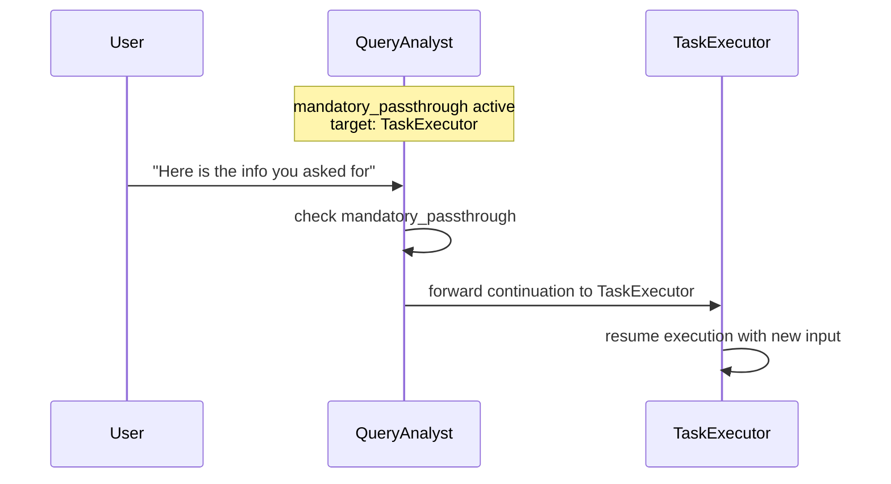
```mermaid
sequenceDiagram
    participant User
    participant QA as QueryAnalyst
    participant TE as TaskExecutor

    Note over QA: mandatory_passthrough active<br/>target: TaskExecutor
    User->>QA: "Here is the info you asked for"
    QA->>QA: check mandatory_passthrough
    QA->>TE: forward continuation to TaskExecutor
    TE->>TE: resume execution with new input
```

**Key contract:** [`query_analyst.md`](query_analyst.md) — precheck and passthrough.

### Sequence 2: Worker passthrough to active worker-owned node

Worker routes `passthrough` to forward input to the next worker-owned node.

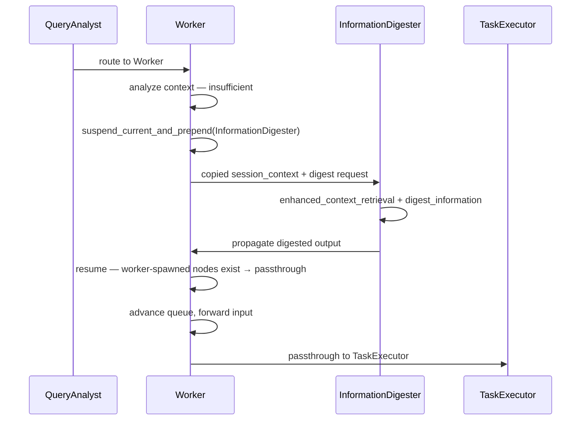
```mermaid
sequenceDiagram
    participant QA as QueryAnalyst
    participant W as Worker
    participant ID as InformationDigester
    participant TE as TaskExecutor

    QA->>W: route to Worker
    W->>W: analyze context — insufficient
    W->>W: suspend_current_and_prepend(InformationDigester)
    W->>ID: copied session_context + digest request
    ID->>ID: enhanced_context_retrieval + digest_information
    ID->>W: propagate digested output
    W->>W: resume — worker-spawned nodes exist → passthrough
    W->>W: advance queue, forward input
    W->>TE: passthrough to TaskExecutor
```

**Key contracts:** [`worker.md`](worker.md), [`information_digester.md`](information_digester.md) — passthrough route.

---

## Uncertain mode

### Sequence 1: QueryAnalyst remains active and waits for user continuation

QueryAnalyst routes to `uncertain` — it remains active and waits for user input.

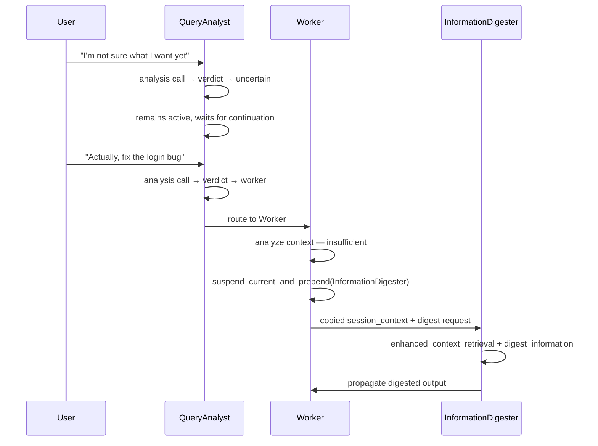
```mermaid
sequenceDiagram
    participant User
    participant QA as QueryAnalyst
    participant W as Worker
    participant ID as InformationDigester

    User->>QA: "I'm not sure what I want yet"
    QA->>QA: analysis call → verdict → uncertain
    QA->>QA: remains active, waits for continuation
    User->>QA: "Actually, fix the login bug"
    QA->>QA: analysis call → verdict → worker
    QA->>W: route to Worker
    W->>W: analyze context — insufficient
    W->>W: suspend_current_and_prepend(InformationDigester)
    W->>ID: copied session_context + digest request
    ID->>ID: enhanced_context_retrieval + digest_information
    ID->>W: propagate digested output
```

**Key contracts:** [`query_analyst.md`](query_analyst.md), [`worker.md`](worker.md), [`information_digester.md`](information_digester.md) — `uncertain` route.

---

## Reviewer flows

### Sequence 1: Accept advances active task

ResultReviewer accepts the executor result.

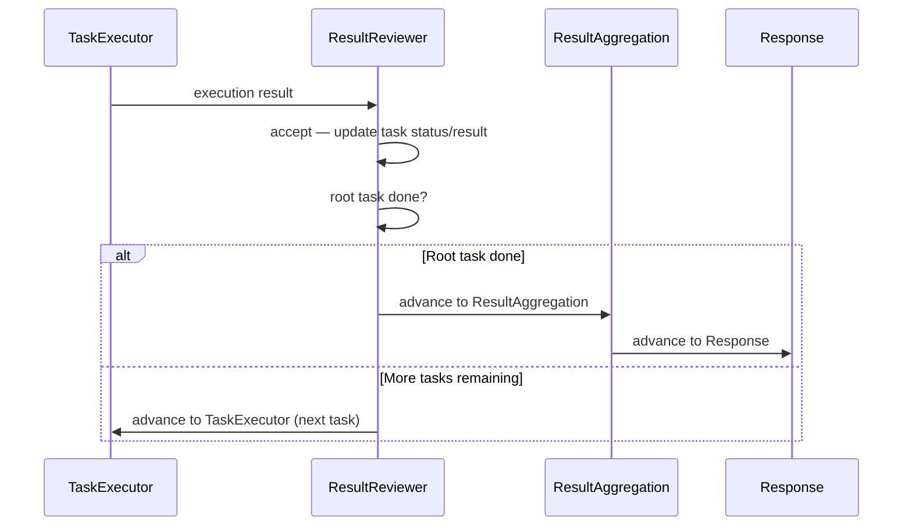
```mermaid
sequenceDiagram
    participant TE as TaskExecutor
    participant RR as ResultReviewer
    participant RAgg as ResultAggregation
    participant R as Response

    TE->>RR: execution result
    RR->>RR: accept — update task status/result
    RR->>RR: root task done?
    alt Root task done
        RR->>RAgg: advance to ResultAggregation
        RAgg->>R: advance to Response
    else More tasks remaining
        RR->>TE: advance to TaskExecutor (next task)
    end
```

**Key contract:** [`result_reviewer.md`](result_reviewer.md) — accept path.

### Sequence 2: Retry below threshold

ResultReviewer retries. Failure count is below the failure threshold (default: 5).

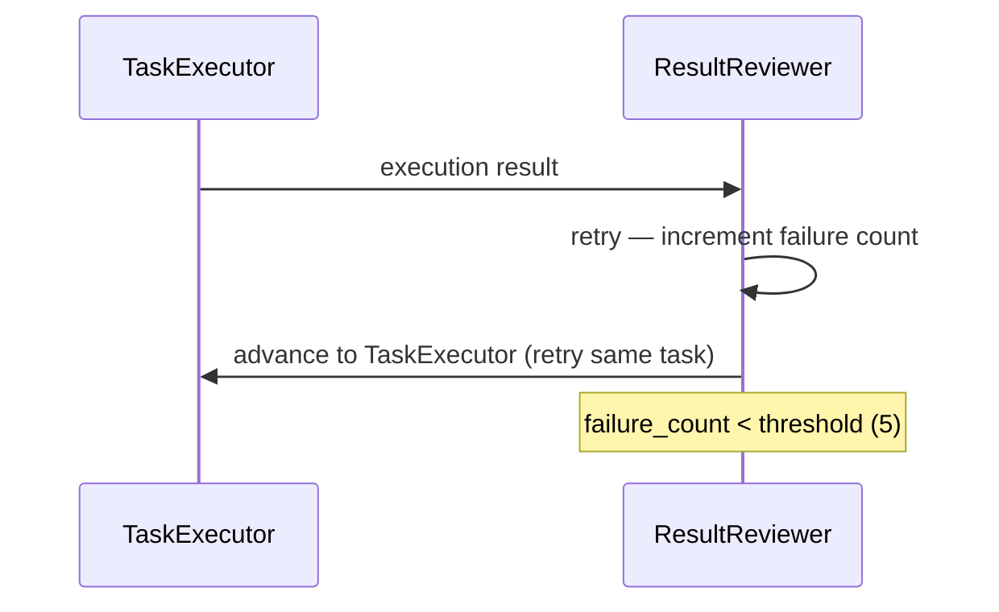
```mermaid
sequenceDiagram
    participant TE as TaskExecutor
    participant RR as ResultReviewer

    TE->>RR: execution result
    RR->>RR: retry — increment failure count
    RR->>TE: advance to TaskExecutor (retry same task)
    Note over RR: failure_count < threshold (5)
```

**Key contract:** [`result_reviewer.md`](result_reviewer.md) — retry and threshold.

### Sequence 3: Retry threshold reached, open question

Failure count reaches threshold. Reviewer escalates.

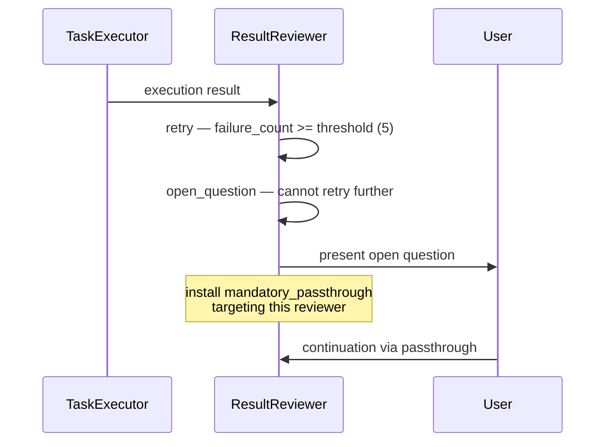
```mermaid
sequenceDiagram
    participant TE as TaskExecutor
    participant RR as ResultReviewer
    participant User

    TE->>RR: execution result
    RR->>RR: retry — failure_count >= threshold (5)
    RR->>RR: open_question — cannot retry further
    RR->>User: present open question
    Note over RR: install mandatory_passthrough<br/>targeting this reviewer
    User->>RR: continuation via passthrough
```

**Key contract:** [`result_reviewer.md`](result_reviewer.md) — threshold and open_question.

### Sequence 4: Replan local active task

ResultReviewer decides replan for the active task.

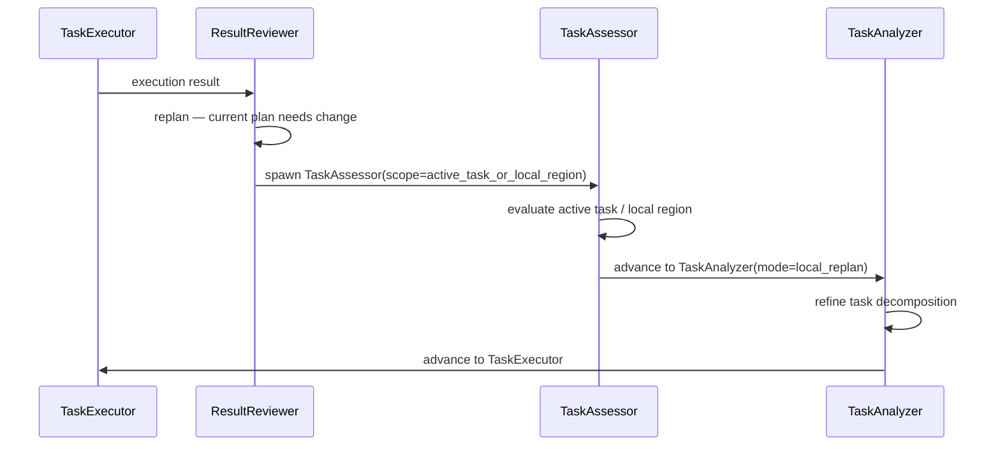
```mermaid
sequenceDiagram
    participant TE as TaskExecutor
    participant RR as ResultReviewer
    participant TAss as TaskAssessor
    participant TAn as TaskAnalyzer

    TE->>RR: execution result
    RR->>RR: replan — current plan needs change
    RR->>TAss: spawn TaskAssessor(scope=active_task_or_local_region)
    TAss->>TAss: evaluate active task / local region
    TAss->>TAn: advance to TaskAnalyzer(mode=local_replan)
    TAn->>TAn: refine task decomposition
    TAn->>TE: advance to TaskExecutor
```

**Key contract:** [`result_reviewer.md`](result_reviewer.md) — replan path.

---

## Response and aggregation

### Sequence 1: Root task complete, aggregate, response

Root task is accepted. Aggregation and response follow.

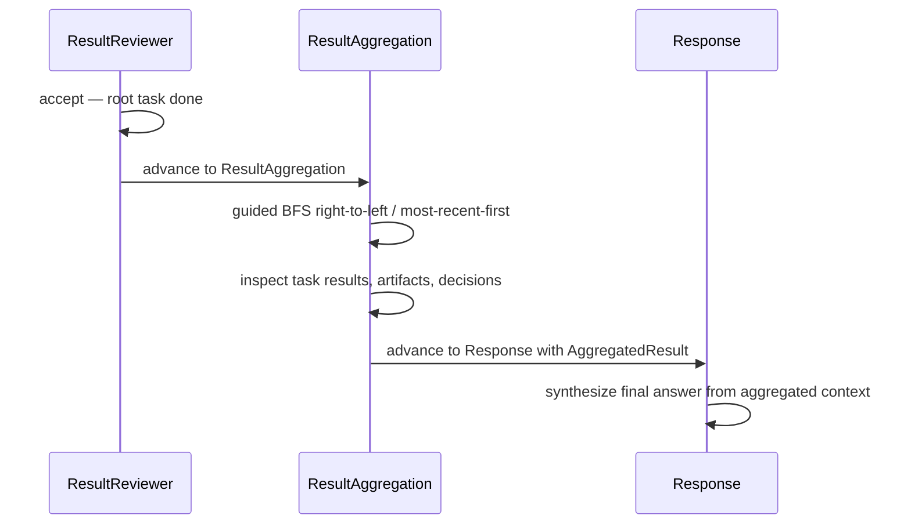
```mermaid
sequenceDiagram
    participant RR as ResultReviewer
    participant RAgg as ResultAggregation
    participant R as Response

    RR->>RR: accept — root task done
    RR->>RAgg: advance to ResultAggregation
    RAgg->>RAgg: guided BFS right-to-left / most-recent-first
    RAgg->>RAgg: inspect task results, artifacts, decisions
    RAgg->>R: advance to Response with AggregatedResult
    R->>R: synthesize final answer from aggregated context
```

**Key contracts:** [`result_aggregation.md`](result_aggregation.md),
[`response.md`](response.md).

### Sequence 2: ResponseNode requests InformationDigester

ResponseNode determines context is insufficient and requests digestion.

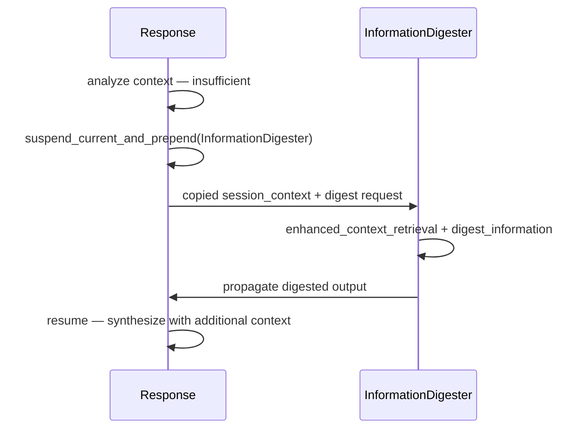
```mermaid
sequenceDiagram
    participant R as Response
    participant ID as InformationDigester

    R->>R: analyze context — insufficient
    R->>R: suspend_current_and_prepend(InformationDigester)
    R->>ID: copied session_context + digest request
    ID->>ID: enhanced_context_retrieval + digest_information
    ID->>R: propagate digested output
    R->>R: resume — synthesize with additional context
```

**Key contracts:** [`response.md`](response.md),
[`information_digester.md`](information_digester.md).

### Sequence 3: InformationDigester finds no useful context

Digester completes but finds nothing useful.

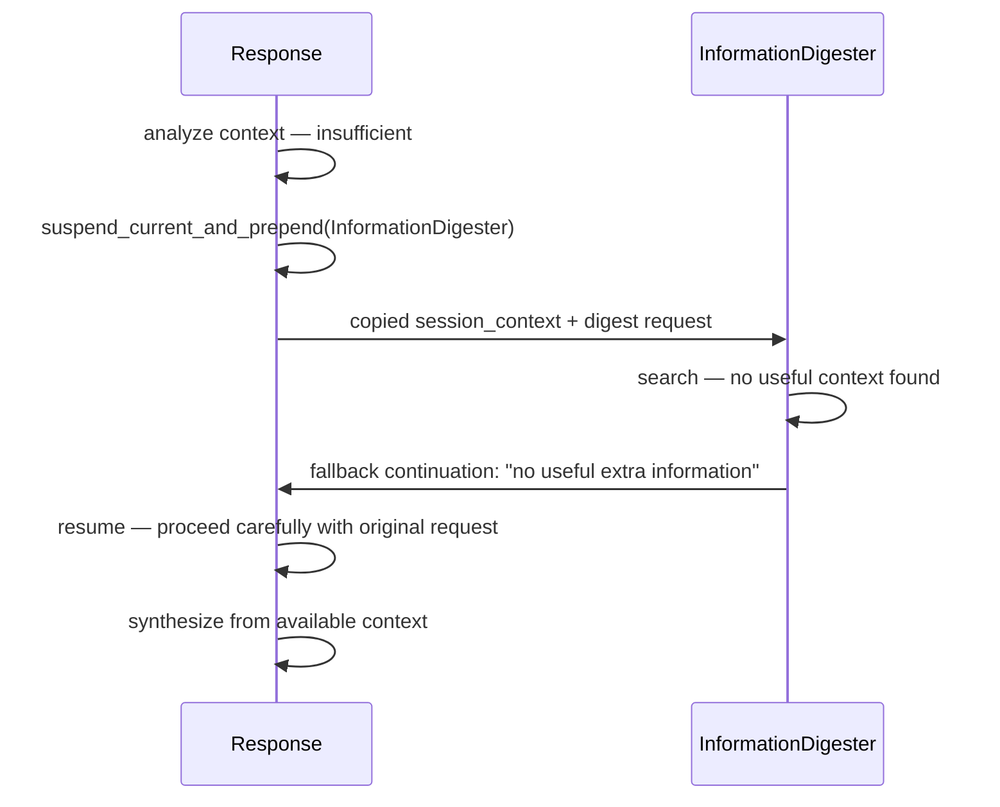
```mermaid
sequenceDiagram
    participant R as Response
    participant ID as InformationDigester

    R->>R: analyze context — insufficient
    R->>R: suspend_current_and_prepend(InformationDigester)
    R->>ID: copied session_context + digest request
    ID->>ID: search — no useful context found
    ID->>R: fallback continuation: "no useful extra information"
    R->>R: resume — proceed carefully with original request
    R->>R: synthesize from available context
```

**Key contract:** [`information_digester.md`](information_digester.md) — fallback.

---

## DecisionNode Two-Step Process

All DecisionNode classes (QueryAnalyst, Worker) follow the same two-step process.

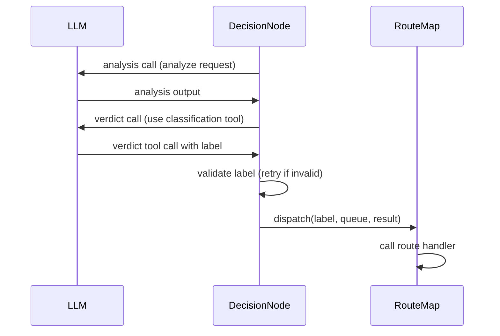
```mermaid
sequenceDiagram
    participant LLM as LLM
    participant DN as DecisionNode
    participant RM as RouteMap

    DN->>LLM: analysis call (analyze request)
    LLM->>DN: analysis output
    DN->>LLM: verdict call (use classification tool)
    LLM->>DN: verdict tool call with label
    DN->>DN: validate label (retry if invalid)
    DN->>RM: dispatch(label, queue, result)
    RM->>RM: call route handler
```

**Key contracts:** [`query_analyst.md`](query_analyst.md),
[`worker.md`](worker.md) — two-step process sections.

---

## Invalid Label Retry

When a DecisionNode produces an invalid or missing label, it retries according to
`NodeRetryPolicy`.

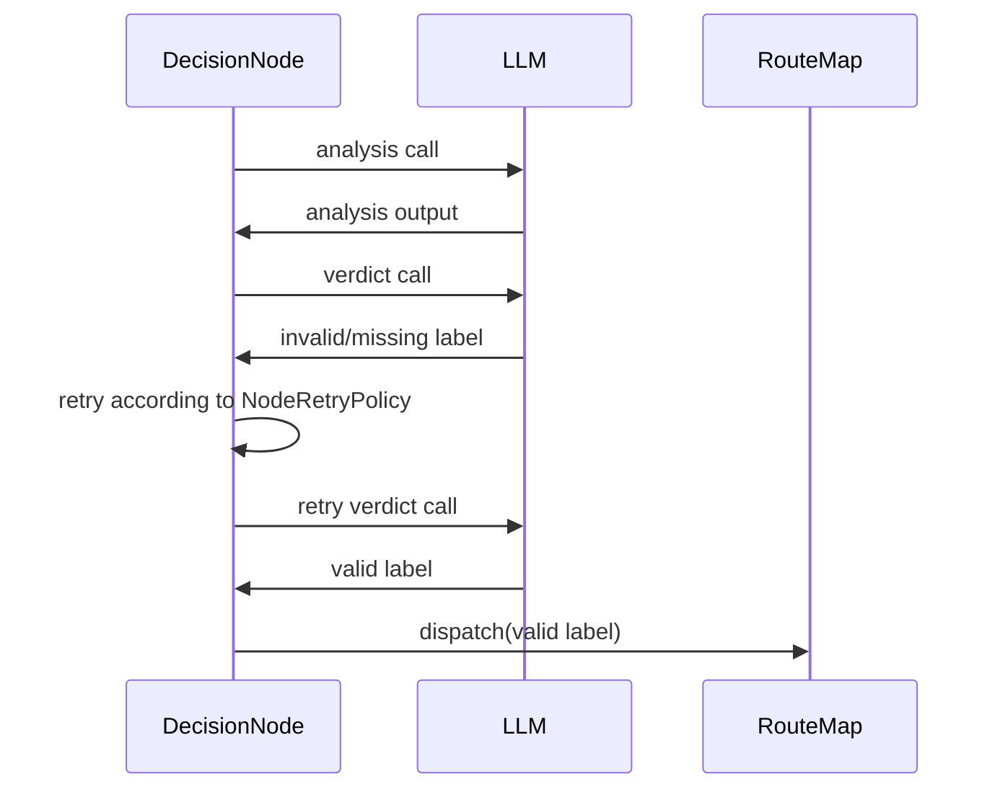
```mermaid
sequenceDiagram
    participant DN as DecisionNode
    participant LLM as LLM
    participant RM as RouteMap

    DN->>LLM: analysis call
    LLM->>DN: analysis output
    DN->>LLM: verdict call
    LLM->>DN: invalid/missing label
    DN->>DN: retry according to NodeRetryPolicy
    DN->>LLM: retry verdict call
    LLM->>DN: valid label
    DN->>RM: dispatch(valid label)
```

**Key contract:** [`query_analyst.md`](query_analyst.md) — failure/retry behavior.
